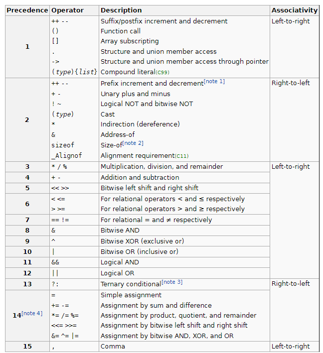

# <p align="center">**Basic Data Types & Operators - Các kiểu dữ liệu cơ bản và các toán tử**</p>

# **1. Biến (variable) và hằng (constant)**

## **1.1. Khái niệm về khai báo - concept of declaration**
Trong ngôn ngữ lập trình C, điều kiện để có thể sử dụng một biến hay một hằng là ta phải khai báo biến/hằng ở phía trước (phía trên) câu lệnh mà ta truy cập tới biến/hằng.

Ví dụ, chương trình sau sẽ không hoạt động vì ta chưa khai báo a
```C
int main() {
    a = 3;      // lỗi, vì chưa khai báo a.
    return 0;
}
```

## **1.2. Biến (variable)**
Biến lưu trữ giá trị nào đó và có thể thay đổi giá trị của nó sau này.

### **1.2.1. Khai báo trước và gán giá trị sau**
Cú pháp khai báo biến (syntax of variable declaration):
```C
data_type variable_name;
```

Ví dụ, chương trình sau khai báo các biến a, b, c.
```C
#include <stdio.h>

int main() {
    // Khai báo biến a, b, c:
    int a;
    float b;
    char c;

    // Gán giá trị cho a, b và c:
    a = 11;
    b = 21;
    c = 'B';
    return 0;
}
```

### **1.2.2. Khai báo đồng thời với khởi tạo giá trị**

```C
#include <stdio.h>

int main() {
    // Khai báo biến và khởi tạo a, b, c:
    int a = 10;
    float b = 20.5;
    char c = 'A';

    // Thay đổi giá trị của a, b và c:
    a = 11;
    b = 21;
    c = 'B';
    return 0;
}
```
Trong ví dụ trên, các số 10, 20.5, 11, 21 và 'B' gọi là các literal:
- 10, 11, 21: là literal kiểu int.
- 20.5: là literal kiểu float.
- 'B' là literal kiểu char.

"**int**", "**float**" và "**char**" đều nằm trong nhóm kiểu dữ liệu nguyên thủy (primitive types). Ở phần (2), chúng ta sẽ làm quen với các kiểu dữ liệu nguyên thủy.

## **1.3. Hằng (constant)**
Hằng cũng lưu giá trị nào đó, nhưng không thể thay đổi giá trị của nó. Cách khai báo và khởi tạo giá trị cho hằng giống với biến, tuy nhiên có thêm từ khóa "const" ở ngay phía trước hoặc ngay phía sau kiểu dữ liệu.

Cú pháp khai báo hằng (syntax of constant declaration):
```C
const data_type constant_name;
data_type const constant_name;
```
Vì hằng không thể thay đổi giá trị, ta thường khởi tạo giá trị ngay từ khi khai báo. 

Ví dụ khai báo và khởi tạo hằng:

```C
#include <stdio.h>

int main() {
    // Khai báo biến a, b, c:
    const int a = 10;
    float const b = 20.5;
    const char c = 'C';

    // Không thể thay đổi giá trị của a, b và c.
    // Hãy thử chạy chương trình này. 
    // Sau đấy thêm các dòng code sau để thay đổi a, b, c 
    // và thấy trình biên dịch báo lỗi:

    // a = 11;
    // b = 21.5;
    // c = 'D';
    return 0;
}
```

**Đố bạn:**
> Tại sao chúng ta khai báo hằng thay vì chỉ dùng biến trong chương trình?


# **2. Kiểu dữ liệu**
## **2.1. Các nhóm kiểu dữ liệu**
Trong C có các nhóm kiểu dữ liệu sau:
- Primitive data types - kiểu dữ liệu nguyên thủy: hầu hết các kiểu dữ liệu được sử dụng để biểu diễn các giá trị đơn giản như số nguyên (integer), số thực (float), ký tự (character).
- User defined data types - kiểu dữ liệu do người dùng định nghĩa.
- Derived types - kiểu dữ liệu dẫn xuất: cho phép kết hợp nhiều kiểu dữ liệu với nhau.

> Trong chương này chúng ta tạm thời chỉ quan tâm tới các kiểu dữ liệu nguyên thủy (primitive data types).


## **2.2. Các kiểu dữ liệu nguyên thủy**

### **2.2.1. Kiểu số nguyên - integer**
- Dùng để biểu diễn số nguyên.
- Các kiểu này có phạm vi biểu diễn và kích thước tùy vào trình biên dịch hoặc hệ điều hành. Sau đây là ví dụ cho trình biên dịch GCC 32-bit:

| Kiểu                                          | Giá trị                   | Kích thước    |
|-----------------------------------------------|---------------------------|---------------|
| short (short int)                             | -2^16 tới (2^16 - 1)      | 2 byte        |
| unsigned short (unsigned short int)           | 0 tới (2^16 - 1)          | 2 byte        |
| int                                           | -2^32 tới (2^32 - 1)      | 4 byte        |
| unsigned int                                  | 0 tới (2^32 - 1)          | 4 byte        |
| long (long int)                               | -2^32 tới (2^32 - 1)      | 4 byte        |
| unsigned long (unsigned long int)             | 0 tới (2^32 - 1)          | 4 byte        |
| long long (long long int)                     | -2^64 tới (2^64 - 1)      | 8 byte        |
| unsigned long long (unsigned long long int)   | 0 tới (2^32 - 1)          | 8 byte        |

### **2.2.2. Kiểu dấu chấm động - floating-point**
- Dùng để biểu diễn số thực.
- Các kiểu này có phạm vi biểu diễn và kích thước tùy vào trình biên dịch hoặc hệ điều hành. Sau đây là ví dụ cho trình biên dịch GCC 32-bit

| Kiểu                                          | Phạm vi biểu diễn         | Kích thước    |
|-----------------------------------------------|---------------------------|---------------|
| float                                         | 1.2E-38 tới 3.4E+38       | 4 byte        |
| double                                        | 1.7E-308 tới 1.7E+308     | 8 byte        |
| long double                                   | 3.4E-4932 tới 1.1E+4932   | 16 byte       |

### **2.2.3. Kiểu ký tự - char**
- Một giá trị kiểu char chiếm một byte (8 bit) và có thể biểu diễn một ký tự thông qua bảng mã ASCII (tự tra cứu trên internet).
- Lưu ý là kiểu char vừa có thể biểu diễn một ký tự vừa có thể biểu diễn một số nguyên.
- Có hai kiểu char:
    - signed char (có thể biểu diễn số nguyên từ -128 đến 127).
    - unsigned char (có thể biểu diễn số nguyên từ 0 đến 255).

### **2.2.4. Kiểu void**
- Dùng để cho biết rằng không có giá trị nào được biểu diễn.

### **2.2.5. Kiểu boolean**
- Kiểu boolean là kiểu dữ liệu có giá trị rơi vào 1 trong 2 trường hợp:
    + Đúng (true).
    + Sai (false).
- Trong C chuẩn không có kiểu boolean. Tuy nhiên, ngôn ngữ C:
    + Xem các số khác 0 tương đương giá trị "true" của kiểu boolean.
    + Xem các số bằng 0 tương đương giá trị "false" của kiểu boolean.

## **2.3. Các kiểu dữ liệu của các literal**
Như đã nói ở phần (1), các số 10, 20.5, hay 'B' được gọi là các literal. Chúng là các giá trị cụ thể, và cũng có kiểu dữ liệu (theo quy ước C).

### **2.3.1. Integer literals**
- **Dạng thập phân (decimal)**: Viết như cách viết số nguyên trong toán học. Ví dụ
    + 0, 1, 2, 3, 4, 5, 6, 7, 8, 9, 10
- **Dạng nhị phân (binary)**: Bắt đầu bằng 0b hoặc 0B, ví dụ:
    + 0b0, 0b1, 0b10, 0b11.
    + 0B0, 0B1, 0B10, 0B11.
- **Dạng bát phân (octal)**: Bắt đầu bằng chữ số 0. Ví dụ:
    + 0, 01, 02, 03, 04, 05, 06, 07, 010
- **Dạng thập lục phân (hexa)**: Bắt đầu bằng 0x. Ví dụ:
    + 0x0, 0x1, 0x2, 0x3, 0x4, ...
    + 0xA, 0xB, 0xC, 0xD, 0xE, 0xF, ...
    + 0xa, 0xb, 0x1a, 0x2a, 0x3a, ...
- **Lưu ý:** theo mặc định, các integer literal có kiểu dữ liệu int. Ta có thể thêm hậu tố:
    - L: để biểu diễn kiểu long. Ví dụ: 1L, 2L, 10L.
    - LL: để biểu diễn kiểu long long. Ví dụ: 1LL, 2LL, 10LL.
    - U: để biểu diễn kiểu unsigned int. Ví dụ: 1U, 2U, 10U.
    - UL hoặc LU: để biểu diễn kiểu unsigned long. Ví dụ: 1UL, 2UL, 10UL, 1LU, 2LU, 10LU
    - ULL hoặc LLU: để biểu diễn kiểu unsigned long long. Ví dụ 1ULL, 2ULL, 10ULL, 1LLU, 2LLU, 10LLU.
    
### **2.3.2. Floating-point literals**
- **Dạng thập phân (decimal form)**: Viết như cách viết số thực trong toán học (lưu ý là dùng dấu . thay vì dấu ,). ví dụ:
    + 1.0, 1.5, 10.0.
- **Dạng mũ**: Thêm e hoặc E kèm số mũ đằng sau. Ví dụ:
    + 6.022e23: 6.022 nhân 10 mũ 23.
    + 6.5E15: 6.5 nhân 10 mũ 5.

### **2.3.3. Character literals**
- Các literal ký tự biểu diễn bằng cách đặt ký tự giữa hai dấu ' '. Ví dụ: 
    - 'a', 'b', 'c' ...
    - 'A', 'B', 'C' ...
    - '0', '1', '2', '3', ... (đừng nhầm lẫn "ký tự số" với "số").
    - '@', '&', '~', '!', ...

### **2.3.4. String literals**
- Ở trên ta đã thấy ví dụ về characte literal (ví dụ 'a', 'B'). Một string literal là dãy các ký tự đặt giữa hai dấu nháy kép " ". Ví dụ:
    - "Hello World"
    - Hello World (sai vì không đặt giữa " ").

# **3. Xuất nhập cơ bản**
Để xuất nhập dữ liệu, ta có nhiều hàm (function) khác nhau. Tuy nhiên, trước hết chúng ta tạm sử dụng hai hàm sau:
- printf: xuất data đã được định dạng (print formated data).
- scanf: nhập data đã được định dạng (scan formated data).

Cú pháp:
```
printf(string, param1, param2, ...);
scanf(string, &param1, param2, ...);
```

Ví dụ 1, thử chạy chương trình sau:
```C
#include <stdio.h>

int main(){
    int a = 10;         // khởi tạo a bằng 10.
    printf("Hello.\n"); // in ra màn hình "Hello."
                        // \n đại diện cho ký tự xuống dòng.
    printf("variable a = %d\n", a); // In giá trị của a ra màn hình.
                                    // %d báo cho trình biên dịch lấy
                                    //giá trị từ biến đầu tiên cho vào
    printf("Change a to: ");
    scanf("%d", &a);        // lấy giá trị người dùng nhập để ghi vào a.
    printf("After changing, a = %d\n", a);  // In giá trị của a ra.
    return 0;
}
```

- Input và output của ví dụ 1:
```
Hello.
variable a = 10
Change a to: 20
After changing, a = 20
```

Ví dụ 2, thử chạy chương trình sau:
```C
#include <stdio.h>

int main() {
    int hours, minutes, seconds;    // khai báo 3 biến.
    printf("Input time (hours:minutes:seconds): "); // In ra màn hình

    scanf("%d:%d:%d", &hours, &minutes, &seconds);  // nhập giá trị vào 3 biến...
    // Ví dụ, người dùng nhập "10:40:30" thì hours=10, minutes=40, seconds=30.

    printf("Your input time: %d:%d:%d", hours, minutes, seconds); // In ra màn hình
    // Ví dụ, biến hours=10, minutes=40, seconds=30 thì sẽ in ra:
    // Your input time: 10:40:30
    return 0;
}
```

- Input và output của ví dụ 2:
```
Input time (hours:minutes:seconds): 10:30:45
Your input time: 10:30:45
```

- Một số lưu ý về cách sử dụng hàm printf và scanf:
    - \n: là ký tự xuống dòng.
    - %d: đại diễn cho một số nguyên nào đó (để thế vào). Thuật ngữ để chỉ %d là "format specifier"
    - &a: nghĩa là "địa chỉ của a". Khi sử dụng hàm scanf, ta không truyền tên biến vào mà truyền địa chỉ của biến vào.

- Format specifier thường dùng của các kiểu dữ liệu:

| Kiểu                                          | Format specifier      |
|-----------------------------------------------|-----------------------|
| char                                          | %c                    |
| short (short int)                             | %hd, %hi              |
| unsigned short (unsigned short int)           | %hu                   |
| int                                           | %d                    |
| unsigned int                                  | %u                    |
| long (long int)                               | %ld                   |
| unsigned long (unsigned long int)             | %lu                   |
| long long (long long int)                     | %ll                   |
| unsigned long long (unsigned long long int)   | %llu                  |
| float                                         | %f                    |
| double                                        | %lf                   |
| long double                                   | %Lf                   |

- Đối với các số nguyên, ta có các format specifier cho các dạng biểu diễn:

| Format specifier      | Sử dụng cho                                   |
|-----------------------|-----------------------------------------------|
| %d                    | số nguyên thập phân (cơ số 10)                |
| %i                    | số nguyên (cơ số được xác định tự động)       |
| %o                    | số nguyên bát phân (cơ số 8)                  |
| %x, %X                | số nguyên thập lục phân (cơ số 16)            |

- Lưu ý đối với %i:
    - Xuất: Số nguyên dưới dạng thập phâp (cơ số 10).
    - Nhập: Tự động nhận dạng dựa vào dạng nhập vào (tham khảo lại phần "Integer literals"). Tuy nhiên chỉ nhận dạng số thập phân, bát phân và thập lục phân, không nhận dạng nhị phân. Ví dụ:
        + 10: số 10 thập phân.
        + 010: số 10 bát phân, bằng số 8 thập phân.
        + 0xA: số A thập lục phân, bằng 16 thập phân.
        + 0b01: không nhận dạng dược.

- Lưu ý đối với %x và %X:
    - Nhập: cả %x lẫn %X chấp nhận các ký tự 
        + 0,1,2,3,4,5,6,7,8,9
        + A,B,C,D,E,F
        + a,b,c,d,e,f
    - Xuất: 
        + %x: xuất ra số dạng thập lục phân có sử dụng các ký tự chữ viết thường nếu có. (ví dụ: a3)
        + %X: xuất ra số dạng thập lục phân có sử dụng các ký tự chữ viết hoa nếu có. (ví dụ: A3)

- Đối với các số thực, ta có các format specifier cho các dạng biểu diễn:

| Format specifier      | Sử dụng cho                                   |
|-----------------------|-----------------------------------------------|
| %f                    | kiểu float                                    |
| %lf                   | kiểu double                                   |
| %Lf                   | kiểu long double                              |
| %e, %E                | kiểu dấu chấm động dạng "khoa học"            |

- Lưu ý đối với %e, %E:
    - Nhập: cả %x lẫn %X chấp nhận dạng khoa học sử dụng ký tự 'e' lẫn "E'. Ví dụ:
        + 1e-2
        + 1E-2
    - Xuất:
        + %e: sử dụng ký tự 'e'. Ví dụ: 1e-2
        + %E: sử dụng ký tự 'E'. Ví dụ: 1E-2

# **4. Toán tử (operator) - toán hạng (operand) - biểu thức (expression)**
Trong C, mỗi biểu thức là kết hợp của toán tử và các toán hạng. Mỗi biểu thức sẽ:
- Thực hiện một công việc nào đó.
- Trả về một giá trị nào đó (bắt buộc luôn trả về giá trị nào đó).

Xét ví dụ sau:
```C
#include <stdio.h>

int main(){
    int a, b, c;
    a = 1;      // Biểu thức gán: toán tử = (gán), toán hạng a và 1.
                // Gán 1 cho a.

    b = 2;      // Biểu thức gán: toán tử = (gán), toán hạng b và 2.
                // Gán 2 cho b.

    c = a + b;  // có 2 biểu thức:
                // 1. biểu thức cộng: toán tử + cùng 2 toán hạng a và b
                // trả về một giá trị tạm 3.
                // 2. biểu thức gán: toán tử =, có 2 toán hạng là biểu thức
                // bên phải và c => gán giá trị tạm (3) cho c.

    printf("c = %d", c);    // Lời gọi hàm printf, cũng là một biểu thức.
    return 0;
}
```

Output:
```
c = 3
```

Lưu ý là một biểu thức luôn trả về một giá trị nào đó. Ví dụ, ngay cả biểu thức gán (ký hiệu là dấu =) cũng trả về giá trị:
```C
#include <stdio.h>

int main(){
    int a, b, c;
    c = b = a = 3 + 7;  // Dòng này có 4 biểu thức:
                // 1. biểu thức cộng: 3 + 7 trả về data 10.
                // 2. biểu thức gán (dấu = đầu tiên từ phải qua):
                //      - Gán 10 cho a.
                //      - Trả về giá trị bằng chính giá trị được gán (10).
                // 3. biểu thức gán (dấu = thứ 2 từ phải qua): 
                //      - Gán 10 cho b. 
                //      - Trả về giá trị 10.
                // 4. biểu thức gán (dấu = thứ 3 từ phải qua):
                //      - Gán 10 cho c.
                //      - Cũng trả về giá trị 10 
                //      (mặc dù ta không dùng đến nữa).

    printf("c = %d", c);    // Ở đây cũng có một biểu thức nữa, là "lời gọi hàm"
                            // nhưng tạm thời không học ở bài này.
                            // Tạm hiểu lệnh printf này sẽ in giá trị
                            // của c ra màn hình
    return 0;
}
```
Output:
```
c = 10
```
## **4.1. Các toán tử gán**
- =
    + Cú pháp: 
        ```
        operand1 = operatnd2
        ```
    + Công dụng: gán giá trị của toán hạng bên phải cho biến bên trái (2 toán hạng).
    + Trả về: chính giá trị được gán.
- +=
    + Cú pháp:
        ```
        operand1 += operand2
        ```
    + Công dụng: Cộng 2 toán tử với nhau, rồi lấy kết quả gán cho operand1.
    + Trả về: chính giá trị được gán.
- Hãy tự suy ra công dụng của các toán tử gán khác:
    + *=
    + /=
    + %=
    + -=
    + ...

## **4.2. Toán tử tăng, giảm**:
- ++: tăng
    + Cú pháp:
        ```
        operand++
        hoặc:
        ++opearnd
        ```
    + Công dụng: tăng giá trị của toán hạng bên phải hoặc bên trái nó (1 toán hạng).
    + Trả về:
        + Nếu nằm bên phải toán hạng: trả về giá trị lúc đầu của toán hạng.
        + Nếu nằm bên trái toán hạng: trả về giá trị lúc sau của toán hạng.
- --: giảm
    + Cú pháp:
        ```
        operand--
        hoặc:
        --opearnd
        ```
    + Công dụng: giảm giá trị của toán hạng bên phải hoặc bên trái nó (1 toán hạng).
    + Trả về:
        + Nếu nằm bên phải toán hạng: trả về giá trị lúc đầu của toán hạng.
        + Nếu nằm bên trái toán hạng: trả về giá trị lúc sau của toán hạng.

Ví dụ:
```C
#include <stdio.h>

int main(){
    int a, b, x;

    a = 1;
    b = 10;
    x = b + a++;
    printf("x = %d, a = %d, b = %d\n", x, a, b);

    a = 1;
    b = 10;
    x = b + ++a;
    printf("x = %d, a = %d, b = %d\n", x, a, b);
    return 0;
}
```
Output:
```
x = 11, a = 2, b = 10
x = 12, a = 2, b = 10
```

## **4.3. Toán tử số học - Arithmetic operators**
- \* : Nhân.
    - Cú pháp:
    ```
    operand1 * operand2
    ```
- / : Chia.
    - Cú pháp:
    ```
    operand1 / operand2
    ```
- % : Chia lấy phần dư.
    - Cú pháp:
    ```
    operand1 % operand2
    ```
- \+ : cộng.
    - Cú pháp:
    ```
    operand1 + operand2
    ```
- \- : trừ:
    - Cú pháp:
    ```
    operand1 - operand2
    ```

## **4.4. Toán tử quan hệ - Relational operators**
```
Tất cả toán tử quan hệ trả về:
    1 nếu đúng.
    0 nếu sai.
```
Có các toán tử quan hệ sau:
- < : so sánh bé hơn.
    - Cú pháp:
    ```
    operand1 < operand2
    ```
- \> : so sánh lớn hơn.
    - Cú pháp:
    ```
    operand1 > operand2
    ```
- <= : so sánh bé hơn hoặc bằng.
    - Cú pháp:
    ```
    operand1 <= operand2
    ```
- \>= : so sánh lớn hơn hoặc bằng.
    - Cú pháp:
    ```
    operand1 >= operand2
    ```
- == : so sánh bằng.
    - Cú pháp:
    ```
    operand1 == operand2
    ```
- != : so sánh khác (không bằng).
    - Cú pháp:
    ```
    operand1 != operand2
    ```

    
## **4.5. Toán tử logic - Logic operators**
```
Tất cả toán tử logic trả về:
    1 nếu đúng.
    0 nếu sai.
```

```
Lưu ý: trong các phép toán logic ở phần này, thì số toán hạng có giá trị "0" có ý nghĩa là "sai" (false), còn toán hạng có giá trị khác "0" có ý nghĩa là "đúng" (true).
```

- ! : phép phủ định.
    - Cú pháp
    ```
    !operand
    ```
    - Trả về:
        + 1 (true) nếu operand bằng 0 (false).
        + 0 (false) nếu operand khác 0 (true).

- && : phép and.
    - Cú pháp:
    ```
    operand1 && operand2
    ```
    - Trả về:
        + 1 (true) nếu cả hai toán tử khác 0 (true).
        + 0 nếu một trong hai toán tử bằng 0 (false).

- || : phép or.
    - Cú pháp:
    ```
    operand1 || operand2
    ```
    - Trả về:
        + 1 (true) nếu một trong hai toán tử khác 0 (true).
        + 0 (false) cả hai toán tử bằng 0 (false).

## **4.6. Toán tử bitwise - Bitwise operators**
- << : dịch bit sang trái
    - Cú pháp:
    ```
    operand1 << operand2
    ```
    - Trả về: data có tất cả các bit của operand1 bị dịch sang trái operand2 lần, mỗi một lần dịch sang trái thì bit tận cùng bên phải được đệm bởi giá trị 0.

- \>> : dịch bit sang phải
    ```
    operand1 >> operand
    ```
    - Trả về: data có tất cả các bit của operand1 bị dịch sang phải operand2 lần, mỗi một lần dịch sang phải thì bit tận cùng bên trái được đệm bởi giá trị 0.

- ~ : phép đảo bit
    - Cú pháp:
    ```
    ~operand
    ```
    - Trả về: data có từng bit bị đảo từ operand.

- & : phép and trên từng cặp bit.
    - Cú pháp:
    ```
    operand1 & operand2
    ```
    - Trả về: data có từng bit là and của từng cặp bit từ operand1 và operand2.

- ^ : phép xor trên từng cặp bit.
    - Cú pháp:
    ```
    operand1 ^ operand2
    ```
    - Trả về: data có từng bit là XOR của từng cặp bit từ operand1 và operand2.
    
- | : phép or trên từng cặp bit.
    - Cú pháp:
    ```
    operand1 | operand2
    ```
    - Trả về: data có từng bit là or của từng cặp bit từ operand1 và operand2.

## **4.7. Toán tử sizeof**
- Như đã nói, kích thước các kiểu dữ liệu cơ bản còn tùy thuộc vào trình biên dịch hoặc hệ điều hành. 
Tuy nhiên, sẽ có những lúc ta cần biết kích thước kiểu dữ liệu. Toán tử "sizeof" được sử dụng để lấy kích thước của biến hoặc kiểu dữ liệu (tính bằng byte). 
- Cú pháp sử dụng toán tử sizeof:
    - sizeof var_name       // không khuyến khích sử dụng.
    - sizeof(var_name)      // khuyến khích sử dụng.
    - sizeof(data_type)     // khuyến khích sử dụng.


Ví dụ:
```C
#include <stdio.h>

int main() {
    int a = 10;
    long long b = 20;
    float c = 40.0;

    printf("sizeof a = %d\n", sizeof a);
    printf("sizeof(int) = %d\n", sizeof(int));
    printf("sizeof(b) = %d\n", sizeof(b));
    printf("sizeof(long long) = %d\n", sizeof (long long));
    printf("sizeof c = %d\n", sizeof c );
    printf("sizeof(float) = %d\n", sizeof(float));
    return 0;
}
```

Output:
```
sizeof a = 4
sizeof(int) = 4
sizeof(b) = 8
sizeof(long long) = 8
sizeof c = 4
sizeof(float) = 4
```

# **5. Thứ tự ưu tiên các toán tử - Operator precedence**
Tham khảo: https://en.cppreference.com/w/c/language/operator_precedence



# **6. Ép kiểu - Type casting**
Toán tử ép kiểu được sử dụng theo cú pháp sau:

```
(data_type) variable_name
(data_type) literal
(data_type) expression
```

Các kiểu dữ liệu (data types) khác nhau sẽ có kích thước và cách lưu trữ giá trị khác nhau. Ép kiểu là việc chuyển dữ liệu từ kiểu này sang kiểu khác. Hiện tượng ép kiểu thường xảy ra trong các biểu thức.
<br>
Có 2 trường hợp ép kiểu:
- Tường minh (explicit cast): lập trình viên sử dụng toán tử ép kiểu.
- Không tường minh (implicit cast): lập trình viên không sử dụng toán tử ép kiểu, nhưng trình biên dịch tự ép kiểu.
<br>
Xét ví dụ sau

```C
#include <stdio.h>

int main() {
    float x = 10/3; // Kết quả ra 3.
                    // Vì 10 và 3 là 2 integer literal.
                    // phép chia 2 kiểu int sẽ ra kết quả kiểu int.
                    // Sau đấy kết quả được ép (không tường minh)
                    // thành kiểu float và gán cho x.

    float y = (float) 10/3; // Kết quả ra 3.33333.
                            // Trước khi chia, 10 được ép
                            // kiểu thành kiểu float, nên phép chia
                            // kiểu float sẽ ra kiểu float
                            // rồi gán cho y
    printf("x = %f\ny = %f\n", x, y);
    return 0;
}
```

Output:
```
x = 3.000000
y = 3.333333
```

