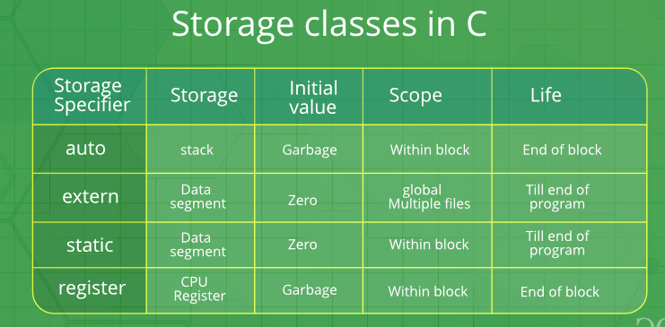

# <p align="center">**Storage Classes - Các kiểu lưu trữ dữ liệu**</p>



Ngôn ngữ C có 4 storage classes:
- auto
- extern
- static
- register

## **1. auto**
Là storage class mặc định cho tất cả các biến được khai báo bên trong một hàm hoặc một "khối" (block). 

Ví dụ:

```C
int main() {
    auto char a;    // storage class của a là auto.
    char b;         // storage class mặc định của b là auto.
    return 0;
}
```

Lưu ý: nếu ta khai báo một biến auto ở phạm vi toàn cục (global), tức là không nằm trong bất kỳ hàm nào hay khối lệnh (block) nào thì trình biên dịch sẽ báo lỗi.

Ví dụ: biên dịch chương trình sau sẽ bị báo lỗi
```C
auto int x;         // báo lỗi ở đây.
int main() {
    return 0;
}
```

## **2. extern**
Biến có storage class "extern" nói cho biết rằng biến được định nghĩa ở bất kỳ đâu trong chương trình mà không phải nằm trong một "hàm" (function) hay một "khối" (block).

Giá trị có thể được gán ở một "khối" và sau đó bị thay đổi trong khối khác.

Ví dụ:
```C
#include <stdio.h>

int x = 10;         // Khai báo biến toàn cục x.
int main() {
    extern int x;   // Nói cho biết x đã được định nghĩa (define) 
                    // ở đâu đó trong chương trình mà không 
                    // thuộc phạm vi một hàm hay khối lệnh.

    printf("x = %d", x);    // x sẽ bằng 10 ở đây.
    return 0;
}
```

Có thể bạn sẽ thắc mắc rằng với chương trình trên, tại sao cần từ khóa extern. Lý do là, nếu không có từ khóa extern, trong hàm main sẽ làm chương trình tạo thêm 1 biến x.

Ví dụ:
```C
#include <stdio.h>

int x = 10;                 // Khai báo biến toàn cục x.
int main() {
    int x;                  // Tạo thêm 1 biến cục bộ x.
    printf("x = %d", x);    // x này sẽ khác 10.
    return 0;
}
```

Ở ví dụ này, chúng ta có thể sử dụng x mà không cần khai báo trong hàm main như sau:
```C
#include <stdio.h>

int x = 10;                 // Khai báo biến toàn cục x.
int main() {
    // int x;               // Không khai báo x.
    printf("x = %d", x);    // x này sẽ bằng 10.
    return 0;
}
```

Tuy nhiên, trong dự án thực tế, bạn sẽ có nhiều file source code `*.c`. Trong một file, bạn define một biến "x", rồi trong những file khác bạn lại muốn sử dụng biến đó, trường hợp này bạn phải sử dụng "extern". Vì chúng ta chưa học cách viết code trên nhiều file source code `*.c`, nên thử ví dụ sau:

```C
#include <stdio.h>

int main() {
    extern int x;
    printf("x = %d", x);    // Không lỗi vì đã khai báo x trước khi sử dụng.
    printf("y = %d", y);    // Lỗi vì chưa khai báo y trước khi sử dụng.
    return 0;
}

int x = 10;
int y = 20;
```

## **3. static**
Biến "static" là biến được khai báo với từ khóa "static" và có 2 đặc tính sau:
- Biến là cục bộ đối với một hàm hoặc một file "*.c".
- Giữ giá trị của nó ngay cả khi bạn thoát ra khỏi phạm vi của nó.

Ví dụ:
```C
#include <stdio.h>

static int a;   // biến static a cục bộ trong file main.c

void myFunction() {
    static int b;   // biến static b cục bộ trong hàm myFunction.
    b++;
    printf("%d\n", b);
}

int main() {
    myFunction();
    myFunction();
    myFunction();
    return 0;
}

int x = 10;
```

Output của ví dụ:
```
1
2
3
```

## **4. register**
Giống với biến "auto", tuy nhiên chương trình sẽ cố lưu trữ các biến "register" trong thanh ghi của vi xử lý nếu có thể, để làm cho việc truy cập các biến này nhanh hơn nhiều lần.