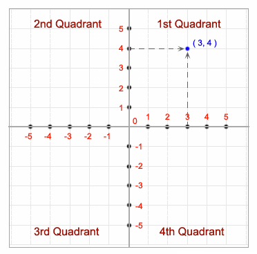
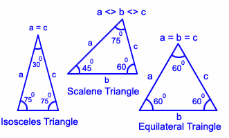

# <p align="center"> **`if/else` statement & Logical Operators & Relational Operators**</p>

## **Problem 1: Absolute of a substraction**

### **Objective**
Absolute of a number n is:
- n if (n >= 0)
- -n if (n < 0).

E.g:
- Absolute of (3 - 2):
    + |3| = |1| = 1
- Absolute of (2 - 3):
    + |2 - 3| = |-1| = 1

### **Task**
- Write a C program to calculate absolute of a substraction.
    - Input: integers a and b.
    - Output: absolute of (a - b).

### **Example**
```
a = 3
b = 5
|a - b| = 2
```
### **Solution**
```C
#include <stdio.h>

int main() {
    int a, b;
    int sub, abs;
    printf("a = ");
    scanf("%d", &a);
    printf("b = ");
    scanf("%d", &b);
    sub = a - b;
    if (sub < 0)
        abs = -sub;
    printf("|a - b| = %d\n", abs);
        
    return 0;
}
```
<div style="page-break-after: always;"></div>


## **Problem 2: Truth value of AND, OR** 

### **Task**
- Write a C program to calculate the truth value of the ‘and’ and ‘or’ operations for integers a and b.
    + Input: integer numbers `a` and `b`.
    + Output: 
        + truth value of `a` and `b`
        + truth value of `a` or `b`

### **Example**
```
a = 1
b = 0
a AND b = 0
a OR b = 1
```

### **Solution**
```C
#include <stdio.h>

int main() {
    int a = 0;
    int b = 0;

    printf("a = ");
    scanf("%d", &a);

    printf("b = ");
    scanf("%d", &b);

    // Calculate the 'and' operation
    int result_and = a && b;

    // Calculate the 'or' operation
    int result_or = a || b;

    printf("a AND b = %d\n", result_and);
    printf("a OR b = %d\n", result_or);

    return 0;
}
```
<div style="page-break-after: always;"></div>

## **Problem 3: Truth value of And, Or (2)** 

### **Objective**
The truth table for the logical OR operator is as follows:

| a     | b     | a or b |
|-------|-------|--------|
| T     | T     | T      |
| T     | F     | T      |
| F     | T     | T      |
| F     | F     | F      |

(T means "True" and F means "False")

The truth table for the logical AND operator is as follows:

| a     | b     | a and b |
|-------|-------|---------|
| T     | T     | T       |
| T     | F     | F       |
| F     | T     | F       |
| F     | F     | F       |

(T means "True" and F means "False")

### **Task**
- Write a C program to calculate the truth value of the ‘and’ and ‘or’ operations for a and b.
    + Input: Truth value of `a` and truth value of `b` (T/F).
    + Output: Truth values of
        + `a` or `b`
        + `a` and `b`

### **Example**
```
a = T
b = F
a AND b = F
a OR b = T
```

### **Solution**
```C
#include <stdio.h>

int main() {
    char truthValueA;
    char truthValueB;
    char truthValueOr;
    char truthValueAnd;

    int num_a;
    int num_b;
    int num_or;
    int num_and;

    printf("a = ");
    scanf(" %c", &truthValueA);

    printf("b = ");
    scanf(" %c", &truthValueB);

    // Convert truthValueA to num_a
    if (truthValueA == 'T')
        num_a = 1;
    else
        num_a = 0;

    // Convert truthValueB to num_b
    if (truthValueB == 'T')
        num_b = 1;
    else
        num_b = 0;

    // Calculate the 'or' operation
    num_or = num_a || num_b;

    // Calculate the 'and' operation
    num_and = num_a && num_b;


    // Convert num_or to truthValueOr
    if (num_or)
        truthValueOr = 'T';
    else
        truthValueOr = 'F';

    // Convert num_and to truthValueAnd
    if (num_and)
        truthValueAnd = 'T';
    else
        truthValueAnd = 'F';

    printf("a AND b = %c\n", truthValueOr);
    printf("a OR b = %c\n", truthValueAnd);

    return 0;
}
```
<div style="page-break-after: always;"></div>


## **Problem 4: Even number and odd number** 

### **Task**
- Write a C program to check whether a given number is even or odd.
    + Input: an integer number.
    + Output: "even" or "odd".

### **Examples**

```
Input an integer: 3
3 is an odd integer
```

```
Input an integer: 10
10 is an even integer
```

### **Solution**
```C
#include <stdio.h>

int main()
{
    int num;   

    printf("Input an integer: ");   
    scanf("%d", &num);   

    if (num % 2 == 0) 
        printf("%d is an even integer\n", num);
    else
        printf("%d is an odd integer\n", num);
    return 0;
}
```
<div style="page-break-after: always;"></div>


## **Problem 5: Weather information** 

### **Task**
- Write a C program to read temperature in centigrade and display a suitable message according to the temperature state below:
    + < 0 then "Freezing weather"
    + 0-10 then "Very Cold weather"
    + 10-20 then "Cold weather"
    + 20-30 then "Normal in Temp"
    + 30-40 then "Its Hot"
    + \>=40 then "Its Very Hot"

### **Examples**

```
Input days temperature : 25
Normal in temp.
```

```
Input days temperature : 41
Its very hot.
```

### **Solution**
```C
#include <stdio.h>

void main()
{
    int tmp = 0;

    printf("Input days temperature : ");
    scanf("%d", &tmp);

    if (tmp < 0)
        printf("Freezing weather.\n");
    else if (tmp < 10)
        printf("Very cold weather.\n");
    else if (tmp < 20)
        printf("Cold weather.\n");
    else if (tmp < 30)
        printf("Normal in temp.\n"); 
    else if (tmp < 40)
        printf("Its Hot.\n");
    else
        printf("Its very hot.\n");
}
```
<div style="page-break-after: always;"></div>


## **Problem 6: Positive and negative** 

### **Task**
- Write a C program to check whether a sum of 2 numbers is positive or negative.
    + Input: 2 integer numbers: a and b.
    + Output: "positive" or "negative" or "neither positive nor negative.

### **Examples**
```
a = 3
b =  -5
sum = -2 is a negative integer
```

```
a = 3
b =  -3
sum = 0 is neither positive nor negative
```

### **Solution**

```C
#include <stdio.h>

int main()
{
    int a = 0, b = 0;   
    int sum = 0;

    printf("a = ");   
    scanf("%d", &a);   

    printf("b =  ");   
    scanf("%d", &b);  

    sum = a + b;

    if (sum > 0) 
        printf("sum = %d is a positive integer\n", sum);
    else if (a + b < 0)
        printf("sum = %d is a negative integer\n", sum);
    else
        printf("sum = %d is neither positive nor negative\n", sum);

    return 0;
}
```
<div style="page-break-after: always;"></div>


## **Problem 7: Quadrant**

### **Objective**

In coordinate system, horizontal axis is Ox and vertical axis is Oy. There are 4 quadrants. For example, the following picture presents a point (3, 4) in 1st quadrant.



### **Task**
- Write a C program to find out which quadrant a point is in.
    + Input: x and y of a point (floating-point numbers).
    + Output: Display one of the following cases:
        + The quadrant name if the point lies in a specific quadrant.
        + The point lies at the origin.
        + The point lies on the x-axis.
        + The point lies on the y-axis.
        

### **Examples**
**Example 1**
```
x = 3
y = 2
The point (3.00,2.00) lies in the First quadrant.
```

**Example 2**
```
x = 3.2
y = 0
The point (3.20,0.00) lies on the x-axis.
```

**Example 3**
```
x = 0
y = 0
The point (0.00,0.00) lies at the origin.
```

### **Solution**
```C
#include <stdio.h>

void main()
{
    float x, y;

    printf("x = ");
    scanf("%f", &x);
    printf("y = ");
    scanf("%f", &y);
    
    if (x > 0 && y > 0)   
        printf("The point (%.2f,%.2f) lies in the First quadrant.\n", x, y);
    else if (x < 0 && y > 0)   
        printf("The point (%.2f,%.2f) lies in the Second quadrant.\n", x, y); 
    else if (x < 0 && y < 0)   
        printf("The point (%.2f,%.2f) lies in the Third quadrant.\n", x, y);
    else if (x > 0 && y < 0)
        printf("The point (%.2f,%.2f) lies in the Fourth quadrant.\n", x, y); 
    else if (x == 0 && y != 0)
        printf("The point (%.2f,%.2f) lies on the y-axis.\n", x, y); 
    else if (x != 0 && y == 0)
        printf("The point (%.2f,%.2f) lies on the x-axis.\n", x, y); 
    else
        printf("The point (%.2f,%.2f) lies at the origin.\n", x, y);
}

```
<div style="page-break-after: always;"></div>


## **Problem 8: Alphabet, digit and special character**

### **Task**
- Write a C program to check whether a character is an alphabet, digit or special character.
    + Input: any readable character.
    + Output: one of the followings
        + is an alphabet.
        + is a digit.
        + is a special character.

### **Examples**

**Example 1**

```
Enter any character: F
'F' is an alphabet.
```

**Example 2**
```
Enter any character: 7
'7' is a digit.
```

**Example 3**
```
Enter any character:!
'!' is a special character.
```

### **Solution**

**Method 1: Using ASCII values**
```C
#include <stdio.h>

int main() {
    char ch;
    printf("Enter any character: ");
    scanf("%c", &ch);

    if ((ch >= 97 && ch <= 122) || (ch >= 65 && ch <= 90)) {
        printf("'%c' is an alphabet.\n", ch);
    } else if (ch >= 48 && ch <= 57) {
        printf("'%c' is a digit.\n", ch);
    } else {
        printf("'%c' is a special character.\n", ch);
    }

    return 0;
}
```

**Method 2: Using Character Ranges**
```C
#include <stdio.h>

int main() {
    char ch;
    printf("Enter any character: ");
    scanf("%c", &ch);

    if ((ch >= 'a' && ch <= 'z') || (ch >= 'A' && ch <= 'Z')) {
        printf("'%c' is an alphabet.\n", ch);
    } else if (ch >= '0' && ch <= '9') {
        printf("'%c' is a digit.\n", ch);
    } else {
        printf("'%c' is a special character.\n", ch);
    }

    return 0;
}
```
<div style="page-break-after: always;"></div>


## **Problem 9: Sides of triangle**

### **Objective**
For any three positive real numbers (side lengths) a, b, and c, they can form a triangle if and only if the sum of the lengths of any two sides is greater than the length of the third side:
- (a + b > c)
- (a + c > b)
- (b + c > a)

### **Task**
- Write a C program to check if three sides can form a triangle.
    + Input: 3 sides (floating-point numbers).
    + Output:
        + "These sides can form a triangle". Or:
        + "These sides cannot form a triangle."

### **Example**
```
Lengths of three sides: 3.3 6.7 10.1
Cannot form a triangle.
```

```
Lengths of three sides: 3.3 6.7 9.5
Can form a triangle.
```

### **Solution**

```C
#include <stdio.h>

int main() {
    float a, b, c;
    printf("Lengths of three sides: ");
    scanf("%f %f %f", &a, &b, &c);

    if ((a + b > c) && (a + c > b) && (b + c > a))
        printf("Can form a triangle.\n");
    else
        printf("Cannot form a triangle.\n");

    return 0;
}
```
<div style="page-break-after: always;"></div>


## **Problem 10: Equilateral, Isosceles or Scalene**

### **Task**
- Write a C program to check whether a triangle is Equilateral, Isosceles or Scalene.
    + Input: 3 sides (floating-point numbers).
    + Output: Equilateral, Isosceles or Scalene.



### **Examples**

```
Input three sides of triangle: 3.3 6.7 12
Cannot form a triangle.
```

```
Input three sides of triangle: 3.3 6.7 8
This is a scalene triangle.
```

```
Input three sides of triangle: 3.3 3.3 5
This is an isosceles triangle.
```

### **Solution**
```C
#include <stdio.h>  // Include the standard input/output header file.

int main()  
{  
    float sidea = 0, sideb = 0, sidec = 0;

    printf("Input three sides of triangle: ");  
    scanf("%f %f %f", &sidea, &sideb, &sidec); 

    if ((sidea + sideb > sidec) && (sidea + sidec > sideb) && (sideb + sidec > sidea))
    {
        if(sidea == sideb && sideb == sidec)
        {  
            printf("This is an equilateral triangle.\n");
        }  
        else if(sidea == sideb || sidea == sidec || sideb == sidec) 
        {  
            printf("This is an isosceles triangle.\n"); 
        }  
        else
        {  
            printf("This is a scalene triangle.\n"); 
        }  
    }
    else
        printf("Cannot form a triangle.\n");

    return 0;  
}
```
<div style="page-break-after: always;"></div>


## **Problem 11: Max and min of 3 integer numers** 

### **Task**
- Write a C program to find max and min of 3 integers.
    + Input: 3 integer numbers.
    + Output: max and min.

### **Example**
```
a = 10
b = 3
c = 7
max = 10
min = 3
```

### **Solution**
```C
#include <stdio.h>

int main() {
    int a = 0, b = 0, c = 0;
    int max = 0, min = 0;

    printf("a = ");
    scanf("%d", &a);

    printf("b = ");
    scanf("%d", &b);

    printf("c = ");
    scanf("%d", &c);

    // Calculate max:
    max = a;
    if (max < b)
        max = b;

    if (max < c)
        max = c;

    // Calculate min:
    min = a;
    if (min > b)
        min = b;

    if (min > c)
        min = c;

    // Results:
    printf("max = %d\n", max);
    printf("min = %d\n", min);
    
    return 0;
}
```
<div style="page-break-after: always;"></div>

## **Problem 12: first-degree equation** 

### **Task**
- Write a C program to solve a first-degree equation of the form (ax + b = 0). Let’s break it down:
    + Input: a and b (floating-point numbers).
    + Output: 
        + If there is no solution, print out "No solution!".
        + If there are infinite solutions, print out "Infinite solutions!".
        + If there is solution, print out the soution rounded to 4 decimal places.

### **Examples**

**Example 1**
- There is solution:
```
Equation: ax + b = 0
Enter the coefficient a: 3
Enter the coefficient b: 2
Solution: x = -0.67
```

**Example 2**
- There are infinite solutions:
```
Equation: ax + b = 0
Enter the coefficient a: 0
Enter the coefficient b: 0
Infinite solutions.
```

**Example 3**
- There is no solution:
```
Equation: ax + b = 0
Enter the coefficient a: 0
Enter the coefficient b: -3
No solution.
```

### **Solution**
```C
#include <stdio.h>

int main() {
    float a, b, x;

    printf("Equation: ax + b = 0\n");

    printf("Enter the coefficient a: ");
    scanf("%f", &a);

    printf("Enter the coefficient b: ");
    scanf("%f", &b);

    if (a == 0) {
        if (b == 0) {
            printf("Infinite solutions.\n");
        } else {
            printf("No solution.\n");
        }
    } else {
        x = -b / a;
        printf("Solution: x = %.2f\n", x);
    }

    return 0;
}

```
<div style="page-break-after: always;"></div>

## **Problem 13: Quadratic Equation** 

### **Objective**: Solving Quadratic Equations

- In this practice, we aim to create a C program that can solve quadratic equations (a*x^2 + b*x + c = 0). The program will prompt the user to input the coefficients a, b, and c of the quadratic equation, calculate the discriminant, and then display the roots (if they exist) of the equation. We assume that the roots are real and distinct.

- To solve a quadratic equations, the program will follow these steps:
    - Calculate the discriminant: discriminant = b^2 - 4ac.
    - Based on the value of the discriminant:
        + If the discriminant is greater than 0, there are 2 roots:
            ```
            root1 = (-b + sqrt(discriminant)) / (2 * a);
            root2 = (-b - sqrt(discriminant)) / (2 * a);
            ```
        + If the discriminant is equal to 0, there is single root:
            ```
            root1 = root2 = -b / (2 * a);
            ```
        + If the discriminant is less than 0, there is no real root.

### **Task**
- Write a C program to solve a quadratic equation: ax^2 + bx + c = 0, with the condition that ‘a’ is not equal to 0.
    + Input: a, b and c (floating-point numbers).
    + Output: 
        + If there is no real roots, print out "No real roots!".
        + If there is single root, print out "root1 = root2 = ...".
        + If there are 2 roots, print out the roots.

### **Examples**

**Example 1**

```
Equation: ax^2 + bx + c = 0, (a is not zero).
a = 1
b = 2
c = -3
root1 = 1.00 and root2 = -3.00
```

**Example 2**

```
Equation: ax^2 + bx + c = 0, (a is not zero).
a = 1
b = -6
c = 9
root1 = root2 = 3.00
```

**Example 3**

```
Equation: ax^2 + bx + c = 0, (a is not zero).
a = 1
b = 1
c = 5
No real roots!
```

### **Solution**
```C
#include <math.h>
#include <stdio.h>

int main() {
    double a, b, c, discriminant, root1, root2;


    printf("Equation: ax^2 + bx + c = 0, (a is not zero).\n");

    printf("a = ");
    scanf("%lf", &a);

    printf("b = ");
    scanf("%lf", &b);

    printf("c = ");
    scanf("%lf", &c);


    // Check if a is equals to zero
    if (a == 0) {
        printf("a cannot be zero!\n");
        return 0;
    }

    discriminant = b * b - 4 * a * c;

    // Condition for real and distinct roots
    if (discriminant > 0) {
        root1 = (-b + sqrt(discriminant)) / (2 * a);
        root2 = (-b - sqrt(discriminant)) / (2 * a);
        printf("root1 = %.2lf and root2 = %.2lf\n", root1, root2);
    }
    // Condition for real and equal roots
    else if (discriminant == 0) {
        root1 = root2 = -b / (2 * a);
        printf("root1 = root2 = %.2lf\n", root1);
    }
    // No real roots
    else {
        printf("No real roots.\n");
    }

    return 0;
}
```
<div style="page-break-after: always;"></div>