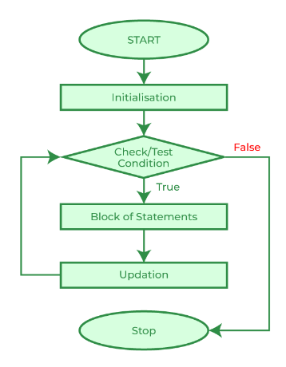
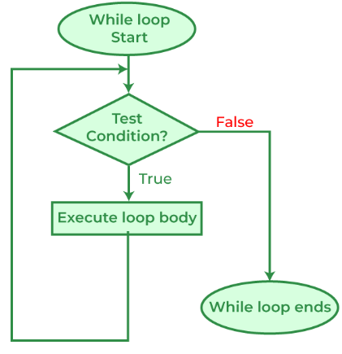
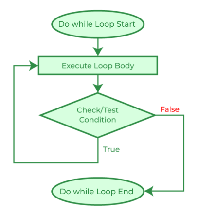

# <p align="center">**Vòng lặp - Loops**</p>

## **Khái niệm về "vòng lặp" (loop) và "lần lặp" (iteration)**
Trong C, Vòng lặp (loop) sẽ thực hiện lặp đi lặp lại các tác vụ nằm trong một khối lệnh(code block) cho đến khi một điều kiện nào đó không còn đúng nữa thì mới dừng. Mỗi một lần thực hiện khối lệnh gọi là một "lần lặp" (iteration).

## **1. for loop**
### **1.1. Cú pháp for loop**
```C
for (init_expression; condition; loop_expression) code_block
```
hoặc:
```C
for (init_expression; condition; loop_expression) 
    code_block
```

Luồng hoạt động của cấu trúc for:
- **Bước 1:** Thực thi init_expression (một lần duy nhất).
- **Bước 2:** Kiểm tra điều kiện, nếu đúng thì thực thi code_block (bước 3), nếu sai thì thoát khỏi cấu trúc for.
- **Bước 3:** Thực thi một "lần lặp" (iteration): thực thi code_block.
- **Bước 4:** Thực thi loop_expression.
- **Bước 5:** Nhảy về bước 2.

<p align="center">

</p>

Ví dụ 1:

```C
#include <stdio.h>

int main() {
    for (int i = 0; i < 10; i++) {
        printf("%d", i);
    }
    return 0;
}
```
Output của ví dụ 1:
```
0123456789
```

Ví dụ 2:
```C
#include <stdio.h>

int main() {
    for (int i = 9; i >= 0; i = i - 2) {
        printf("%d", i);
    }
    return 0;
}
```

Output của ví dụ 2:
```
97531
```

### **1.2. break**
"break" statement làm chương trình thoát khỏi cấu trúc for loop ngay lập tức.

Ví dụ:
```C
#include <stdio.h>

int main() {
    for (int i = 0; i < 10; i++) {
        printf("%d", i);
        if (i == 7)
            break;
    }
    return 0;
}
```
Output của ví dụ:
```
01234567
```

### **1.3. continue**
Trước hết, xem lại luồng hoạt động của for:
- **Bước 1:** Thực thi init_expression;
- **Bước 2:** Kiểm tra điều kiện (condition), nếu đúng thì thực hiện tiếp bước dưới, nếu sai thì thoát khỏi cấu trúc for.
- **Bước 3:** Thực thi một "lần lặp" (iteration): thực thi code_block.
- **Bước 4:** Thực thi loop_expression.
- **Bước 5:** Nhảy về bước 2.

"**continue**" statement làm chương trình bỏ qua các dòng code ngay phía dưới nó để nhảy tới phần "condition" (bước 2) ngay lập tức.

Ví dụ:
```C
#include <stdio.h>

int main() {
    for (int i = 0; i < 10; i++) {
        if (3 <= i && i <= 6)
            continue;
        printf("%d", i);
    }
    return 0;
}
```

Output của ví dụ:
```
012789
```


## **2. while loop**

### **2.1. Cú pháp for loop**

```C
while (condition) code_block
```
hoặc:
```C
while (condition)
    code_block
```

Luồng hoạt động của cấu trúc "while":
- **Bước 1:** Kiểm tra điều kiện, nếu đúng thì thực thi code_block (bước 3), nếu sai thì thoát khỏi cấu trúc "while".
- **Bước 2:** Thực thi một "lần lặp" (iteration): thực thi code_block.
- **Bước 3:** nhảy về bước 1.

<p align="center">

</p>

Ví dụ:
```C
#include <stdio.h>

int main() {
    int i = 0;
    while (i < 10) {
        printf("%d", i++);
    }
    return 0;
}
```

Output của ví dụ
```
0123456789
```

### **2.2. break**
"break" statement làm chương trình thoát khỏi cấu trúc while loop ngay lập tức.

Ví dụ:
```C
#include <stdio.h>

int main() {
    int i = 0;
    while (i < 10) {
        printf("%d", i++);
        if (i == 7)
            break;
    }
    return 0;
}
```

Output của ví dụ
```
0123456
```

### **2.3. continue**

"**continue**" statement làm chương trình bỏ qua các dòng code ngay phía dưới nó để nhảy tới phần "condition" (bước 2) ngay lập tức.

Ví dụ:
```C
#include <stdio.h>

int main() {
    int i = 0;
    while (i < 10) {
        if (3 <= i && i <= 6) {
            i++;
            continue;
        }
        printf("%d", i++);
    }
    return 0;
}
```

Output của ví dụ:
```
012789
```

## **3. do/while loop**
**do/while** statement rất giống **while** statement. Điểm khác biệt là bước đầu tiên do/while sẽ thực thi code_block rồi mới kiểm tra điều kiện (condition).

### **3.1. Cúp pháp do/while loop**

```C
do code_block while(condition);     // Lưu ý: có dấu ; sau (condition)
```
hoặc
```C
do code_block
while (condition);                  // Lưu ý: có dấu ; sau (condition)
```

Luồng hoạt động của cấu trúc **do/while**:
- **Bước 1:** Thực thi một "lần lặp" (iteration): thực thi code_block.
- **Bước 2:** Kiểm tra điều kiện, nếu đúng thì nhảy về bước 1, nếu sai thì thoát khỏi cấu trúc while.

<p align="center">

</p>

Ví dụ
```C
#include <stdio.h>

int main() {
    int i = 0;
    do {
        printf("%d", i++);
    } while (i < 10);
    return 0;
}
```
Output của ví dụ:
```
0123456789
```
### **3.2. break**
Tương tự trong while statement.

### **3.3. continue**
Tương tự trong while statement.

