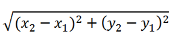
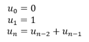

# <p align="center">**Function**</p>

## **Problem 1: Size of some basic data types**

### **Task**
- Complete the sample code below, defining a function in C to to display size of the following data types:
    + char
    + unsigned char
    + short
    + unsigned short
    + int
    + unsigned int
    + long
    + unsigned long
    + float
    + double

### **Sample Code**
```C
#include <stdio.h>

/**
 * @brief : displays size of data types
 */
// Define you function displaySizeOfDataTypes here

int main() 
{
    // call displaySizeOfDataTypes here

    return 0;
}
```

### Expected Output
```
size of char: 1
size of unsigned char: 1
size of short: 2
size of unsigned short: 2
size of int: 4
size of unsigned int: 4
size of long: 4
size of unsigned long: 4
size of float: 4
size of double: 8
```

### Solution
```C
#include <stdio.h>

/**
 * 
 * @brief : displays size of data types
 */
void displaySizeOfDataTypes()
{
    printf("size of char: %ld\n", sizeof(char));
    printf("size of unsigned char: %ld\n", sizeof(unsigned char));
    printf("size of short: %ld\n", sizeof(short));
    printf("size of unsigned short: %ld\n", sizeof(unsigned short));
    printf("size of int: %ld\n", sizeof(int));
    printf("size of unsigned int: %ld\n", sizeof(unsigned int));
    printf("size of long: %ld\n", sizeof(long));
    printf("size of unsigned long: %ld\n", sizeof(unsigned long));
    printf("size of float: %ld\n", sizeof(float));
    printf("size of double: %ld\n", sizeof(double));
}

int main() 
{
    displaySizeOfDataTypes();

    return 0;
}
```
<div style="page-break-after: always;"></div>

## **Problem 2: Function to check if a number is even**

### Task
- Complete the sample code below, defining a function in C to check if a given number is even or odd using the function.
    + Input: integer n.
    + Output: displays if n is even or odd.

### Sample Code
```C
#include <stdio.h>
 
/**
 * @param  {int} n : the number which needs checking
 * @return {int}   : 1 if even, 0 if odd.
 */
// define the function checkOddEven here

int main()
{
    int n;
	printf("Function : check the number is even or odd:\n");
    printf("Input any number : ");
    scanf("%d", &n);

    // Combine if/else statement with the function checkOddEven() 
    // to display if the number is even or odd:
    
    return 0;
}
```

### Example
```
Function : check the number is even or odd:
Input any number : 7
The entered number is odd.
```

### Solution
```C
#include <stdio.h>

/**
 * @param  {int} n : the number which needs checking
 * @return {int}   : 1 if even, 0 if odd.
 */
int checkOddEven(int n)
{   
    return (n & 1);//The & operator does a bitwise and,
}

int main()
{
    int n1;
	printf("Function : check the number is even or odd:\n");	     
    printf("Input any number : ");
    scanf("%d", &n);

    // Combine if/else statement with the function checkOddEven() 
    // to display if the number is even or odd:
    if(checkOddEven(n))
    {
        printf("The entered number is odd.\n");
    }
    else
    {
        printf("The entered number is even.\n");
    }
    return 0;
}
```
<div style="page-break-after: always;"></div>


## **Problem 3: Perimeter and area of a circle**

### Task
- Complete the sample code below, defining a function in C to compute the perimeter and area of a circle with a given radius.
    + Inpput: radius of the circle.
    + Output: perimeter and area.

### Sample Code
```C
#include <stdio.h>

/**
 * @brief: Calculate perimeter from radius
 * @param  {float} radius
 * @return {float}: perimeter of the circle
 */
// define function getPerimeter here

/**
 * @brief: Calculate area from radius
 * @param {float} radius
 * @return {float}: area of the circle
 */
//define function getArea here

int main() {
    float radius = 0;

    /* Inputting the radius of the circle */
    printf("radius = ");
    scanf("%f", &radius);

    // Call getPerimeter and display the perimeter here

    // Call getArea and display the area here

   return 0;
}
```

### Example
```
radius = 10
perimeter = 62.799999 inches
area = 314.000000 square inches
```

### Solution
```C
#include <stdio.h>

/**
 * @brief: Calculate perimeter from radius
 * @param  {float} radius
 * @return {float}: perimeter of the circle
 */
float getPerimeter(float radius)
{
    return 2 * 3.14 * radius;
}

/**
 * @brief: Calculate area from radius
 * @param {float} radius
 * @return {float}: area of the circle
 */
float getArea(float radius)
{
    return 3.14 * radius * radius;
}

int main() {
    float radius = 0;

    /* Inputting the radius of the circle */
    printf("radius = ");
    scanf("%f", &radius);

    printf("perimeter = %f inches\n", getPerimeter(radius));
    printf("area = %f square inches\n", getArea(radius));

   return 0;
}
```
<div style="page-break-after: always;"></div>


## **Problem 4: Functions in `math.h`**

### Task
- Research and write examples of using some common functions in the ‘math.h’ library.

### Sample Code
```C
#include <stdio.h>
#include <math.h>

int main() {
    double num = 25.0;
    double result = sqrt(num);
    printf("Square root of %.2f is %.2f\n", num, result);
    return 0;
}
```

```C
#include <stdio.h>
#include <math.h>

int main() {
    double base = 2.0;
    double exponent = 3.0;
    double result = pow(base, exponent);
    printf("%.2f raised to the power of %.2f is %.2f\n", base, exponent, result);
    return 0;
}
```

```C
#include <stdio.h>
#include <math.h>

int main() {
    double angle_degrees = 30.0;
    double angle_radians = angle_degrees * M_PI / 180.0;
    printf("sin(%.2f) = %.2f\n", angle_degrees, sin(angle_radians));
    printf("cos(%.2f) = %.2f\n", angle_degrees, cos(angle_radians));
    printf("tan(%.2f) = %.2f\n", angle_degrees, tan(angle_radians));
    return 0;
}
```

```C
#include <stdio.h>
#include <math.h>

int main() {
    double num = 100.0; // Example value

    // Exponential (e^x)
    double result_exp = exp(num);

    // Common logarithm (base 10)
    double result_log10 = log10(num);

    // Natural logarithm (base e)
    double result_log = log(num);

    printf("Exponential of %.2lf = %.2lf\n", num, result_exp);
    printf("Log10 of %.2lf = %.2lf\n", num, result_log10);
    printf("Log of %.2lf = %.2lf\n", num, result_log);

    return 0;
}
```
<div style="page-break-after: always;"></div>


## **Problem 5: The distance between two points**

### Objective

The formula of distance between two points is:



### Task
- Complete the sample code below, defining a function in C to calculate the distance between two points.
    + Input: (x1, y1) and (x2, y2).
    + Output: distance between two points.

### Sample Code
```C
#include <stdio.h>
#include <math.h>

// The following is just declaration of function getDistance.
// Define it at the end of the sample code
float getDistance(float x1, float y1, float x2, float y2);

int main() {
    float x1 = 0, y1 = 0, x2 = 0, y2 = 0;
    float squareDistance = 0, distance = 0;
    
    // Input point 1 (x1, y1)
    printf("Input x1: ");
    scanf("%f", &x1);
    printf("Input y1: ");
    scanf("%f", &y1);
    
    // Input point 2 (x2, y2)
    printf("Input x2: ");
    scanf("%f", &x2);
    printf("Input y2: ");
    scanf("%f", &y2);
        
    // Display the distance:
    printf("Distance between the said points: %.4f", getDistance(x1, y1, x2, y2));
    printf("\n");

    return 0;
}

/**
 * @brief : Calculate distance between 2 points
 * @param  {float} x1 : x-axis (horizontal) of 1st point
 * @param  {float} y1 : y-axis (vertical) of 1st point
 * @param  {float} x2 : x-axis (horizontal) of 2nd point
 * @param  {float} y2 : y-axis (vertical) of 2nd point
 * @return {float}    : distance of 2 points
*/
// Define getDistance here:
```

### Example
- Assume that (x1, y2) = (0, 0) and (x2, y2) = (4, 3).  The input and output will be displayed as the followings:

```
Input x1: 0
Input y1: 0
Input x2: 4
Input y2: 3
Distance = 5.0000
```

### Solution
```C
#include <stdio.h>
#include <math.h>

// The following is just declaration of function getDistance.
// Define it at the end of the sample code
float getDistance(float x1, float y1, float x2, float y2);

int main() {
    float x1 = 0, y1 = 0, x2 = 0, y2 = 0;
    float squareDistance = 0, distance = 0;
    
    // Input point 1 (x1, y1)
    printf("Input x1: ");
    scanf("%f", &x1);
    printf("Input y1: ");
    scanf("%f", &y1);
    
    // Input point 2 (x2, y2)
    printf("Input x2: ");
    scanf("%f", &x2);
    printf("Input y2: ");
    scanf("%f", &y2);
        
    // Display the distance:
    printf("Distance between the said points: %.4f", getDistance(x1, y1, x2, y2));
    printf("\n");

    return 0;
}

/**
 * @brief : Calculate distance between 2 points
 * @param  {float} x1 : x-axis (horizontal) of 1st point
 * @param  {float} y1 : y-axis (vertical) of 1st point
 * @param  {float} x2 : x-axis (horizontal) of 2nd point
 * @param  {float} y2 : y-axis (vertical) of 2nd point
 * @return {float}    : distance of 2 points
 */
float getDistance(float x1, float y1, float x2, float y2)
{
    return sqrt((x1-x2)*(x1-x2) + (y1-y2)*(y1-y2));
}
```
<div style="page-break-after: always;"></div>


## **Problem 6: Function to calculate sum of 1/1 + 1/2 + ... + 1/n**

### Task
- Complete the sample code below, defining a function in C to find the sum of the series 1/1 + 1/2 + 1/3 + ... + 1/n and display it.
    + Input: integer n.
    + Output: the sum.

### Constraint:
- Don't use recursive functions.

### Sample Code
```C
#include <stdio.h>
 
// Declare function displaySum here

int main()
{
    int n = 0;

    printf("Input any number: ");
    scanf("%d", &n);
    
    // Call function displaySum here

    return 0;
}

/**
 * @brief: calculate sum of 1/1 + 1/2 + 1/3 + ... + 1/n.
 * @param  {int} n
 */
// Define function displaySum here
```

### Example
```
Input any number: 5
Sum = 2.283334
```

### Solution
```C
#include <stdio.h>
 
void displaySum(int n);

int main()
{
    int n = 0;

    printf("Input any number: ");
    scanf("%d", &n);
    displaySum(n);

    return 0;
}

/**
 * @brief: calculate sum of 1/1 + 1/2 + 1/3 + ... + 1/n.
 * @param  {int} n
 */
void displaySum(int n)
{   
    int i = 0;
    float sum = 0;
    for (i = 1; i <= n; i++) {
        sum += 1.0/i;
    }

    printf("Sum = %f", sum);
}
```
<div style="page-break-after: always;"></div>


## **Problem 7: Function to calculate sum of odd numbers**

### Task
- Complete the sample code below to calculate odd numbers among `n` integer numbers. 
    + Input: n.
    + Output: sum of odd numbers

### Sample Code
```C
#include <stdio.h>

// Declare function calculateSumOfOdds here

int main() {
    int n = 0;
    int i = 0;

    int sumOfOdds = 0;

    printf("n = ");
    scanf("%d", &n);

    // call calculateSumOfOdds here and assign the return value to sumOfOdds

    printf("sum of the odd numbers: %d\n", sumOfOdds);

    return 0;
}

/**
 * @brief : allow user to input n integer numbers, then calculate sum of all
 *          odd numbers among the input numbers.
 * @param  {int} n : number of numbers to be entered.
 * @return {int}   : sum of odd numbers among the input numbers.
 */
// Define function calculateSumOfOdds here
```

### Example
```
n = 10
input number 1: 1
input number 2: 3
input number 3: 7
input number 4: 2
input number 5: 4
input number 6: 8
input number 7: 10
input number 8: 6
input number 9: 2
input number 10: 4
sum of the odd numbers: 11
```

### Solution
```C
#include <stdio.h>

int calculateSumOfOdds(int n);

int main() {
    int n = 0;
    int i = 0;
    
    int sumOfOdds = 0;

    printf("n = ");
    scanf("%d", &n);

    sumOfOdds = calculateSumOfOdds(n);

    printf("sum of the odd numbers: %d\n", sumOfOdds);

    return 0;
}

/**
 * @brief : allow user to input n integer numbers, then calculate sum of all
 *          odd numbers among the input numbers.
 * @param  {int} n : number of numbers to be entered.
 * @return {int}   : sum of odd numbers among the input numbers.
 */
int calculateSumOfOdds(int n)
{
    int temp = 0;
    int sumOfOdds = 0;

    for (int i = 1; i <= n; i++) {
        printf("input number %d: ", i);
        scanf("%d", &temp);

        if (temp % 2 != 0)      // check if temp is an odd number
        {
            sumOfOdds += temp;
        }
    }

    return sumOfOdds;
} 
```
<div style="page-break-after: always;"></div>

## **Problem 8: Function to calculate sum of even numbers**

### Task
- Write a C program to calculate even numbers among `n` integer numbers. 
    + Input: n.
    + Output: sum of even numbers

### Solution:
- Refer to Problem 7
<div style="page-break-after: always;"></div>


## **Problem 9: Simple Caclulator**

### Task
- Complete the sample code below, giving Menu-Driven Program to perform a simple calculation
    + Input: 
        + an options among:
            1. addition (enter 1)
            2. substraction (enter 2)
            3. multiplication (enter 3)
            4. division (enter 4)
            5. Exit the program (enter 5)
        + 2 real numbers.
    + Output: a real number which is result of the calculation.
- When enter the option, if user enters an invalid number, ask him/her to enter again.

### Sample Code
```C
#include <stdio.h>

// declare function getOption here

// declare function doAddition here

// declare function doSubstraction here

// declare function doMultiplication here

// declare function doDivision here

int main() {
    float num1 = 0, num2 = 0, result = 0;
    int option = 0;

    option = getOption();

    if (option == 5) {
        printf("Exiting the program ...");
        return 0;
    }
    else {
        printf("1st number: ");
        scanf("%f",&num1);
        printf("2nd number: ");
        scanf("%f",&num2);
    }

    switch(option)  // Start a switch statement based on the user's choice.
    {
    case 1:
        doAddition(num1, num2);
        break;

    case 2:
        doSubstraction(num1, num2);
        break;

    case 3:
        doMultiplication(num1, num2);
        break;  

    case 4:
        doDivision(num1, num2);
        break;

    case 5: 
        break;  // Exit the program.
    }

    return 0;
}

/**
 * @brieft : display options (from 1 to 5) for user to select.
 * @return {int}  : option input by user
 */
// define function getOption here

/**
 * @brief : Display result of addition of 'a' and 'b'
 * @param  {float} a
 * @param  {float} b
 */
// define function doAddition here

/**
 * @brief : Display result of substraction of 'a' and 'b'
 * @param  {float} a
 * @param  {float} b
 */
// define function doSubstraction here

/**
 * @brief : Display result of multiplication of 'a' and 'b'
 * @param  {float} a
 * @param  {float} b
 */
// define function doMultiplication here

/**
 * @brief : Display result of division of 'a' and 'b'
 * @param  {float} a
 * @param  {float} b
 */
// define function doDivision here

```

### Example
- The first example demonstrates how a program prompts the user to input a valid number and displays the result of multiplication. The behavior of addition, subtraction, and division is similar to multiplication.

```
Input your option:
1-Addition.
2-Substraction.
3-Multiplication.
4-Division.
5-Exit.
z
The input is wrong format. Please input a valid option
Input your option:
1-Addition.
2-Substraction.
3-Multiplication.
4-Division.
5-Exit.
7
7 is an invalid option. Please input a valid option.
Input your option:
1-Addition.
2-Substraction.
3-Multiplication.
4-Division.
5-Exit.
1
1st number: 3.2
2nd number: 1
The Addition of  3.200000 and 1.000000 is: 4.200000
```

- The second example demonstrates what will happen when user select "exit".
```
Input your option :
1-Addition.
2-Substraction.
3-Multiplication.
4-Division.
5-Exit.
5
Exiting the program ...
```

- The third example demonstrates what will happen when a user attempts to divide by 0.
```
Input your option:
1-Addition.
2-Substraction.
3-Multiplication.
4-Division.
5-Exit.
4
1st number: 1.5
2nd number: 0
The second integer is zero. Divide by zero.
```

### Solution
```C
#include <stdio.h>

int getOption();

void doAddition(float a, float b);

void doSubstraction(float a, float b);

void doMultiplication(float a, float b);

void doDivision(float a, float b);

int main() {
    float num1 = 0, num2 = 0, result = 0;
    int option = 0;

    option = getOption();

    if (option == 5) {
        printf("Exiting the program ...");
        return 0;
    }
    else {
        printf("1st number: ");
        scanf("%f",&num1);
        printf("2nd number: ");
        scanf("%f",&num2);
    }

    switch(option)  // Start a switch statement based on the user's choice.
    {
    case 1:
        doAddition(num1, num2);
        break;

    case 2:
        doSubstraction(num1, num2);
        break;

    case 3:
        doMultiplication(num1, num2);
        break;  

    case 4:
        doDivision(num1, num2);
        break;

    case 5: 
        break;  // Exit the program.
    }

    return 0;
}

/**
 * @brieft : display options (from 1 to 5) for user to select.
 * @return {int}  : option input by user
 */
int getOption()
{
    int option = 0;

    // Display the menu for operation choice.
    while (1) {
        printf("Input your option:\n");
        printf("1-Addition.\n2-Substraction.\n3-Multiplication.\n4-Division.\n5-Exit.\n");

        if (scanf("%d",&option) == 0)
        {
            printf("The input is wrong format. Please input a valid option\n");
            // fflush(stdin);   // should not use this function because
                                // fflushing an input stream is undefined 
                                // behaviour
            int x = 0;
            while ( (x = getchar()) != EOF && x != '\n' );
            continue;
        }
        else if (option < 1 || option > 5)
        {
            printf("%d is an invalid option. Please input a valid option.\n", option);
            continue;
        }
        else
            break;
    }

    return option;
}

/**
 * @brief : Display result of addition of 'a' and 'b'
 * @param  {float} a
 * @param  {float} b
 */
void doAddition(float a, float b)
{
    printf("The Addition of  %f and %f is: %f\n", a ,b, a + b);
}

/**
 * @brief : Display result of substraction of 'a' and 'b'
 * @param  {float} a
 * @param  {float} b
 */
void doSubstraction(float a, float b)
{
    printf("The Substraction of %f  and %d is: %f\n", a, b, a - b);
}

/**
 * @brief : Display result of multiplication of 'a' and 'b'
 * @param  {float} a
 * @param  {float} b
 */
void doMultiplication(float a, float b)
{
    printf("The Multiplication of %f  and %f is: %f\n", a, b, a * b);
}

/**
 * @brief : Display result of division of 'a' and 'b'
 * @param  {float} a
 * @param  {float} b
 */
void doDivision(float a, float b)
{
    if(b == 0) 
    {
        printf("The second integer is zero. Divide by zero.\n");
    } 
    else 
    {
        printf("The Division of %f  and %d is : %f\n", a, b, a/b);
    }  
}
```
<div style="page-break-after: always;"></div>


## **Problem 10: max function and min function**

### Task
- Complete the sample code below, giving Menu-Driven Program to find max and min among n integer numbers. (Write one program using for loop and another using while loop).
    + Input:
        + an option among:
            1. max (enter 1)
            2. min (enter 2)
            3. Exit the program (enter 3)
        + n (integer)
        + n numbers to find max or min.
    + Output: max and min.

### Sample Code
```C
#include <stdio.h>

// Declare function promtUserToInputN here

// Declare function getOption here

// Declare function getMax here

// Declare function getMin here

// Declare function readInteger here

int main() {
    int n = promtUserToInputN();
    int option = getOption();

    switch(option) 
    {
        case 1:
            printf("max = %d\n", getMax(n));
            break;

        case 2:
            printf("min = %d\n", getMin(n));
            break;

        case 3:
            printf("Exiting the program ...");
            break;
    }
    
    return 0;
}

/**
 * @brief : allow user to input n - number of numbers. n must be a positive integer.
 * @return {int}  : n.
 */
// Define function promtUserToInputN here

/**
 * @brieft : display options (from 1 to 1) for user to select.
 * @return {int}  : option input by user
 */
// Define function getOption here

/**
 * @brief : allows user to input n numbers, then find the max number
 * @param {int} n : number of numbers which user will input
 * @return {int}  : max number among the input numbers
 */
int getMax(int n)
{
    int max;
    for (int i = 1; i <= n; i ++) 
    {
        int temp = readInteger(i);
        if (i == 1)             // If this is the first number which user inputs,
            max = temp;         // assign the first number to max.
        else if (max < temp)    // Else, compare the current max value with temp,
            max = temp;         // and assign temp value to max if max < temp.
        else                    // Else,
            ;                   // do nothing.
    }
    return max;
}

/**
 * @brief : allows user to input n numbers, then find the min number
 * @param {int} n : number of numbers which user will input
 * @return {int}  : min number among the input numbers
 */
int getMin(int n)
{
    int min;
    for (int i = 1; i <= n; i ++) 
    {
        int temp = readInteger(i);
        if (i == 1)             // If this is the first number which user inputs,
            min = temp;         // assign the first number to min.
        else if (min > temp)    // Else, compare the current min value with temp,
            min = temp;         // and assign temp value to min if min > temp.
        else                    // Else,
            ;                   // do nothing.
    }
    return min;
}

/**
 * @brief : read an integer
 * @param  {int} i : index which is displayed so that user will know the index of number. 
 * @return {int}   : the number which user enters.
 */
// Define function readInteger here
```

### Examples

- The first example shows the case in which the user decides to exit the program.
```
Input n (n > 0): 5
Input your option:
1-Max of n numbers.
2-Min of n numbers.
3-Exit.
3
Exiting the program ...
```

- The 2nd example shows the case in which the user input some wrong format, wrong valid and then select to find max.
```
Input n (n > 0): a
The input is wrong format. Please input a positive integer.
Input n (n > 0): 0
n must be greater than 0. Please input a positive integer.
Input n (n > 0): 5
Input your option:
1-Max of n numbers.
2-Min of n numbers.
3-Exit.
a
The input is wrong format. Please input a valid option
Input your option:
1-Max of n numbers.
2-Min of n numbers.
3-Exit.
1
Input number 1: 1
Input number 2: 2
Input number 3: 3
Input number 4: 5
Input number 5: 4
max = 5
```

### Solution
```C
#include <stdio.h>

int promtUserToInputN();

int getOption();

int getMax(int n);

int getMin(int n);

int readInteger(int i);

int main() {
    int n = promtUserToInputN();
    int option = getOption();

    switch(option) 
    {
        case 1:
            printf("max = %d\n", getMax(n));
            break;

        case 2:
            printf("min = %d\n", getMin(n));
            break;

        case 3:
            printf("Exiting the program ...");
            break;
    }
    
    return 0;
}

/**
 * @brief : allow user to input n - number of numbers. n must be a positive integer.
 * @return {int}  : n.
 */
int promtUserToInputN()
{
    int n = 0;

    while (1) {
        printf("Input n (n > 0): ");

        if (scanf("%d",&n) == 0)
        {
            printf("The input is wrong format. Please input a positive integer.\n");
            fflush(stdin);
            continue;
        }
        else if (n <= 0)
        {
            printf("n must be greater than 0. Please input a positive integer.\n");
            fflush(stdin);
            continue;
        }
        else
            break;
    }

    return n;
}

/**
 * @brieft : display options (from 1 to 1) for user to select.
 * @return {int}  : option input by user
 */
int getOption()
{
    int option = 0;

    // Display the menu for operation choice.
    while (1) {
        printf("Input your option:\n");
        printf("1-Max of n numbers.\n2-Min of n numbers.\n3-Exit.\n");

        if (scanf("%d",&option) == 0)
        {
            printf("The input is wrong format. Please input a valid option\n");
            fflush(stdin);
            continue;
        }
        else if (option < 1 || option > 3)
        {
            printf("%d is an invalid option. Please input a valid option.\n", option);
            continue;
        }
        else
            break;
    }

    return option;
}

/**
 * @brief : allows user to input n numbers, then find the max number
 * @param {int} n : number of numbers which user will input
 * @return {int}  : max number among the input numbers
 */
int getMax(int n)
{
    int max;
    for (int i = 1; i <= n; i ++) 
    {
        int temp = readInteger(i);
        if (i == 1)             // If this is the first number which user inputs,
            max = temp;         // assign the first number to max.
        else if (max < temp)    // Else, compare the current max value with temp,
            max = temp;         // and assign temp value to max if current max < temp.
        else                    // Else,
            ;                   // do nothing.
    }
    return max;
}

/**
 * @brief : allows user to input n numbers, then find the min number
 * @param {int} n : number of numbers which user will input
 * @return {int}  : min number among the input numbers
 */
int getMin(int n)
{
    int min;
    for (int i = 1; i <= n; i ++) 
    {
        int temp = readInteger(i);
        if (i == 1)             // If this is the first number which user inputs,
            min = temp;         // assign the first number to min.
        else if (min > temp)    // Else, compare the current min value with temp,
            min = temp;         // and assign temp value to min if min > temp.
        else                    // Else,
            ;                   // do nothing.
    }
    return min;
}

/**
 * @brief : read an integer
 * @param  {int} i : index which is displayed so that user will know the index of number. 
 * @return {int}   : the number which user enters.
 */
int readInteger(int i)
{
    int inputNumber = 0;

    while (1) {
        printf("Input number %d: ", i);

        if (scanf("%d",&inputNumber) == 0)
        {
            printf("The input is wrong format. Please input a valid option\n");
            fflush(stdin);
            continue;
        }
        else
            break;
    }

    return inputNumber;
}
```
<div style="page-break-after: always;"></div>


## **Problem 11: Recursive function for the sum of n natural numbers**

### Task
- Write a C program to calculate sum of the first n natural numbers, using recrusive function.
    + Input: n
    + Output:
        + sum of the first n natural numbers

### Example
```
Enter a positive integer: 7
Sum = 28
```

### Solution
```C
#include <stdio.h>

int addNumbers(int n);

int main() {
    int num;
    printf("Enter a positive integer: ");
    scanf("%d", &num);
    printf("Sum = %d", addNumbers(num));
    return 0;
}

int addNumbers(int n) {
    if (n != 0)
        return n + addNumbers(n - 1);
    else
        return n;
}
```
<div style="page-break-after: always;"></div>


## **Problem 12: Recrusive function for factorial**

### Task
- Write a C program to calculate factorial of n, using recursive function.
    + Input: n
    + Output: factorial of n

### Example
```
Enter a non-negative integer: 7
Factorial of 7 = 5040
```

### Solution
```C
#include <stdio.h>

unsigned long long factorial(int n);

int main() {
    int n;
    printf("Enter a non-negative integer: ");
    scanf("%d", &n);
    printf("Factorial of %d = %llu", n, factorial(n));
    return 0;
}

unsigned long long factorial(int n) {
    if (n >= 1)
        return n * factorial(n - 1);
    else
        return 1;
}
```
<div style="page-break-after: always;"></div>

## **Problem 13: Recrusive function for Fibonacci sequence**

### Objective
Fibonacci sequence formula:



### Task
- Write a C program to output the nth number in Fibonacci sequence, using recursive function.
    + Input: n
    + Output: the nth number in Fibonacci sequence.

### Example
```
Program to output the nth number in Fibonacci sequence
Input integer n (n >= 0): 10
10th Fibonacci term is 55
```

### Solution
```C
#include <stdio.h>

unsigned long long calFibonacci(int num);

int main() {
    int n = 0;
    unsigned long long fibonacci;

    printf("Program to output the nth number in Fibonacci sequence\n");
    printf("Input integer n (n >= 0): ");
    scanf("%d", &n);

    fibonacci = calFibonacci(n);
    printf("%dth Fibonacci term is %llu\n", n, fibonacci);

    return 0;
}

unsigned long long calFibonacci(int num) {
    if (num == 0) // Base condition
        return 0;
    else if (num == 1) // Base condition
        return 1;
    else
        return calFibonacci(num - 1) + calFibonacci(num - 2);
}
```
<div style="page-break-after: always;"></div>
