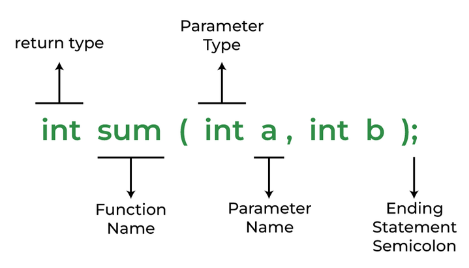

# <p align="center">**Hàm - Function**</p>

## **1. Tổng quan**
Một hàm (function) trong C là một tập hợp các câu lệnh mà khi "được gọi" sẽ thực thi một hoặc vài tác vụ gì đó. Khi nói tới cú pháp của hàm (function), ta cần để ý 3 thứ sau:
- Khai báo hàm (function declaration).
- Định nghĩa hàm (function definition).
- Gọi hàm (function call).

## **2. Khai báo hàm - function declaration**
Để có thể gọi một hàm, trước hết ta phải khai báo hàm ở phía trước (phía trên) câu lệnh mà ta gọi hàm.

Khai báo hàm sẽ cho biết:
- return type: kiểu trả về của hàm
- function name: tên của hàm
- Danh sách các kiểu trả về của các "tham số" (parameter).

**Cú pháp**
```C
return_type function_name (data_type1 parameter1, data_type2 parameter2, ...);
```
hoặc
```C
return_type function_name (data_type1, data_type2, ...);
```
Lưu ý 
- Khi khai báo ta có thể bỏ qua tên của các tham số (parameter), bởi vì phần quan trọng ở khai báo hàm là tên hàm và các kiểu dữ liệu.
- Nếu hàm không có giá trị trả về thì return_type sẽ là void.

**Ví dụ:**
```C
// sum là một hàm (function) có tham số:
//      a là biến kiểu int,
//      b là biến kiểu int
// hàm sum trả về giá trị kiểu int
int sum(int a, int b);
```
hoặc
```C
// sum là một hàm (function) có tham số:
//      tham số đầu tiên là biến kiểu int,
//      tham số thứ hai  là biến kiểu int
// hàm sum trả về giá trị kiểu int
int sum(int, int);
```

Hình minh họa giải thích:



## **3. Định nghĩa hàm - function definition**

Định nghĩa hàm bao gồm các câu lệnh được thực thi khi ta gọi hàm. Định nghĩa hàm phải có trong chương trình của bạn hoặc trong thư viện mà chương trình của bạn sử dụng.

**Cú pháp**
```C
return_type function_name (data_type1 parameter1, data_type2 parameter2, ...)
{
    // body of the function
}
```

Lưu ý: Một định địnhn nghĩa hàm đã bao gồm khai báo hàm. Vì vậy, nếu định nghĩa hàm đã xuất hiện phía trước (phía trên) câu lệnh mà bạn gọi hàm, thì không cần phải khai báo hàm thêm.

Ví dụ sau là định nghĩa hàm không có tham số và không có kiểu trả về (kiểu trả về void).

```C
#include <stdio.h>

void helloWorld()   // định nghĩa và khai báo chung với nhau.
{
    printf("Hello World");
}

int main() {
    helloWorld();   // gọi hàm
    return 0;
}
```

Còn ví dụ sau là định nghĩa xuất hiện phía sau lời gọi hàm, vì vậy phải khai báo trước khi gọi.

```C
#include <stdio.h>

void helloWorld();   // khai báo trước lời gọi hàm

int main() {
    helloWorld();   // gọi hàm
    return 0;
}

void helloWorld()   // định nghĩa sau lời gọi hàm.
{
    printf("Hello World");
}
```

## **4. Gọi hàm - function call**
Lời gọi hàm là câu lệnh hướng dẫn chương trình thực thi hàm. (Như những ví dụ trên ta đã có lời gọi hàm "helloWorld").

Khi một hàm được gọi, chương trình sẽ cấp phát vùng nhớ cho các tham số (parameter) của hàm (nếu có), và các tham số đó sẽ sao chép giá trị của các đối số (argument) truyền vào hàm. Sau đó các câu lệnh ở thân hàm sẽ được thực thi.

Ví dụ, khi ta định nghĩa hàm sum như sau:
```C
int sum(int a, int b) {
    return a + b;
}
```
rồi gọi hàm
```C
int x = sum(3, 4);
```
Thì chương trình sẽ tạo ra tham số a và tham số b. 3, và 4 là đối số (argument) truyền vào, và giá trị của chúng, 3 sẽ được copy vào tham số a, 4 sẽ được copy vào tham số b. Sau đấy thân hàm sẽ được thực thi.

Lưu ý: Vì tham số (parameter) của hàm chỉ sao chép giá trị từ đối số (argument) chứ bản thân tham số không phải là đối số, cho nên giá trị của tham số dù có thay đổi cũng không làm giá trị của argument thay đổi. Ví dụ:

```C
#include <stdio.h>

void myFunction(int a);

int main() {
    int a = 0;
    myFunction(a);  // a ở đây là biến cục bộ (local) của hàm main
                    // được sử dụng như đối số (argument) truyền vào
                    // hàm myFunction. Hàm myFunction không thể
                    // thay đổi giá trị của a.
    printf("%d", a);
    return 0;
}

void myFunction(int a) {
    a = 10;         // a ở đây là tham số (parameter) của hàm myFunction.
                    // a chỉ sao chép giá trị từ đối số (argument),
                    // nên dù a ở đây bằng 10 thì đối số không thay đổi.
}
```

Output của ví dụ:
```
0
```

## **5. Giá trị trả về - return value**
Câu lệnh "return" sẽ làm chương trình thoát khỏi hàm và trả về một giá trị có kiểu giống với kiểu trả về (return type).

Ví dụ ở trên, hàm "sum" có kiểu trả về là int, nên ở thân hàm khi chương trình gặp "return a + b" sẽ tính tổng của a và b (3 + 4), sau đấy thoát khỏi hàm và trả về giá trị của hàm là 7 (kiểu int).

Trường hợp hàm không có giá trị trả về (kiểu trả về là void), thì câu lệnh return không cần có giá trị sau đó. (Xem ví dụ hàm helloWorld phía trên).

## **6. Giá trị trả về của hàm main**
Khi chương trình viết bằng C được thực thi, hàm được gọi đầu tiên là hàm main. Khi hàm main trả về, chương trình sẽ kết thúc. Nếu hàm main trả về giá trị 0, có nghĩa là chương trình kết thúc mà không có lỗi gì xảy ra. Nếu hàm main trả về giá trị khác 0, có nghĩa là đã có lỗi xảy ra trong quá trình chương trình chạy.