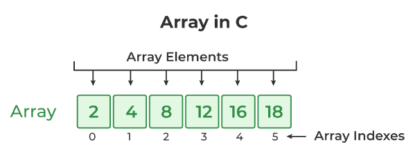
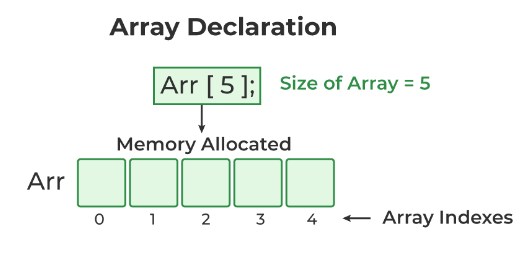
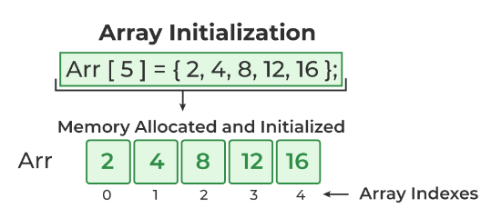
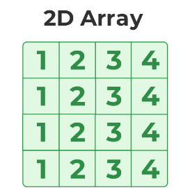
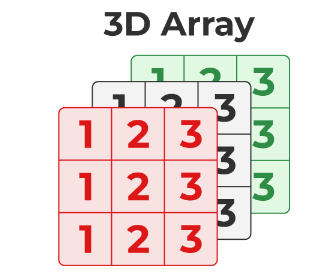

# <p align="center">**Mảng - Array**</p>

## **1. Mảng 1 chiều**
### **1.1. Khái niệm về mảng**
Trong C, một mảng là một tập hợp các phần tử cùng "kiểu dữ liệu" (data type), có "kích thước" (số các phần tử) cố định.



Mỗi phần tử trong mảng có "chỉ số mảng" (array index), liên quan đến vị trí của phần tử trong mảng. Phần tử đầu tiên có chỉ số "0".

### **1.2 Khai báo mảng và truy cập đến phần tử trong mảng**
Cú pháp khai báo mảng:
```
data_type array_name [size];
```

Ví dụ:
```C
#include <stdio.h>

int main() {
    float a[5];   // Khai báo mảng 5 phần tử.

    // Truy xuất các phần tử có chỉ số (index) 0, 1, 2, 3, 4:
    printf("a[0] = %.1f\n", a[0]);
    printf("a[1] = %.1f\n", a[1]);
    printf("a[2] = %.1f\n", a[2]);
    printf("a[3] = %.1f\n", a[3]);
    printf("a[4] = %.1f\n", a[4]);
    return 0;
}
```


Lưu ý:
- Phần tử đầu tiên có chỉ số "0".
- Phần tử thứ n có chỉ số "n-1"
- Nếu chúng ta chưa khởi tạo mảng, giá trị mỗi phần tử ở đây có thể là ngẫu nhiên. (Có thể là bằng 0, cũng có thể bằng một số nào đó).

### **1.3. Khai báo và khởi tạo mảng trên cùng dòng lệnh**
Chúng ta có thể khởi tạo mảng cùng với size theo cú pháp:
```
data_type array_name [size] = {value1, value2, ... valueN};
```

Ví dụ:
```C
#include <stdio.h>

int main() {
    // Khai báo và khởi tạo mảng 5 phần tử:
    float a[5] = {1.1, 2.2, 3.3, 4.4, 5.5}; 

    // Truy xuất các phần tử có chỉ số (index) 0, 1, 2, 3, 4:
    printf("a[0] = %.1f\n", a[0]);
    printf("a[1] = %.1f\n", a[1]);
    printf("a[2] = %.1f\n", a[2]);
    printf("a[3] = %.1f\n", a[3]);
    printf("a[4] = %.1f\n", a[4]);
    return 0;
}
```

Output của ví dụ:
```C
a[0] = 1.1
a[1] = 2.2
a[2] = 3.3
a[3] = 4.4
a[4] = 5.5
```



Chúng ta cũng có thể khai báo và khởi tạo mảng trên cùng một dòng lệnh mà không cần size.

```C
#include <stdio.h>

int main() {
    // Khai báo và khởi tạo mảng 5 phần tử:
    float a[] = {1.1, 2.2, 3.3, 4.4, 5.5}; 

    // Truy xuất các phần tử có chỉ số (index) 0, 1, 2, 3, 4:
    printf("a[0] = %.1f\n", a[0]);
    printf("a[1] = %.1f\n", a[1]);
    printf("a[2] = %.1f\n", a[2]);
    printf("a[3] = %.1f\n", a[3]);
    printf("a[4] = %.1f\n", a[4]);
    return 0;
}
```

Lưu ý: Nếu khai báo mảng có kích thước lớn hơn số lượng giá trị ta điền vào khi khởi tạo như ví dụ sau, thì chương trình sẽ gán các giá trị cho các phần tử đầu tiên của mảng. Các phần tử còn lại trong mảng sẽ có giá trị 0.

```C
#include <stdio.h>

int main() {
    // Khai báo và khởi tạo mảng 2 phần tử:
    float a[5] = {1.1, 2.2}; 

    // Truy xuất các phần tử có chỉ số (index) 0, 1, 2, 3, 4:
    printf("a[0] = %.1f\n", a[0]);
    printf("a[1] = %.1f\n", a[1]);
    printf("a[2] = %.1f\n", a[2]);
    printf("a[3] = %.1f\n", a[3]);
    printf("a[4] = %.1f\n", a[4]);
    return 0;
}
```

Output của ví dụ trên:
```
a[0] = 1.1
a[1] = 2.2
a[2] = 0.0
a[3] = 0.0
a[4] = 0.0
```

## **2. Mảng đa chiều**

### **2.1. Mảng 2 chiều**
Mảng hai chiều có thể hiểu như một mảng của mảng một chiều. Ví dụ như hình minh họa


Cú pháp khai báo mảng 2D (2 chiều):
```
array_name[size1] [size2];
```
Ở đây:
- size1: Size of the first dimension.
- size2: Size of the second dimension.

**Ví dụ**:
```C
#include <stdio.h>

int main() {
    int a[3][3];
    for (int i = 0; i < 3; i++)
        for (int j = 0; j < 3; j ++) {
            a[i][j] = i + j;
        }

    for (int i = 0; i < 3; i++) {
        printf("\n");
        for (int j = 0; j < 3; j ++) {
            printf("%d\t", a[i][j]);
        }
    }
    return 0;
}
```

Output của ví dụ:
```
0       1       2
1       2       3
2       3       4
```

Cũng như mảng 1 chiều, ta có thể khởi tạo giá trị của mảng 2 chiều ngay từ lúc khai báo, ví dụ:

```C
int a[3][3] = {1, 2, 3, 4, 5, 6, 7, 8, 9}   // 9 phần tử
// hoặc ta nhóm lại như sau cho dễ nhìn mà vẫn đúng cú pháp:
int b[3][3] = {
    {1, 2, 3},
    {4, 5, 6},
    {7, 8, 9}
}
```


### **2.2. Mảng 3 chiều**
Sau khi đã hiểu rõ mảng 2 chiều. Bạn có thể suy ra tương tự với mảng 3 chiều:



Ví dụ:
```C
int main() {
    int a[3][3][3];
    for (int i = 0; i < 3; i++)
        for (int j = 0; j < 3; j ++) 
            for (int k = 0; k < 3; k++) {
                a[i][j][k] = i + j + k;
            }
    return 0;
}
```

Ta cũng có thể khởi tạo giá trị cho mảng 3 chiều ngay từ khi khai báo:
```C
int a[2][2][2] = {1, 2, 3, 4, 5, 6, 7, 8};
```

## **3. Truyền mảng vào hàm**

## **3.1. truyền mảng 1 chiều vào hàm**
Khi khai báo hoặc định nghĩa hàm, ta có viết tham số của hàm là mảng. Ví dụ:

```C
int sumArray(int numbers[100], int size);
```

hoặc:
```C
int sumArray(int numbers[], int size);
```

Sau đấy ta gọi hàm và truyền mảng tương ứng vào, ví dụ:
```C
int numbers[5];
sumArray(numbers, size);        // truyền mảng vào bằng cách sử dụng tên mảng
```

Lưu ý: khi khai báo mảng 1 chiều như tham số của hàm, dù ta viết kích thước bao nhiêu, có hay không cũng không quan trọng. Ví dụ:

```C
#include <stdio.h>

//void myFunction(float a[]) {  // Có thể bỏ qua phần kích thước mảng
void myFunction(float a[1]) {   // Hoặc ghi kích thước 1
    for (int i = 0; i < 5; i++) {
        printf("%.1f\n", a[i]); 
    }
}

int main() {
    float a[5] = {1.1, 2.2, 3.3, 4.4, 5.5}; 
    myFunction(a);  // Nhưng vẫn có thể truyền mảng 5 phần tử vào.
    return 0;
}
```

## **3.2. truyền mảng đa chiều vào hàm**
Cũng giống mảng một chiều, tuy nhiên lưu ý: Khi khai báo mảng nhiều chiều như tham số của hàm, ngoại trừ "chiều" đầu tiên, các chiều còn lại phải chỉ định kích thước. Ví dụ:

```C
void myFunction(float a[][5][5]);
```

## **4. Không nên khai báo mảng có kích thước quá lớn**
Mảng chiếm bộ nhớ phân vùng stack, mà stack thường rất nhỏ so với phân vùng heap. Vì vậy không nên thường xuyên khai báo mảng có kích thước quá lớn. Thay vào đó ta có thể sử dụng cấp phát động (sẽ học trong bài con trỏ).

## **5. Mảng có chiều dài thay đổi - VLA (variable-length array)**
Chúng ta đã quen với kiểu khai báo mảng có chiều dài cố định như trên. Trong C có hỗ trợ VLA (mảng có chiều dài cố định), như 2 ví dụ sau:

```C
void fun(int size)
{
     int arr[size];
     // code
}
```

```C
int main() {
    int n = 0;
    scanf("%d", &n);
    int arr[n];
    return 0;
}
```

Ta thấy kích thước của "arr" phụ thuộc giá trị của tham số "size" hoặc biến n.

Tuy nhiên, ta lưu ý rằng C++ chuẩn không hỗ trợ VLA. Trong các dự án thực tiễn bằng ngôn ngữ C, cũng ít khi sử dụng VLA. Những mảng này có thể chiếm nhiều bộ nhớ phân vùng stack trong lúc chương trình chạy. Thay vì sử dụng VLA trong C, nếu muốn sử dụng mảng có kích thước không cố định, ta có thể sử dụng cấp phát động (sẽ học ở phần pointer).