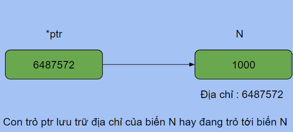
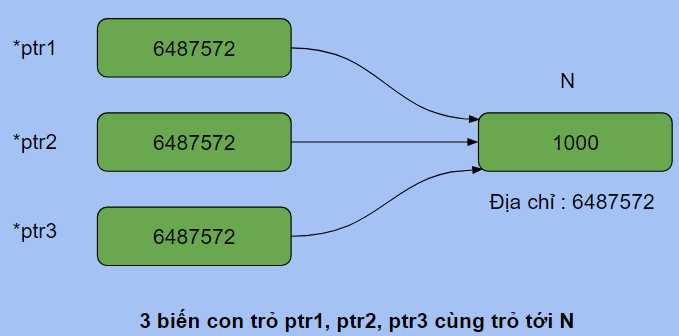

# <p align="center">**Pointer - Con trỏ**</p>

## **1. Pointer and operator Address-of - Con trỏ và toán tử lấy địa chỉ**
- Data ở trong bộ nhớ của chương trình luôn có địa chỉ cụ thể. Con trỏ (pointer) là biến hoặc hằng được sử dụng để chuyên chứa địa chỉ. Cú pháp để khai báo một con trỏ trong C là:
```C
data_type * pointer_name;
```
 Ví dụ:
```C
#include <stdio.h>

int main(){
    //Dấu * thể hiện ptr là con trỏ:
    int *ptr;           // con trỏ đến data kiểu int

    //Dấu * có thể đặt cạnh tên biến hoặc cạnh kiểu dữ liệu:
    long long* ptr2;    // con trỏ đến data kiểu long long

    //Dấu * cũng có thể nằm cách xa tên biến và kiểu dữ liệu: 
    char    *           ptr3;        // con trỏ đến data kiểu char

    return 0;
}
```
- Toán tử `& (toán tử lấy địa chỉ)` đứng trước tên biến sẽ trả về cho ta địa chỉ của biến đó. Ví dụ
```C
#include <stdio.h>

int main(){
    int N = 28;
    int *ptr = &N;
    printf("Dia chi cua N trong bo nho : %d\n", &N);
    printf("Gia tri ma ptr luu tru cung la dia chi cua N : %d\n", ptr);
    return 0;
}
```
- Output
```
Dia chi cua N trong bo nho : 6487572
Gia tri ma ptr luu tru cung la dia chi cua N : 6487572
```
- Chú ý : Khi bạn chạy code trên thì địa chỉ của N là ngẫu nhiên, không đoán trước được.



## **2. NULL - Không trỏ đến đâu cả**
- Để diễn tả một con trỏ không trỏ tới data nào cả, ta quy ước dùng giá trị NULL. Ví dụ:
```C
#include <stdio.h>

int main() {
    int *ptr = NULL;
    if (ptr == NULL)
        printf("ptr không trỏ đến giá trị nào\n");
        
    return 0;
}
```
- Lưu ý: Nếu ta xem định nghĩa của NULL trong thư viện, ta sẽ thấy NULL là `0`. Tuy nhiên, khi viết code, chúng ta sử dụng từ khóa NULL nhé.

## **3. Operator * (Dereference) - toán tử giải tham chiếu**
- Toán tử `* (toán tử giải tham chiếu)` khi đứng trước một con trỏ sẽ trả về data mà con trỏ đang trỏ tới. Ví dụ:
```CPP
#include <stdio.h>

int main(){
    int N = 1000;
    printf("Dia chi cua N : %d\n", &N);
    int *ptr = &N; // ptr trỏ tới N.
    printf("Gia tri cua ptr : %d\n", ptr);

    // Toán tử giải tham chiếu
    printf("Gia tri cua bien ma con tro ptr tro toi : %d\n", *ptr); 

    // Vì ptr đang trỏ tới N nên *ptr chính là N. 
    // Có thể thay đổi N bằng *ptr:
    *ptr = 280;
    printf("Gia tri cua N sau thay doi : %d %d\n", N, *ptr);
    return 0;
}
```
- Output
```
Dia chi cua N : 6487572
Gia tri cua ptr : 6487572
Gia tri cua bien ma con tro ptr tro toi : 1000
Gia tri cua N sau thay doi : 280 280
```
- Lưu ý: Một biến có thể được trỏ tới bởi nhiều con trỏ, khi đó bạn có thể thông qua bất cứ 1 con trỏ nào để thay đổi giá trị của biến mà nó đang trỏ tới.
- Ví dụ:

```CPP
#include <stdio.h>

int main(){
    int N = 1000;
    int *ptr1 = &N; // ptr1 trỏ tới N
    int *ptr2 = &N; // ptr2 trỏ tới N
    int *ptr3 = ptr1; // Gán giá trị của ptr1 cho ptr3, tương tự gán &N cho ptr3
    printf("Gia tri cua 3 con tro : %d %d %d\n", ptr1, ptr2, ptr3);
    *ptr1 = 100; // N = 100
    printf("Gia tri cua N : %d\n", N);
    *ptr2 = 200; // N = 200
    printf("Gia tri cua N : %d\n", N);
    *ptr3 = 300; // N = 300
    printf("%d %d %d %d\n", *ptr1, *ptr2, *ptr3, N);
    return 0;
}
```
- Output:
```
Gia tri cua 3 con tro : 6487572 6487572 6487572
Gia tri cua N : 100
Gia tri cua N : 200
300 300 300 300
```



## **4. Pointer to constant and constant pointer - con trỏ tới hằng và hằng con trỏ**

- Ví dụ:
```CPP
#include <studio.h>

int main() {
    float * a;          // a là con trỏ tới biến kiểu float.

    float const * b;    // b la con trỏ tới hằng kiểu float.
    const float * c;    // c là con trỏ tới kiểu float hằng.
                        // Lưu ý: con trỏ tới hằng kiểu float hay
                        //kiểu float hằng cũng cùng ý nghĩa.

    float * const d;        // d là hằng con trỏ tới biến kiểu float.

    float const * const e;  // e là hằng con trỏ tới hằng kiểu float.
    const float * const f   // f là hằng con trỏ tới kiểu float hằng.
                            // Lưu ý: hằng con trỏ tới hằng kiểu float hay
                            // hằng con trỏ tới kiểu float hằng cũng cùng ý nghĩa

    return 0;
}
```
- Lưu ý con trỏ tới hằng và hằng con trỏ là hai khái niệm khác nhau:
    - Con trỏ tới hằng là con trỏ mà khi giải tham chiếu sẽ trả về một hằng, tức là data nó trỏ tới không thay đổi được thông qua giải tham chiếu.
    - Hằng con trỏ là một con trỏ không thể thay đổi giá trị của nó. Vậy, cũng đồng nghĩa là hằng con trỏ sẽ chỉ có thể trỏ tới một đối tượng nào đấy vĩnh viễn.
- Ví dụ:
```CPP
#include <studio.h>

int main() {
    float a = 10;
    float b = 20;

    // Con trỏ tới hằng:
    float const * ptr1; // ptr1 là con trỏ tới hằng kiểu float.
    c = &a;             // Gán địa chỉ của a cho ptr1 
                        // (tức là ptr1 trỏ tới a).

    *ptr1 = 11;         // Khi compile sẽ bị lỗi chỗ này. 
                        // Bởi vì ptr1 là con trỏ tới hằng,
                        //cho nên *ptr1 (giải tham chiếu b) trả về một hằng,
                        //và không thể gán giá trị mới cho hằng.

    ptr1 = &b;          // Tuy nhiên, ta vẫn có thể gán một địa chỉ khác cho ptr1 
                        //vì ptr1 không phải là hằng.  (mà trỏ tới hằng).

    // Hằng con trỏ:
    float * const ptr2 = &a;    // ptr2 là hằng con trỏ tới biến kiểu float
    ptr2 = &b;                  // Khi compile sẽ bị lỗi chỗ này. 
                                // Bởi vì ptr2 là hằng,
                                //nên không thể gán một địa chỉ mới cho nó
    return 0;
}
```

## **5. Array address - địa chỉ của mảng**
- Mảng gồm có nhiều phần tử (element) nằm kề nhau, thì mỗi phần tử đều có địa chỉ của riêng nó. Địa chỉ của mảng được quy định là địa chỉ của phần tử đầu tiên trong mảng.
- Sau khi đã khai báo hoặc định nghĩa một mảng, thì tên của mảng ấy trong code được ngầm hiểu là địa chỉ của mảng.
- Một con trỏ kiểu "T" nào đấy có thể trỏ tới một biến kiểu "T", cũng có thể trỏ tới một mảng "một chiều" kiểu "T". Khi một con trỏ tham chiếu tới một mảng, ta có thể dùng toán tử [] (array subscripting) đi sau con trỏ đó để truy cập vào một phần tử của mảng.

Ví dụ:
```C
#include <stdio.h>

int main() {
    int a[] = {1, 2};

    int *ptrB = a;        // a được hiểu là địa chỉ của mảng a.
                            // khởi tạo ptrB lưu địa chỉ của mảng a.

    //float *ptrC = &a;     // không được, vì a đã được hiểu là địa chỉ của mảng,
                            //&a được hiểu là "địa chỉ của địa chỉ" của mảng (sai).

    int *ptrA0 = &a[0];   // khởi tạo ptrA0 lưu địa chỉ của phần tử a[0].
    int *ptrA1 = &a[1];   // khởi tạo ptrA0 lưu địa chỉ của phần tử a[1].

    printf("ptrA0 = %d\n", ptrA0);      // ptrA0 cũng là địa chỉ a[0].
    printf("ptrA1 = %d\n", ptrA1);      // ptrA1 cũng là địa chỉ a[1].
    printf("ptrB = %d\n", ptrB);        // ptrB cũng là địa chỉ mảng a.

    printf("*ptrA0 = %d\n", *ptrA0);    // *ptrA0 là a[0]
    printf("*ptrA1 = %d\n", *ptrA1);    // *ptrA1 là a[1]
    printf("ptrB[0] = %d\n", ptrB[0]);  // ptrB[0] cũng là a[0]
    printf("ptrB[1] = %d\n", ptrB[1]);  // ptrB[1] cũng là a[1]
    return 0;
}
```
- Output:
```
ptrA0 = 6422284
ptrA1 = 6422288
ptrB = 6422284
*ptrA0 = 1
*ptrA1 = 2
ptrB[0] = 1
ptrB[1] = 2
```
- Lưu ý: ở ví dụ trên, sau khi con trỏ "**ptrB**" trỏ tới mảng "**a**", ta có thể dùng truy cập phần tử của mảng "**a**" thông qua "**ptrB[0]**", "**ptrB[1]**", ... giống như ptrB cũng là mảng.
## **6. Passing pointer/address to function as argument - Truyền con trỏ hoặc địa chỉ vào hàm như tham số**
- Ta có thể truyền con trỏ hoặc địa chỉ vào hàm như tham số. Ví dụ:
```C
#include <stdio.h>

void change(int * ptrA) // ptrA là một bản copy của tham số truyền vào
{
    *ptrA = 1;      // Thay đổi data mà ptrA trỏ tới thành 1.
    ptrA = NULL;    // Thay đổi ptrA không làm cho tham số thay đổi.
}

void cannotChange(int a) // a là một bản copy của tham số truyền vào
{
    a = 2;          // Thay đổi a ở đây, không làm thay đổi tham số
                    // bởi vì a chỉ là một bản copy của tha ms6o1.
}

int main() {
    int a = 0;
    int *ptrA = &a; // ptrA trỏ tới a.

    printf("a = %d\n", a);
    change(ptrA);   // Do đã khai báo hàm change như sau:  
                    //    void change(int * ptrA)
                    //nên hàm change sẽ tạo ra một con trỏ ptrA của hàm,
                    //rồi lưu giá trị của ptrA gốc vào ptrA của hàm.
                    // Vậy tức là ptrA của hàm cũng trỏ tới a.
                    // Vì vậy nếu hàm change thay đổi data mà 
                    //ptrA của change trỏ tới, thì 'a' cũng thay đổi.
    printf("a bi thay doi boi ham change: a = %d\n", a);
    printf("Nhung ptrA khong bi thay doi: ptrA = %d\n", ptrA);
    cannotChange(a);
    printf("a khong bi thay doi boi ham cannotChange: a = %d\n", a);
    
    return 0;
}
```
- Output:
```
a = 0
a bi thay doi boi ham change: a = 1
Nhung ptrA khong bi thay doi: ptrA = 6422296
a khong bi thay doi boi ham cannotChange: a = 1
```
- Ở ví dụ này, bạn thấy một công dụng cực kỳ hữu ích, cần thiết của con trỏ: ***làm cho các hàm (function) có khả năng thay đổi data được tạo ở bên ngoài hàm.***
- Lưu ý: O ví dụ trên ta truyền địa chỉ của "**a**" vào hàm "**change**" thông qua con trỏ "**ptrA**". Tuy nhiên, ta có thể truyền trực tiếp địa chỉ vào mà không cần thông qua con trỏ  "**ptrA**" như sau:
```C
    // change(ptrA);
    change(&a);     // Do đã khai báo hàm change như sau:  
                    //    void change(int * ptrA)
                    //nên hàm change sẽ tạo ra một con trỏ ptrA của hàm,
                    //rồi lưu địa chỉ của a vào con trỏ ptrA của hàm.
```

## **7. Dynamic allocation - cấp phát động**
- Để sử dụng cấp phát động cần include "stdlib.h".
- Ta có thể yêu cầu chương trình cấp phát một vùng nhớ trong khi chương trình đang chạy bằng hàm "**malloc**" hoặc "**calloc**". Ví dụ:
```C
#include <stdio.h>
#include <stdlib.h>     // dùng cho các hàm cấp phát động.

int main() {
    int * numbers = NULL;
    
    // cấp phát vùng nhớ có kích thước gấp 5 lần kích thước kiểu int
    numbers = malloc(sizeof(int)*5);    

    // lưu trữ 5 giá trị kiểu int:
    for (int i = 0; i < 5; i++) { 
        numbers[i] = i*10; 
    }
    
    // Xuất 5 giá trị kiểu int đã lưu trữ:
    for (int i = 0; i < 5; i++) { 
        printf("numbers[%d] = %d\n", i, numbers[i]);
    }

    // Giải phóng vùng nhớ đã cấp phát:
    free(numbers);
    
    return 0;
}
```
- Output:
```
numbers[0] = 0
numbers[1] = 10
numbers[2] = 20
numbers[3] = 30
numbers[4] = 40
```
- Lưu ý: Khi xác định là không cần sử dụng vùng nhớ đã cấp phát động, ta phải giải phóng vùng nhớ để tránh lãng phí bộ nhớ. Thuật ngữ được sử dụng để nói về việc lãng phí bộ nhớ trong trường hợp này là "memory leak" (rò bộ nhớ).
- Để viết lại ví dụ trên sử dụng "**calloc**", chỉ cần thay thế dòng "**malloc**":
```C
    // numbers = malloc(sizeof(int)*5);  
    numbers = calloc(sizeof(int), 5);   // calloc sẽ lấy sizeof(int) nhân 5
    numbers = calloc(5, sizeof(int));   // Viết thế này cũng được, 
                                        //do phép nhân có tính giao hoán
```
- Lưu ý: vẫn phải giải phóng vùng nhớ khi không còn sử dụng.
## **8. Double pointer (pointer to pointer) - Con trỏ tới con trỏ**
- Bản thân con trỏ cũng phải có địa chỉ, và ta có thể lưu địa chỉ của nó vào một con trỏ khác. Con trỏ lưu địa chỉ của một con trỏ khác gọi là **"con trỏ tới con trỏ"** - **pointer to pointer**", (hay còn gọi là double pointer).
- Để thấy công dụng của "double pointer", xét lại ví dụ rút gọn của ví dụ ở phần 6:
```C
#include <stdio.h>

void change(int * ptrA) // ptrA là một bản copy của tham số truyền vào
{
    *ptrA = 1;      // Thay đổi data mà ptrA trỏ tới thành 1.
    ptrA = NULL;    // Thay đổi ptrA không làm cho tham số thay đổi.
}

int main() {
    int a = 0;
    int *ptrA = &a; // ptrA trỏ tới a.

    printf("a = %d\n", a);
    change(ptrA);
    printf("a bi thay doi boi ham change: a = %d\n", a);
    printf("Nhung ptrA khong bi thay doi: ptrA = %d\n", ptrA);
    
    return 0;
}
```
- Để hàm "**change**" có thể làm cho "**ptrA**" trỏ tới địa chỉ NULL (sau khi thoát khỏi hàm change), ta sửa lại như sau:
```C
#include <stdio.h>

void change(int ** ptrA)
{
    **ptrA = 1;     
    *ptrA = NULL;
}

int main() {
    int a = 0;
    int *ptrA = &a;     // ptrA trỏ tới a.

    printf("a = %d\n", a);
    change(&ptrA);      // truyền địa chỉ của ptrA vào hàm change.
                        // Lưu ý: địa chỉ của ptrA khác địa chỉ của a.
                        // Hàm change sẽ tạo ra một double pointer ptrA và lưu
                        // địa chỉ của ptrA từ hàm main vào ptrA của hàm change
    printf("a bi thay doi boi ham change: a = %d\n", a);
    printf("ptrA da bi thay doi: ptrA = %d\n", ptrA);
    
    return 0;
}
```
- Output:
```
a = 0
a bi thay doi boi ham change: a = 1
ptrA da bi thay doi: ptrA = 0
```