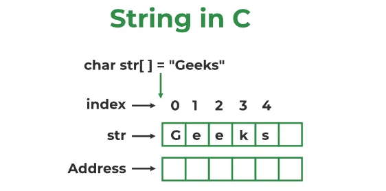

# <p align="center">**C-string - Chuỗi ký tự trong C**</p>

# **Tham khảo**
[Strings in C - Geeksforgeeks](https://www.geeksforgeeks.org/strings-in-c)

# **1. chuỗi ký tự trong C (C-string)**

## **1.1. Khái niệm của chuỗi ký tự**
Một chuỗi ký tự trong C là một dãy các ký tự có ký tự kết thúc là ký tự null ('\0').



## **1.2. Khai báo chuỗi ký tự**
Cũng giống như khai báo mảng char.
```C
char string_name[size];
```

## **1.3. Độ dài chuỗi ký tự**
Độ dài của chuỗi ký tự là số ký tự hiện diện trong chuỗi ngoại trừ ký tự kết thúc (ký tự null - '\0').

## **1.4. Khởi tạo chuỗi ký tự (C-string initialization)**

### **1.4.1. Gán string literal không xác định kích thước**
Ví dụ:
```C
char str[] = "GeeksforGeeks";
```

### **1.4.2. Gán string literal có kích thước xác định trước**
Ví dụ:
```C
char str[50] = "GeeksforGeeks";
```

Ở ví dụ này ta có một mảng 50 ký tự. Các ký tự đầu tiên sẽ hình thành chuỗi ký tự "GeeksforGeeks" (có cả ký tự null kết thúc).

### **1.4.3.  Assigning Character by Character with Size**
Ví dụ:
```C
char str[14] = { 'G','e','e','k','s','f','o','r','G','e','e','k','s','\0'};
```

### **1.4.4. Assigning Character by Character without Size**
Ví dụ:
```C
char str[] = { 'G','e','e','k','s','f','o','r','G','e','e','k','s','\0'};
```

## **1.5. Đọc chuỗi ký tự**

### **1.5.1. Đọc chuỗi bằng hàm scanf**
Lấy ví dụ sau:
```C
#include <stdio.h>
int main()
{
    char str[20];
    scanf("%s", str);
    printf("%s", str);
    return 0;
}
```

Thử nhập và xem xuất ở terminal:
```
Geeks for Geeks
Geeks
```

Ta có thể thấy vấn đề xảy ra là chỉ có từ đầu tiên "Geeks" được lưu trữ vào "str". Lý do vì hàm "scanf" chỉ đọc các ký tự đến khi gặp khoảng trắng.

Để fix vấn đề này. Chúng ta sử dụng "scanset". Ví dụ:

```C
#include <stdio.h>
int main()
{
    char str[20];
    scanf("%[^\n]s", str);  // [^\n] làm cho hàm scanf đọc các ký tự
                            // đến khi gặp ký tự xuống dòng '\n'.
                            // Lưu ý là ký tự xuống dòng sẽ bị bỏ đi.
    printf("%s", str);
    return 0;
}
```

### **1.5.2. Đọc chuỗi bằng hàm fgets**
Ví dụ:
```C
#include <stdio.h>
int main()
{
    char str[20];
    fgets(str, 20, stdin);  // đọc chuỗi từ stdin với 
                            // chiều dài tối đa là 20 bytes
    printf("%s", str);
    return 0;
}
```

Lưu ý: 
- Ngoài scanf và fgets, ta còn có thể sử dụng hàm gets. Tuy nhiên, khuyến nghị nên sử dụng fgets. Lý do vì hàm fgets có tham số thứ 2 giới hạn số lượng byte sẽ đọc, giúp chương trình ít gặp lỗi đọc nhiều byte hơn độ dài mảng.
- Khác với trường hợp đọc chuỗi ký tự bằng hàm scanf kết hợp scanset, hàm fgets sẽ đọc luôn cả ký tự xuống dòng '\n' và lưu vào str.
- Để bỏ ký tự xuống dòng, ta thay thế ký tự xuống dòng bằng ký tự null:

```C
#include <stdio.h>
#include <string.h>

int main()
{
    char str[20];
    fgets(str, 20, stdin);
    str[strcspn(str, "\n")] = '\0'; // Thay thế ký tự '\n' bằng ký tự null.
    printf("%s", str);
    return 0;
}
```

# **2. Một số hàm xử lý chuỗi ký tự và mảng trong  C**
Trong thư viện chuẩn "string.h" của C có một số hàm xử lý chuỗi ký tự và mảng thưởng sử dụng như sau:

## **strlen**
**Công dụng:** tính chiều dài của chuỗi ký tự.

**Cú pháp:**
```C
size_t strlen(const char* str);
```

**Tham số:**
- str: chuỗi ký tự có chiều dài đang muốn tìm.

**Giá trị trả về:** chiều dài của chuỗi ký tự (không bao gồm ký tự null).

Ví dụ:
```C
#include <stdio.h>
#include <string.h>

int main()
{
    char str[] = "Hello World.";
    printf("%s\n", str);
    printf("length: %d", strlen(str));
    return 0;
}
```

Output của ví dụ:
```
Hello World.
length: 12
```

## **memset**
**Công dụng:** set giá trị ban đầu cho một mảng.

Ví dụ:
```C
#include <stdio.h>
#include <string.h>

int main()
{
    char str[] = "Hello";
    
    int length = strlen(str);
    for (int i = 0; i < length; i++) {
        printf("%d\n", str[i]);
    }

    memset(str, 0, sizeof(str));
    printf("After reseting:\n");
    for (int i = 0; i < length; i++) {
        printf("%d\n", str[i]);
    }
    return 0;
}
```

Output của ví dụ:
```
72
101
108
108
111
After reseting:
0
0
0
0
0
```

## **strcmp**
**Công dụng**: so sánh hai chuỗi ký tự.

**Cú pháp:**
```C
strcmp(first_str, second_str );
```

**Tham số:**
- first_str: Con trỏ tới chuỗi ký tự đầu tiên.
- second_str: Con trỏ tới chuỗi ký tự thứ hai.

**Giá trị trả về:**
- Nếu first_str bé hơn second_str: trả về số bé hơn 0.
- Nếu first_str bằng second_str: trả về 0.
- Nếu first_str lớn hơn second_str: trả về số lớn hơn 0.


**Giải thuật để so sánh hai chuỗi đơn giản như sau:**
1. Xét ký tự hiện tại là ký tự đầu tiên của hai chuỗi.
2. So sánh ký tự hiện tại của hai chuỗi:
    - Nếu ký tự hiện tại từ chuỗi thứ nhất lớn hơn (hoặc nhỏ hơn) so với ký tự hiện tại của chuỗi thứ hai, thì chuỗi thứ nhất lớn hơn (hoặc nhỏ hơn) chuỗi thứ hai và kết thúc giải thuật.
    - Nếu hai ký tự hiện tại bằng nhau, tiếp tục bước 3.
3. Kiểm tra xem có chuỗi nào kết thúc không.
    - Nếu chỉ một chuỗi kết thúc: thì chuỗi chưa kết thúc lớn hơn và kết thúc giải thuật.
    - Nếu cả hai chuỗi kết thúc: thì hai chuỗi bằng nhau và kết thúc giải thuật.
    - Nếu không có chuỗi nào kết thúc: xét ký tự tiếp theo trong cả 2 chuỗi là ký tự hiện tại, quay lại bước 2.

Ví dụ:
```C
#include <stdio.h>
#include <string.h>

int main()
{
    char str1[] = "Hello";
    char str2[] = "Hello World";
    
    int result = strcmp(str1, str2);
    if (result < 0)
        printf("str1 < str2");
    else if (result == 0)
        printf("str1 = str2");
    else
        printf("str1 > str2");
        
    return 0;
}
```

Output của ví dụ:

```
str1 < str2
```

## **strcspn**
**Công dụng**: Hàm strcspn() trong thư viện C tính toán độ dài của số ký tự trước lần xuất hiện đầu tiên của ký tự có trong cả hai chuỗi.

**Cú pháp:**
```C
strcspn(const char *str1, const char *str2)
```

**Tham số:** 
- str1 : Chuỗi mục tiêu cần thực hiện tìm kiếm.
- str2 : Chuỗi đối số chứa các ký tự để khớp trong chuỗi mục tiêu.

**Giá trị trả về:** số ký tự trước lần xuất hiện đầu tiên của ký tự có trong cả hai chuỗi

Ví dụ:
```C
#include <stdio.h>
#include <string.h>

int main()
{
    char str1[] = "Hello.\nMy name is Nhat\n";
    int lenHello = strcspn(str1, ".");
    printf("lenth of \"Hello\": %d", lenHello);
    return 0;
}
```

Output của ví dụ:
```
lenth of "Hello": 5
```

## **strcpy**

**Công dụng:** Copy chuỗi ký tự.

**Cú pháp**:
```C
char* strcpy(char* destination, const char* source);
```

Tham số:
- destination: Con trỏ tới mảng ký tự đích.
- source: Con trỏ tới mảng ký tự nguồn.

**Giá trị trả về:** con trỏ tới chuỗi ký tự đích sau khi đã copy chuỗi ký tự.

Ví dụ:

```C
#include <stdio.h>
#include <string.h>
 
int main()
{
    char str1[] = "Hello World!";
    char str2[20] = "GfG";
    strcpy(str2, str1);
    printf("str1: %s\nstr2: %s\n", str1, str2);
    return 0;
}
```

Output của ví dụ:
```
str1: Hello World!
str2: Hello World!
```

## **strncpy**

Giống hàm "strcpy" nhưng có thêm tham số giới hạn số byte có thể copy.

**Cú pháp**
```C
char *strncpy( char *dest, const char *src, size_t n )
```