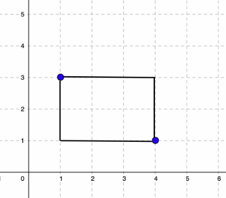

# <p align="center">**struct - practices**</p>

## **Problem 1: Student Information**

### **Task**
- Create a structure called "Student" with members name, age, and total marks. Write a C program to input data for a student, display his/her information.

### **Example**
```
Input details for Student:
Name: John Watson
Age: 21
Total Marks: 7.5

Student Information:
Name: John Watson
Age: 21
Total Marks: 7.50
```

### **Solution**
```C
#include <stdio.h> 
#include <string.h>

// Define the structure "Student"
struct Student {
    char name[50];
    int age;
    float totalMarks;
};

int main() {
    // Declare variables to store information
    struct Student student;

    // Input data for the first student
    printf("Input details for Student:\n");
    printf("Name: ");
    fgets(student.name, sizeof(student.name), stdin);
    student.name[strcspn(student.name, "\n")] = '\0';

    printf("Age: ");
    scanf("%d", &student.age);
    printf("Total Marks: ");
    scanf("%f", &student.totalMarks);

    // Display information
    printf("\nStudent Information:\n");
    printf("Name: %s\n", student.name);
    printf("Age: %d\n", student.age);
    printf("Total Marks: %.2f\n", student.totalMarks);

    return 0;
}
```
<div style="page-break-after: always;"></div>

## **Problem 2: Time Duration**

### **Tasks**
-  Define a structure named Time with members hours, minutes, and seconds. Allow user to input 2 times in day and display time duration between them.

### **Example**
```
Input the first time (hours minutes seconds): 8:44:30
Input the second time (hours minutes seconds): 9:46:35

Time Duration: 01:02:05
```
- Explanation: time duration between 8:44:30 and 9:46:35 is 01:02:05

### **Solution**
```C
#include <stdio.h>

// Define the structure "Time"
struct Time {
    int hours;
    int minutes;
    int seconds;
};

int main() {
    // Declare variables to store two times and the result
    struct Time time1, time2, result;

    // Input time1
    printf("Input the first time (hours minutes seconds): ");
    scanf("%d:%d:%d", &time1.hours, &time1.minutes, &time1.seconds);

    // Input time2
    printf("Input the second time (hours minutes seconds): ");
    scanf("%d:%d:%d", &time2.hours, &time2.minutes, &time2.seconds);

    // Calculate the time difference (period)
    int totalSeconds1 = time1.hours * 3600 + time1.minutes * 60 + time1.seconds;
    int totalSeconds2 = time2.hours * 3600 + time2.minutes * 60 + time2.seconds;
    int diffSeconds = totalSeconds2 - totalSeconds1;

    // Convert back to hours, minutes, and seconds
    result.hours = diffSeconds / 3600;
    result.minutes = (diffSeconds % 3600) / 60;
    result.seconds = diffSeconds % 60;

    // Display the result
    printf("\nTime Duration: %02d:%02d:%02d\n", result.hours, result.minutes, result.seconds);

    return 0;
}
```
<div style="page-break-after: always;"></div>


## **Problem 3: Area of ​​rectangle**

### **Objective**
With 2 different points on the coordinate system, we can draw a rectangle which contains these points and has all sides parallel to Coordinate axis. For example, with 2 points: (1, 3) and (4, 1), we have the following rectange.


### **Tasks**
For a struct type named POINT, use the following code:
```C
typedef struct {
    float x;
    float y;
} POINT;
```

Write a program which allows user to input coordinates of 2 points and calculates area of the rectangle which contains these points and has all sides parellel to Coordinate asis.
    - Input
        + cooridnates of 2 points.
    - Output
        + area of the rectangle.

### **Example**
```
Enter coordinates of Point P1 (x y): 3 4
Enter coordinates of Point P2 (x y): 0.5 6
Area of the rectangle: 5.00
```

### **Solution**
```C
#include <stdio.h>
#include <math.h> // for absolute value function

typedef struct {
    float x;
    float y;
} POINT;

int main() {
    POINT point1, point2;
    float width, height, area;

    printf("Enter coordinates of Point P1 (x y): ");
    scanf("%f %f", &point1.x, &point1.y);

    printf("Enter coordinates of Point P2 (x y): ");
    scanf("%f %f", &point2.x, &point2.y);

    width = fabs(point2.x - point1.x);
    height = fabs(point2.y - point1.y);

    area = width * height;
    printf("Area of the rectangle: %.2f\n", area);

    return 0;
}
```
<div style="page-break-after: always;"></div>


## **Problem 4: Rectangle struct**

### **Objective**
Refer to the objective of problem 3.

### **Tasks**
Refer to struct POINT in Problem 3, for a struct type named RECT, use the following struct:
```C
typedef struct {
    POINT point1;
    POINT point2;
} RECT;
```
To write a program for user to input a rectangle and display its height, width, perimeter and area.
- Input:
    + coordinates of point1.
    + coordinates of point2.
- Output:
    + width.
    + height.
    + perimeter.
    + area.

**Constraints**
Write and use following functions:
- Function for inputing rectangle.
- Function for displaying information of rectangle: width, height, perimeter and area.

### **Example**
```
Enter rectangle:
Enter coordinates of Point 1 (x y): 3 4
Enter coordinates of Point 2 (x y): 0.5 6

Your input rectangle has:
width = 2.50
height = 2.00
perimeter = 9.00
area = 5.00
```

### **Solution**
```C
#include <stdio.h>
#include <math.h> // for absolute value function

typedef struct {
    float x;
    float y;
} POINT;

typedef struct {
    POINT point1;
    POINT point2;
} RECT;

void inputPoint(POINT *point);
void inputRect(RECT *rect);
float getWidth(const RECT *rect);
float getHeight(const RECT *rect);
float getPerimeter(const RECT *rect);
float getArea(const RECT *rect);
void displayRect(const RECT *rect);

int main() {
    RECT rect;
    printf("Enter rectangle:\n");
    inputRect(&rect);
    printf("\nYour input rectangle has:\n");
    displayRect(&rect);
    return 0;
}

void inputPoint(POINT * point) {
    scanf("%f %f", &point->x, &point->y);
}

void inputRect(RECT * rect) {
    printf("Enter coordinates of Point 1 (x y): ");
    inputPoint(&rect->point1);
    printf("Enter coordinates of Point 2 (x y): ");
    inputPoint(&rect->point2);
}

float getWidth(const RECT *rect) {
    return fabs(rect->point1.x - rect->point2.x);
}

float getHeight(const RECT *rect) {
    return fabs(rect->point1.y - rect->point2.y);
}

float getPerimeter(const RECT *rect) {
    return 2*(getWidth(rect) + getHeight(rect));
}

float getArea(const RECT *rect) {
    return getWidth(rect) * getHeight(rect);
}

void displayRect(const RECT * rect) {
    printf("width = %0.2f\n", getWidth(rect));
    printf("height = %0.2f\n", getHeight(rect));
    printf("perimeter = %0.2f\n", getPerimeter(rect));
    printf("area = %0.2f\n", getArea(rect));
}
```
<div style="page-break-after: always;"></div>


## **Problem 5: Book information**

### **Tasks**
- The following sample code is using array of struct, arrays of title char to store information of books which will be bought by user. It is waste of memory if an user buys few books. On the other hand, if user buys more than limited number of books, a bug will happen. Optimize the the sample code, using dynamic allocation.
    - Input:
        + Number of books user is buying. (<=50).
        + Title, author, and price of every book.
    - Output invoice of books which includes:
        + Information of every book user is buying.
        + Total price in VND.

**Sample Code**
```C
#include <stdio.h>
#include <string.h>

// Define the structure "Book"
typedef struct {
    char title[100];
    char author[100];
    int price;
} BOOK;

int main() {
    int numBooks;
    BOOK books[50];
    printf("Enter the number of books you're buying (up to 50): ");
    scanf("%d", &numBooks);

    // Input details for each book
    for (int i = 0; i < numBooks; ++i) {
        printf("\nInput details for Book %d:\n", i + 1);

        printf("Title: ");
        fflush(stdin);
        fgets(books[i].title, 100, stdin);
        books[i].title[strcspn(books[i].title, "\n")] = '\0';

        printf("Author: ");
        fflush(stdin);
        fgets(books[i].author, 100, stdin);
        books[i].author[strcspn(books[i].author, "\n")] = '\0';

        printf("Price (in VND): ");
        scanf("%d", &books[i].price);
    }

    int totalCost = 0;

    for (int i = 0; i < numBooks; ++i) {
        totalCost += books[i].price;
    }

    // Display the invoice:
    printf("\nInvoice:\n");
    for (int i = 0; i < numBooks; ++i) {
        printf("%d. %s - %s : %d VND\n", i, books[i].title, 
                books[i].author, books[i].price);
    }
    printf("\nTotal Cost: %d VND\n", totalCost);

    return 0;
}
```

### **Example**
```
Enter the number of books you're buying: 2

Input details for Book 1:
Title: Basic C
Author: Coder Tier
Price (in VND): 50000

Input details for Book 2:
Title: Basic C++
Author: Coder Tiger
Price (in VND): 95000

Invoice:
0. Basic C - Coder Tier : 50000 VND
1. Basic C++ - Coder Tiger : 95000 VND

Total Cost: 145000 VND
```

### **Solution**
```C
#include <stdio.h>
#include <string.h>
#include <stdlib.h>

// Define the structure "Book"
typedef struct {
    char *title;
    char *author;
    int price;
} BOOK;

int main() {
    int numBooks;
    BOOK *books = NULL;
    printf("Enter the number of books you're buying: ");
    scanf("%d", &numBooks);

    // Input details for each book
    books = calloc(numBooks, sizeof(BOOK));
    for (int i = 0; i < numBooks; ++i) {
        char buffer[100];
        printf("\nInput details for Book %d:\n", i + 1);

        printf("Title: ");
        fflush(stdin);
        fgets(buffer, 100, stdin);
        buffer[strcspn(buffer, "\n")] = '\0';
        books[i].title = malloc(strlen(buffer) + 1);
        strcpy(books[i].title, buffer);

        printf("Author: ");
        fflush(stdin);
        fgets(buffer, 100, stdin);
        buffer[strcspn(buffer, "\n")] = '\0';
        books[i].author = malloc(strlen(buffer) + 1);
        strcpy(books[i].author, buffer);

        printf("Price (in VND): ");
        scanf("%d", &books[i].price);
    }

    int totalCost = 0;

    for (int i = 0; i < numBooks; ++i) {
        totalCost += books[i].price;
    }

    // Display the invoice:
    printf("\nInvoice:\n");
    for (int i = 0; i < numBooks; ++i) {
        printf("%d. %s - %s : %d VND\n", i, books[i].title, 
                books[i].author, books[i].price);
    }
    printf("\nTotal Cost: %d VND\n", totalCost);

    // Free memory
    for (int i = 0; i < numBooks; ++i) {
        free(books[i].author);
        free(books[i].title);
    }
    free(books);
    return 0;
}
```
<div style="page-break-after: always;"></div>

## **Problem 6: Solder**
### **Task**
With following sample code, write a C program to create and display information of solders.

- **Sample code**:
```C
#include <stdio.h>
#include <stdlib.h>
#include <string.h>

const char *BLADE = "BLADE";
const char *SPEAR = "SPEAR";

typedef struct {
    char *weaponName;
    int damage;
} Weapon;

typedef struct {
    char *name;
    Weapon weapon;
} Solder;

// The following is just declaration of function create_weapon.
// Define it at the end of the sample code
Weapon create_weapon(const char *name, int damage);

// The following is just declaration of function create_solder.
// Define it at the end of the sample code
Solder create_solder(const char *name, Weapon weapon);

// The following is just declaration of function print_solder.
// Define it at the end of the sample code
void print_solder(Solder s);

int main() {
    Weapon blade = create_weapon(BLADE, 50);
    Weapon spear = create_weapon(SPEAR, 40);

    Solder solder1 = create_solder("John", blade);
    Solder solder2 = create_solder("Alice", spear);

    // Display information of solders


    // Free allocated memory

    return 0;
}

/**
 * @brief initialize a Weapon
 * @param {const char*} name    : weapon name.
 * @param {int} damage          : damage of weapon.
 * @return {Weapon}
 */


/**
 * @brief  initialize a Solder
 * @param {const char*} name    : solder name.
 * @param {Weapon}              : solder's weapon.
 * @return {Solder}
 */


/**
 * @brief  display Solder details
 * @param {Solder} s : solder.
 */
```

### **Output**
```
Solder Name: John
Weapon: BLADE, Damage: 50
Solder Name: Alice
Weapon: SPEAR, Damage: 40
```
### **Solution**
```C
#include <stdio.h>
#include <stdlib.h>
#include <string.h>

const char *BLADE = "BLADE";
const char *SPEAR = "SPEAR";

typedef struct {
    char *weaponName;
    int damage;
} Weapon;

typedef struct {
    char *name;
    Weapon weapon;
} Solder;

// The following is just declaration of function create_weapon.
// Define it at the end of the sample code
Weapon create_weapon(const char *name, int damage);

// The following is just declaration of function create_solder.
// Define it at the end of the sample code
Solder create_solder(const char *name, Weapon weapon);

// The following is just declaration of function print_solder.
// Define it at the end of the sample code
void print_solder(Solder s);

int main() {
    Weapon blade = create_weapon(BLADE, 50);
    Weapon spear = create_weapon(SPEAR, 40);

    Solder solder1 = create_solder("John", blade);
    Solder solder2 = create_solder("Alice", spear);

    // Display information of solders
    print_solder(solder1);
    print_solder(solder2);

    // Free allocated memory
    free(solder1.name);
    free(solder1.weapon.weaponName);
    free(solder2.name);
    free(solder2.weapon.weaponName);

    return 0;
}

/**
 * @brief initialize a Weapon
 * @param {const char*} name    : weapon name.
 * @param {int} damage          : damage of weapon.
 * @return {Weapon}
 */
Weapon create_weapon(const char *name, int damage) {
    Weapon w;
    w.weaponName = malloc(strlen(name) + 1);
    strcpy(w.weaponName, name);
    w.damage = damage;
    return w;
}

/**
 * @brief  initialize a Solder
 * @param {const char*} name    : solder name.
 * @param {Weapon}              : solder's weapon.
 * @return {Solder}
 */
Solder create_solder(const char *name, Weapon weapon) {
    Solder s;
    s.name = malloc(strlen(name) + 1);
    strcpy(s.name, name);
    s.weapon = weapon;
    return s;
}

/**
 * @brief  display Solder details
 * @param {Solder} s : solder.
 */
void print_solder(Solder s) {
    printf("Solder Name: %s\n", s.name);
    printf("Weapon: %s, Damage: %d\n", s.weapon.weaponName, s.weapon.damage);
}
```
<div style="page-break-after: always;"></div>


## **Problem 7: Simple linked list**
### **Task**
Complete the sample code below, display a chain of data.

### **Sample Code**
```C
#include <stdio.h>
#include <stdlib.h>

// Define the Node struct
struct Node {
    int data;
    struct Node* next;
};

// The following is just declaration of function create_node.
// Define it at the end of the sample code
struct Node* create_node(int data);

// The following is just declaration of function insert_at_end.
// Define it at the end of the sample code
void insert_at_end(struct Node** node, int data);

// The following is just declaration of function display_list.
// Define it at the end of the sample code
void display_list(struct Node* head);

int main() {
    struct Node* head = NULL; // Initialize the head of the list

    // Insert nodes into the list
    insert_at_end(&head, 10);
    insert_at_end(&head, 20);
    insert_at_end(&head, 30);

    // Display the list
    display_list(head);

    // Free allocated memory

    return 0;
}

/**
 * @brief : initialize Node
 * @param {int} data        : data
 * @return {struct Node*}   : pointer to Node instance
 */


/**
 * @brief : insert a node at the end of the list
 * @param {struct Node*} node   : pointer to Node instance
 * @param {int} data            : data of node.
 */


/**
 * @brief : display the list
 * @param {struct Node*} head   : pointer head node.
 */

```

### **Output**
```
10 -> 20 -> 30 -> NULL
```
### **Solution**
```C
#include <stdio.h>
#include <stdlib.h>

// Define the Node struct
struct Node {
    int data;
    struct Node* next;
};

// The following is just declaration of function create_node.
// Define it at the end of the sample code
struct Node* create_node(int data);

// The following is just declaration of function insert_at_end.
// Define it at the end of the sample code
void insert_at_end(struct Node** node, int data);

// The following is just declaration of function display_list.
// Define it at the end of the sample code
void display_list(struct Node* head);

int main() {
    struct Node* head = NULL; // Initialize the head of the list

    // Insert nodes into the list
    insert_at_end(&head, 10);
    insert_at_end(&head, 20);
    insert_at_end(&head, 30);

    // Display the list
    display_list(head);

    // Free allocated memory
    struct Node* current = head;
    struct Node* next;
    while (current != NULL) {
        next = current->next;
        free(current);
        current = next;
    }

    return 0;
}

/**
 * @brief : initialize Node
 * @param {int} data        : data
 * @return {struct Node*}   : pointer to Node instance
 */
struct Node* create_node(int data) {
    struct Node* new_node = (struct Node*)malloc(sizeof(struct Node));
    new_node->data = data;
    new_node->next = NULL;
    return new_node;
}

/**
 * @brief : insert a node at the end of the list
 * @param {struct Node*} node   : pointer to Node instance
 * @param {int} data            : data of node.
 */
void insert_at_end(struct Node** node, int data) {
    struct Node* new_node = create_node(data);
    if (*node == NULL) {
        *node = new_node;
    } else {
        struct Node* current = *node;
        while (current->next != NULL) {
            current = current->next;
        }
        current->next = new_node;
    }
}

/**
 * @brief : display the list
 * @param {struct Node*} head   : pointer head node.
 */
void display_list(struct Node* head) {
    struct Node* current = head;
    while (current != NULL) {
        printf("%d -> ", current->data);
        current = current->next;
    }
    printf("NULL\n");
}
```
<div style="page-break-after: always;"></div>


## **Problem 8: English class**
### **Task**
For struct Person and struct EnglishClass:
```C
struct Person {
    char *name;
    int age;
};

struct EnglishClass {
    char name[10];
    struct Person teacher;
    struct Person *students;
};
```
Create Functions:
- Write a function to initialize a Person.
- Write a function to initialize an EnglishClass.
- Write a function to add a student to an EnglishClass.

Implement Main Program:
- Create an instance of EnglishClass.
- Add a teacher and a few students to the class.
- Print the details of the class, including the teacher and students.

### **Example**
- Input and output the program:
```
Enter class name: Basic C/C++
Enter teacher details:
Enter name: Coder Tiger
Enter age: 38
Enter number of students: 3

Enter details for student 1:
Enter name: John Watson
Enter age: 22

Enter details for student 2:
Enter name: Anne Hana
Enter age: 21

Enter details for student 3:
Enter name: Tom Cruise
Enter age: 25

-----------------------
Class Name: Basic C/C++
Teacher: Coder Tiger, Age: 38
Students:
  John Watson, Age: 22
  Anne Hana, Age: 21
  Tom Cruise, Age: 25
```

### **Solution**
```C
#include <stdio.h>
#include <stdlib.h>
#include <string.h>

struct Person {
    char *name;
    int age;
};

struct EnglishClass {
    char name[10];
    struct Person teacher;
    struct Person *students;
    int student_count;
};

// Function to initialize a Person
struct Person create_person() {
    struct Person p;
    char buffer[100];
    
    printf("Enter name: ");
    fgets(buffer, sizeof(buffer), stdin);
    buffer[strcspn(buffer, "\n")] = '\0'; // Remove newline character
    p.name = malloc(strlen(buffer) + 1);
    strcpy(p.name, buffer);
    
    printf("Enter age: ");
    scanf("%d", &p.age);
    getchar(); // Consume the newline character left by scanf
    
    return p;
}

// Function to initialize an EnglishClass
struct EnglishClass create_class() {
    struct EnglishClass ec;
    char buffer[20];
    
    printf("Enter class name: ");
    fgets(buffer, sizeof(buffer), stdin);
    buffer[strcspn(buffer, "\n")] = '\0'; // Remove newline character
    strcpy(ec.name, buffer);
    
    printf("Enter teacher details:\n");
    ec.teacher = create_person();
    
    ec.students = NULL;
    ec.student_count = 0;
    
    return ec;
}

// Function to add a student to an EnglishClass
void add_student(struct EnglishClass *ec) {
    struct Person student = create_person();
    ec->students = realloc(ec->students, (ec->student_count + 1) * sizeof(struct Person));
    ec->students[ec->student_count] = student;
    ec->student_count++;
}

// Function to print class details
void print_class(struct EnglishClass ec) {
    printf("\n-----------------------\n");
    printf("Class Name: %s\n", ec.name);
    printf("Teacher: %s, Age: %d\n", ec.teacher.name, ec.teacher.age);
    printf("Students:\n");
    for (int i = 0; i < ec.student_count; i++) {
        printf("  %s, Age: %d\n", ec.students[i].name, ec.students[i].age);
    }
}

int main() {
    struct EnglishClass english_class = create_class();
    
    int num_students;
    printf("Enter number of students: ");
    scanf("%d", &num_students);
    getchar(); // Consume the newline character left by scanf
    
    for (int i = 0; i < num_students; i++) {
        printf("\nEnter details for student %d:\n", i + 1);
        add_student(&english_class);
    }
    
    print_class(english_class);
    
    // Free allocated memory
    free(english_class.teacher.name);
    for (int i = 0; i < english_class.student_count; i++) {
        free(english_class.students[i].name);
    }
    free(english_class.students);
    
    return 0;
}

```
<div style="page-break-after: always;"></div>
