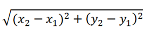

# **C++ Basic Data Types**

## **Problem 1: Printing name, date of birth and mobile number** 

### **Task**
- Write a C+ program to print someone's name, date of birth, and mobile number.
    + Input: nothing.
    + Output: name, date of birth and mobile number.

### **Example**
- For **Example**, the output might be:
```
Name : John Watson
Date of birth : Jun 29, 1990
Mobile : +84 903 xxx xxx
```

### **Solution**
```CPP
#include <iostream>
using std::cout;
int main()  
{
    cout << "Name : John Watson\n";
    cout << "Date of birth : Jun 29, 1990\n";
    cout << "Mobile : +84 903 xxx xxx\n";
    return 0; 
}
```
<div style="page-break-after: always;"></div>

## **Problem 2: Printing a block F**

### **Task**

- Write a C++ program to print a block F using the hash (#), where the F has a height of six characters and width of five and four characters.
    + Input: nothing.
    + Output: name, date of birth and mobile number.

### **Expected Output**

```
######
#
#
#####
#
#
#
```

### **Solution:**
```CPP
#include <iostream>
using std::cout;
int main() 
{
    cout << "######\n";
    cout << "#\n";
    cout << "#\n";
    cout << "#####\n";
    cout << "#\n";
    cout << "#\n";
    cout << "#";
    return(0);
}
```
<div style="page-break-after: always;"></div>

## **Problem 3: Size of some basic data types**

### **Task**
- Write a C++ program to display size of the following data types:
    + char
    + unsigned char
    + short
    + unsigned short
    + int
    + unsigned int
    + long
    + unsigned long
    + float
    + double

### **Expected ouptput**
```
size of char: 1
size of unsigned char: 1
size of short: 2
size of unsigned short: 2
size of int: 4
size of unsigned int: 4
size of long: 4
size of unsigned long: 4
size of float: 4
size of double: 8
```

### **Solution**
```CPP
#include <iostream>
using std::cout;
int main() 
{
    cout << "size of char: " << sizeof(char);
    cout << "size of unsigned char: " << sizeof(unsigned char);
    cout << "size of short: " << sizeof(short);
    cout << "size of unsigned short: " << sizeof(unsigned short);
    cout << "size of int: " << sizeof(int);
    cout << "size of unsigned int: " << sizeof(unsigned int);
    cout << "size of long: " << sizeof(long);
    cout << "size of unsigned long: " << sizeof(unsigned long);
    cout << "size of float: " << sizeof(float);
    cout << "size of double: " << sizeof(double);

    return 0;
}
```
<div style="page-break-after: always;"></div>

## **Problem 4: perimeter and area of a rectangle**

### **Task**
- Write a C++ program to compute the perimeter and area of a rectangle with the height and the width which are input by user.
    + Input: width & height.
    + Output: perimeter & area.

### **Example**
- Assume that user inputs width = 3.3, and height = 4.4. The input and output will be displayed as the followings
```
width = 3.3
height = 4.4
perimeter = 15.400000 inches
area = 14.520000 square inches
```

### **Solution:**
```CPP
#include <iostream> 
using std::cout;
using std::cin;
int main() {
    /* Assigning values to height and width */
    float width = 0;
    float height = 0;
    float area = 0;
    float perimeter = 0;

    /* Inputting the width and the height of the rectangle */
    cout << "width = ";
    cin >> width;

    cout << "height = ";
    cin >> height;

    // Calculating the perimeter of the rectangle
    perimeter = 2 * (height + width);
    cout << "perimeter = " << perimeter << " inches\n";

    // Calculating the area of the rectangle
    area = height * width;
    cout << "area = " << area << " square inches\n";
    return 0;
}
```
<div style="page-break-after: always;"></div>

## **Problem 5: Perimeter and area of a circle**

### **Task**
- Write a C++ program to compute the perimeter and area of a circle with a given radius.
    + Inpput: radius of the circle.
    + Output: perimeter and area.

### **Example**
- Assume that user inputs radius = 100.  The input and output will be displayed as the followings
```
radius = 10
perimeter = 62.799999 inches
area = 314.000000 square inches
```

### **Solution**
```CPP
#include <iostream>
using std::cout;
using std::cin;
int main() {
    float radius = 0, area = 0, perimeter = 0;

    // Inputting the radius of the circle
    cout << "radius = ";
    cin >> radius;

    // Calculating the perimeter of the circle
    perimeter = 2 * 3.14 * radius;
    cout << "perimeter = " << perimeter << " inches\n";

    // Calculating the area of the circle
    area = 3.14 * radius * radius;
    cout << "area = " << area << " square inches\n";

   return 0;
}
```
<div style="page-break-after: always;"></div>

## **Problem 6: The distance between two points**

### Objective
The formula of distance between two points is:



### **Task**
- Write a C++ program to calculate the distance between two points.
    + Input: (x1, y1) and (x2, y2).
    + Output: distance between two points.

### **Example**
- Assume that (x1, y2) = (0, 0) and (x2, y2) = (4, 3).  The input and output will be displayed as the followings:

```
Input x1: 0
Input y1: 0
Input x2: 4
Input y2: 3
Distance = 5.0000
```

### **Solution**
```CPP
#include <iostream>
#include <iomanip>
#include <math.h>

using std::cout;
using std::cin;
using std::fixed;
using std::setprecision;

int main() {
    float x1 = 0, y1 = 0, x2 = 0, y2 = 0;
    float squareDistance = 0, distance = 0;

    // Input point 1 (x1, y1)
    cout << "Input x1: ";
    cin >> x1;
    cout << "Input y1: ";
    cin >> y1;

    // Input point 2 (x2, y2)
    cout << "Input x2: ";
    cin >> x2;
    cout << "Input y2: ";
    cin >> y2;

    // Calculate squared distance between points
    distance = ((x2 - x1) * (x2 - x1)) + ((y2 - y1) * (y2 - y1));

    // Calculate and print the distance between the points
    cout << "Distance between the said points: " << fixed << setprecision(4) << sqrt(distance);

    return 0;
}
```
<div style="page-break-after: always;"></div>

## **Problem 7: Sum of 3 digits of a number**

### **Task**
- Write a C++ program that allows the user to input a 3-digit number and separates the digits into units, tens, and hundreds:
    + Input: a 3-digit number.
    + Output: units digit, tens digit and hundres digit.
- Assume that the input is always correct format (always 3-digit number). It means, you don't need to check the input format.

### **Example**
```
the 3-digit number: 234
hundreds = 2
tens = 3
units = 4
```

### **Solution**
```CPP
#include <iostream>
#include <math.h>

using std::cout;
using std::cin;

int main() {
    int threeDigit = 0;
    int units = 0, tens = 0, hundreds = 0;
    int remaining = 0;
    
    cout << "The 3-digit number: ";
    cin >> threeDigit;
    
    remaining = threeDigit;

    // Calculate units and remaining
    units = remaining % 10;
    remaining = remaining / 10;
    
    // Calculate tens and remaining
    tens = remaining % 10;
    remaining = remaining / 10;

    // So far, the remaining is the hundreds
    hundreds = remaining;

    // Results:
    cout << "hundreds = " << hundreds;
    cout << "\ntens = " << tens;
    cout << "\nunits = " << units;

    return 0;
}
```
<div style="page-break-after: always;"></div>

## **Problem 8: Hour, minute and second**

### **Task**
- Write a C+ program that allows the user to input a number of seconds then convert it to numbers of day, hour, minute and the remaining second:
    + Input: seconds
    + Output: days, hours, minutes, remaining seconds

### **Examples**
**Example 1**
```
Input seconds: 3600
3600 seconds are 0 days, 1 hours, 0 minutes, 0 seconds
```

**Example 2**
```
Input seconds: 3800
3800 seconds are 0 days, 1 hours, 3 minutes, 20 seconds
```

**Example 3**
```
Input seconds: 3789021
3789021 seconds are 43 days, 20 hours, 30 minutes, 21 seconds
```


### **Solution**
```CPP
#include <iostream>

using std::cout;
using std::cin;

int main() {
    long inSeconds = 0;
    long outDays = 0, outHours = 0, outMinutes = 0, outSeconds = 0;
    long remaining = 0;
    
    cout << "Input seconds: ";
    cin >> inSeconds;
    
    remaining = inSeconds;

    // Calculate output seconds and remaining
    outSeconds = remaining % 60;
    remaining = remaining / 60;
    
    // Calculate output minutes and remaining
    outMinutes = remaining % 60;
    remaining = remaining / 60;

    // Calculate output hours and remaining
    outHours = remaining % 24;
    remaining = remaining / 24;

    // So far, the remaining is the number of days
    outDays = remaining;

    // Results:
     cout << inSeconds << " seconds are " 
              << outDays << " days, " 
              << outHours << " hours, " 
              << outMinutes << " minutes, " 
              << outSeconds << " seconds";

    return 0;
}
```
<div style="page-break-after: always;"></div>

## **Problem 9: Explicit type-casting**

### **Task**
- Correct the following samples of code:

**Sample 1**
```CPP
#include <iostream>

using std::cout;

int main() {
    float result = 5 / 2;
    cout << "result = " << result;
}
```

**Sample 2**
```CPP
#include <iostream>

using std::cout;

int main() {
    int x = 10;
    int y = 3;
    float result = x / y;
    cout << "result = " << result;
}
```

**Sample 3**
```CPP
#include <iostream>

using std::cout;

int main() {
    float result = 1/2 + 1/3 + 1/4;
    cout << "result = " << result;
}
```

**Sample 4**
```CPP
#include <iostream>

using std::cout;

int main() {
    int num_int = 10;
    float num_float = num_int;
    cout << "num_float = " << num_float;
}
```

**Sample 5**
```CPP
#include <iostream>

using std::cout;

int main() {
    float result = 1.0/2 + 1/3.0 + 1/4.0;
    cout << "result = " << result;
}
```

### **Solution**
**Sample 1**
```CPP
#include <iostream>
using std::cout;
int main() {
    float result = (float) 5 / 2;
    cout << "result = " << result;
}
```

**Sample 2**
```CPP
#include <iostream>
using std::cout;
int main() {
    int x = 10;
    int y = 3;
    float result = (float) x / y;
    cout << "result = " << result;
}
```

**Sample 3**
```CPP
#include <iostream>

using std::cout;

int main() {
    float result = (float) 1/2 + (float) 1/3 + (float) 1/4;
    cout << "result = " << result;
}
```

**Sample 4**
```CPP
// Nothing needs changing, because num_int shall be casting to float implicitly.
#include <iostream>

using std::cout;

int main() {
    int num_int = 10;
    float num_float = num_int;  // Implicitly converts integer to float
    cout << "num_float = " << num_float;
}
```

**Sample 5**
```
Nothing needs changing. Because:
1.0/2 returns a correct double number because 1.0 is double.
1/3.0 returns a correct double number because 3.0 is double.
1/4.0 returns a correct double number because 4.0 is double.
variable "result" is float, therefore sum of doubles is casted to float.
```