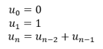
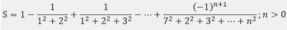

# <p align="center">**loop statement**</p>

## **Problem 1: ASCII printable characters**

### **Objective**
Integer code of ASCII printable characters are from 32 to 126. Pay attention that the code 32 means "space" character.

### **Task**
- Write 2 C++ programs to display ASCII printable characters.
    + Input: Nothing
    + Output: ASCII printable characters, its decimal values and hexa values.

### Expected output
- Pay attention that the following output is not enough.
```
character       DEC             HEX
                32              20
!               33              21
"               34              22
#               35              23
$               36              24

...             ...             ...

y               121             79
z               122             7a
{               123             7b
|               124             7c
}               125             7d
~               126             7e
```

**Method 1: for loop**
```CPP
#include <iostream>
#include <iomanip>
using std::cout;
using std::setw;
using std::hex;
using std::dec;
int main() {
    
    cout << "character\tDEC\t\tHEX\n";
    for (int i = 32; i <= 126; i++)
        cout << setw(10) << static_cast<char>(i) << setw(10) << i<< setw(10) << hex << i << dec << '\n';

    return 0;
}
```

**Method 2: while loop**
```CPP
#include <iostream>
#include <iomanip>
using std::cout;
using std::setw;
using std::hex;
using std::dec;
int main() {
    
    cout << "character\tDEC\t\tHEX\n";
    int i = 32;
    while ( i <= 126) {
        cout << setw(10) << static_cast<char>(i) << setw(10) << i<< setw(10) << hex << i << dec << '\n';
        i++;
    }

    return 0;
}
```
<div style="page-break-after: always;"></div>

## **Problem 2: Sum of first n natural numbers**

### **Task**
-  Write 2 C++ programs to compute the sum of the first `n` natural numbers (n <= 100) (write one program using for loop and another using while loop).
    + Input: integer n > 0.
    + Output: sum of first n natural numbers.

### **Example**
```
n = 15
The first 15 natural number are:
1 2 3 4 5 6 7 8 9 10 11 12 13 14 15
The Sum is : 120
```
### **Solution**

**Method 1: for loop**
```CPP
#include <iostream>
using std::cout;
using std::cin;
int main()
{
    int  i = 0, n = 0, sum = 0;

    cout << "n = ";
    cin >> n;
    
    cout << "The first " << n << " natural numbers are:\n";
    for (i = 1; i <= n; i++)
    {
        sum = sum + i;
        cout << i << " ";    
    }
    
    cout << "\nThe Sum is: " << sum;

    return 0;
}
```

**Method 2: while loop**
```CPP
#include <iostream>
using std::cout;

int main()
{
    int  i = 0, n = 0, sum = 0;

     cout << "n = ";
    cin >> n;
    
    cout << "The first " << n << " natural numbers are:\n";
    
    i = 1;
    while (i <= n)
    {
        sum = sum + i;
        cout << i << " ";   
        i++;
    }
    
    cout << "\nThe Sum is: " << sum;

    return 0;
}
```
<div style="page-break-after: always;"></div>


## **Problem 3: sum and average of integers from 13 to 22**

### **Task**
-  Write 2 C++ programs to calculate the sum and average of integers from 10 to 20. (Write one program using for loop and another using while loop).
    + Input: Nothing.
    + Output: the sum and the average

### Expected output
```
13 + 14 + 15 + 16 + 17 + 18 + 19 + 20 + 21 + 22 = 175
Average of the numbers = 17.50
```

### **Solution**

**Method 1: for loop**
```CPP
#include <iostream>
#include <iomanip>
using std::cout;
using std::fixed;
using std::setprecision;
int main() {
    int sum = 0;
    float average = 0;;

    for (int i = 13; i <= 22; i++) {
        cout << i << " ";
        if (i < 22)
            cout << "+ ";
        else
            cout << "= ";
        sum += i;
    }

    average = (float) sum / 10;
    cout << sum;
    cout << "\nAverage of the numbers = " << fixed << setprecision(2) << average;

    return 0;
}
```

**Method 2: while loop**
```CPP
#include <iostream>
#include <iomanip>
using std::cout;
using std::fixed;
using std::setprecision;
using std::cout;
int main() {
    int sum = 0;
    float average = 0;;

    int i = 13;
    while (i <= 22) {
        cout << i << " ";
        if (i < 22)
            cout << "+ ";
        else
            cout << "= ";
        sum += i;
        i++;
    }

     average = (float) sum / 10;
    cout << sum;
    cout << "\nAverage of the numbers = " << fixed << setprecision(2) << average;

    return 0;
}
```
<div style="page-break-after: always;"></div>


## **Problem 4: Factorial of n**

### **Objective**
formula to calculate factorial of `n` is: n! = 1 * 2 * ... *n.

### **Task**
- Write 2 C++ programs to calculate the factorial of `n` (n <= 10). (Write one program using for loop and another using while loop).
    + Input: n
    + Output: 
        + If n <= 10, display "n!".
        + If n > 10, display "Exit the program." and exit.

### **Examples**

```
n = 10
10! = 3628800
```

```
n = 20
n > 10
Exit the program.
```

### **Solution**

**Method 1: for loop**
```CPP
#include <iostream>
using std::cout;
using std::cin;
int main() {
    int n = 0;
    int factorial = 1;

    cout << "n = ";
    cin >> n;

    if (n > 10) {
        cout << "n > 10\nExit the program.";
        return 0;
    }

    for (int i = 1; i <= n; i++) {
        factorial *= i;
    }

    cout << n << "! = " << factorial;

    return 0;
}
```

**Method 2: while loop**
```CPP
#include <iostream>
using std::cout;
using std::cin;
int main() {
    int n = 0;
    int factorial = 1;
    int i = 0;

    cout << "n = ";
    cin >> n;

    if (n > 10) {
        cout << "n > 10\nExit the program.";
        return 0;
    }

    i = 1;
    while (i <= n) {
        factorial *= i;
        i++;
    }

    cout << n << "! = " << factorial;

    return 0;
}
```
<div style="page-break-after: always;"></div>


## **Problem 5: squares of the numbers up to an integer**

### **Task**
- Write 2 programs in C++ to display the squares of the numbers up to an integer, and calculate sum of all the squares. (Write one program using for loop and another using while loop).
    + Input: n.
    + Output: 
        + 1^2, 2^2, 3^2, ..., n^2.
        + sum of 1^2, 2^2, 3^2, ..., n^2.

### **Example**

```
n = 10
The squares of the first 10 natural numbers are:
1 4 9 16 25 36 49 64 81 100
The sum of them is: 385
```

### **Solution**

**Method 1: for loop**
```CPP
#include <iostream>
using std::cout;
using std::cin;
int main() {

    int n = 0;
    int square = 0;
    int sumOfSquares = 0;

    cout << "n = ";
    cin >> n;

    cout << "The squares of the first " << n << " natural numbers are:\n";
    for (int i = 1; i <= n; i++) {
        square = i*i;
        cout << square << " ";
        sumOfSquares += square;
    }

    cout << "\nThe sum of them is: " << sumOfSquares;

    return 0;
}
```

**Method 2: while loop**
```CPP
#include <iostream>
using std::cout;
using std::cin;
int main() {

    int n = 0;
    int square = 0;
    int sumOfSquares = 0;
    int i = 0;

    cout << "n = ";
    cin >> n;

    cout << "The squares of the first " << n << " natural numbers are:\n";

    i = 1;
    while (i <= n) {
        square = i*i;
        cout << square << " ";
        sumOfSquares += square;
        i++;
    }

    cout << "\nThe sum of them is: " << sumOfSquares;


    return 0;
}
```

<div style="page-break-after: always;"></div>

## **Problem 6: Max and min**

### **Task**
- Write 2 a program in C++ to find max and min among n integer numbers. (Write one program using for loop and another using while loop).
    + Input: n.
    + Output: max and min.

### **Example**

```
n = 7 
input number 1: 15
input number 2: -3
input number 3: 7
input number 4: 6
input number 5: 39
input number 6: 25
input number 7: 12
max = 39
min = -3
```

### **Solution**

**Method 1: for loop**
```CPP
#include <iostream>
using std::cout;
using std::cin;
int main() {
    int n = 0;
    int i = 0;
    int temp = 0;
    int max = 0;
    int min = 0;

    cout << "n = ";
    cin >> n;

    cout << "input number 1: ";
    cin >> temp;

    max = min = temp;

    for (i = 2; i <= n; i++) {
        cout << "input number " << i << ": ";
        cin >> temp;

        if (max < temp)
            max = temp;

        if (min > temp)
            min = temp;
    }

    cout << "max = " << max << '\n';
    cout << "min = " << min << '\n';

    return 0;
}
```

**Method 2: while loop**
```CPP
#include <iostream>
using std::cout;
using std::cin;
int main() {
    int n = 0;
    int i = 0;
    int temp = 0;
    int max = 0;
    int min = 0;

    cout << "n = ";
    cin >> n;

    cout << "input number 1: ";
    cin >> temp;

    max = min = temp;

    i = 2;
    while (i <= n) {
        cout << "input number " << i << ": ";
        cin >> temp;

        if (max < temp)
            max = temp;

        if (min > temp)
            min = temp;

        i++;
    }

    cout << "max = " << max << '\n';
    cout << "min = " << min << '\n';

    return 0;
}
```
<div style="page-break-after: always;"></div>

## **Problem 7: Sum of odd numbers**

### **Task**
- Write 2 a program in C++ to calculate odd numbers among n integer numbers. (Write one program using for loop and another using while loop).
    + Input: n.
    + Output: sum of odd numbers

### **Example**

```
n = 7
input number 1: 3
input number 2: 1
input number 3: 2
input number 4: 4
input number 5: 5
input number 6: 6
input number 7: 10
sum of the odd numbers: 9
```

### **Solution**

**Method 1: for loop**
```CPP
#include <iostream>
using std::cout;
using std::cin;
int main() {
    int n = 0;
    int i = 0;
    int temp = 0;
    int sumOfOdds = 0;

    cout << "n = ";
    cin >> n;

    for (i = 1; i <= n; i++) {
        cout << "input number " << i << ": ";
        cin >> temp;

        if (temp % 2 != 0)      // check if temp is an odd number
        {
            sumOfOdds += temp;
        }
    }

    cout << "sum of the odd numbers: " << sumOfOdds;

    return 0;
}
```

**Method 2: while loop**
```CPP
#include <iostream>
using std::cout;
using std::cin;
int main() {
    int n = 0;
    int i = 0;
    int temp = 0;
    int sumOfOdds = 0;

    cout << "n = ";
    cin >> n;

    i = 1;
    while (i <= n) {
       cout << "input number " << i << ": ";
        cin >> temp;

        if (temp % 2 != 0)      // check if temp is an odd number
        {
            sumOfOdds += temp;
        }

        i++;
    }

    cout << "sum of the odd numbers: " << sumOfOdds;

    return 0;
}
```
<div style="page-break-after: always;"></div>


## **Problem 8: Sum of digits of a number**

### **Task**
- Write a C++ program to calculate sum of all digits of a positive integer. (Use `"do/while"` loops instead of `"for"` loops and `"while"` loops).
    + Input: a positive number
    + Output: sum of all the digits.
- If user input an integer number which is less than or equal to 0, ask him/her to input again.

### **Example**
```
Enter any positive integer: -123
-123 is not a positive integer. Please input again!
Enter any positive integer: 123
Sum of digits = 6
```

### **Solution**
```CPP
#include <iostream>
using std::cout;
using std::cin;
int main() {
    int num = 0, sum = 0;

    do {
        cout << "Enter any positive integer: ";
        cin >> num;
        if (num <= 0) {
            cout << num << " is not a positive integer. Please input again!\n";
        }
    } while (num <= 0);

    // Calculate the sum of digits
    do {
        // Extract the last digit of the number
        int lastDigit = num % 10;
        // Add the last digit to the sum
        sum += lastDigit;
        // Remove the last digit from the number
        num /= 10;
    } while (num != 0);


    cout << "Sum of digits = " << sum;
    return 0;
}
```
<div style="page-break-after: always;"></div>


## **Problem 9: Simple calculator**

### **Task**
- Write a program in C++ which is a Menu-Driven Program to perform a simple calculation.  (Use "do/while" loops instead of "for" loops and "while" loops).
    + Input: 
        + an options among:
            1. addition (enter 1)
            2. substraction (enter 2)
            3. multiplication (enter 3)
            4. division (enter 4)
            5. Exit the program (enter 5)
        + 2 real numbers.
    + Output: a real number which is result of the calculation.
- When enter the option, if user enters an invalid number, ask him/her to enter again.

### **Example**
- The first **Example** demonstrates how a program prompts the user to input a valid number and displays the result of multiplication. The behavior of addition, subtraction, and division is similar to multiplication.

```
Input your option :
1-Addition.
2-Substraction.
3-Multiplication.
4-Division.
5-Exit.
10
10 is an invalid option. Please input a valid option.
Input your option :
1-Addition.
2-Substraction.
3-Multiplication.
4-Division.
5-Exit.
3
1st number: 4
2nd number: 3.7
The Multiplication of 4.000000  and 3.700000 is: 14.800000
```

- The second example demonstrates what will happen when user select "exit".
```
Input your option :
1-Addition.
2-Substraction.
3-Multiplication.
4-Division.
5-Exit.
5
Exiting the program ...
```

- The third example demonstrates what will happen when a user attempts to divide by 0.
```
Input your option:
1-Addition.
2-Substraction.
3-Multiplication.
4-Division.
5-Exit.
4
1st number: 1.5
2nd number: 0
The second integer is zero. Divide by zero.
```

### **Solution**
```CPP
#include <iostream>
using std::cout;
using std::cin;
int main() {
    float num1 = 0, num2 = 0, result = 0;
    int option = 0;

    // Display the menu for operation choice.
    do {
        cout << "Input your option:\n";
        cout << "1-Addition.\n2-Subtraction.\n3-Multiplication.\n4-Division.\n5-Exit.\n";
        cin >> option;

        if (option < 1 || option > 5)
            cout << option << " is an invalid option. Please input a valid option.";

    } while (option < 1 || option > 5);

    if (option == 5) {
        cout << "Exiting the program...";
        return 0;
    }
    else {
        cout << "1st number: ";
        cin >> num1;
        cout << "2nd number: ";
        cin >> num2;
    }

    switch(option)  
    // Start a switch statement based on the user's choice.
    {
    case 1:
        cout << "The Addition of " << num1 << " and " << num2 << " is: " << (num1 + num2);
        break;

    case 2:
        cout << "The Subtraction of " << num1 << " and " << num2 << " is: " << (num1 - num2);
        break;

    case 3:
        cout << "The Multiplication of " << num1 << " and " << num2 << " is: " << (num1 * num2);
        break;

    case 4:
        if(num2 == 0) {
            cout << "The second integer is zero. Divide by zero.\n";
        } else {
            cout << "The Division of " << num1 << " and " << num2 << " is: " << (num1 / num2);
        }
        break;

    case 5: 
        break;  // Exit the program.

    default:
       cout << "Input correct option\n";  
       // Display error message for invalid input.
        break; 
    }

    return 0;
}
```
<div style="page-break-after: always;"></div>


## **Problem 10: Average of n integers**

### **Task**
-  Write a C++ program that calculates the average of a set of numbers input by the user. The user should be able to input as many numbers as desired, and the program should continue until the user decides to stop by inputting characters or words which are not an integer. (Use `"do/while"` loops instead of `"for"` loops and `"while"` loops).
    + Input: integers.
    + Output: Average of the integers.

### **Solution**
```
Input numbers to calculate the average (enter a non-numeric value to stop):
Input a number: 3
Input a number: 1
Input a number: 12
Input a number: -12
Input a number: 6
Input a number: a
Average of input numbers: 2.00
```

### **Solution**
```CPP
#include <iostream>
#include <limits>
using std::cout;
using std::cin;
using std::numeric_limits;
using std::streamsize;
int main() {
    int count = 0;
    double sum = 0.0;
    double number;
    int result = 0;

    // Prompt the user to enter numbers and calculate the average
    cout << "Input numbers to calculate the average (enter a non-numeric value to stop):\n";

    while (true) {
        cout << "Input a number: ";

        if (cin >> number) {  
            sum += number;
            count++;              
        }
        else {
            // Xử lý lỗi nếu không phải số
            cin.clear();                    
            cin.ignore(numeric_limits<std::streamsize>::max(), '\n');  
            break;                              
        }
    }


    if (count > 0) {    // Check if any numbers were entered
        double average = sum / count;
        cout << "Average of input numbers: " << average;
    }
    else {
        cout << "No numbers were entered.";
    }

    return 0;
}
```
<div style="page-break-after: always;"></div>

## **Problem 11: Sum of positive real numbers**

### **Task**
-  Write a C++ program that calculate sum of positive real numbers. If user input a negative real number or word in wrong format of number, return the sum of input numbers til that moment.
    + Input: 
        + n positive real numbers
    + Output:
        + sum of n positive real numbers.

### **Solution**
```
Input positive real numbers to calculate the sum:
1
2
3.3
-5
sum = 6.300000
```

### **Solution**
```CPP
#include <iostream>
#include <limits>
using std::cout;
using std::cin;
using std::numeric_limits;
using std::streamsize;
int main() {
    double sum = 0.0;
    double number = 0.0;

    cout << "Input positive real numbers to calculate the sum:\n";

    while (true) {
        cout << "Input a number: ";
        if (cin >> number) {
            if (number < 0) {
                break;  
            }
            sum += number;  
        }
        else {
            
            cin.clear(); 
            cin.ignore(numeric_limits<streamsize>::max(), '\n'); 
            cout << "Invalid input. Please enter a positive real number.\n";
        }
    }

    std::cout << "sum = " << sum << std::endl;

    return 0;
}
```
<div style="page-break-after: always;"></div>


## **Problem 12: Sum of `N` positive real numbers**

### **Task**
-  Write a C++ program that calculate sum of `"N"` positive real numbers. If user inputs a negative real number or a word in wrong format of number before finishing inputting N real numbers, ignore it and continue.
    + Input: 
        + `"N"`
        + n positive real numbers
    + Output:
        + sum of n positive real numbers.

### **Solutions**
```
Input 5 positive real numbers to calculate the sum:
1
2
3
4
-7
-4
5
sum = 15.000000
```

### **Solution**
```CPP
#include <iostream>
#include <limits>
using std::cout;
using std::cin;
using std::numeric_limits;
using std::streamsize;
int main() {
    int N = 0;
    double sum = 0.0;
    double number = 0.0;
    int count = 0;

    cout << "N = ";
    cin >> N;

    // Prompt the user to enter numbers and calculate the sum
    cout << "Input " << N << " positive real numbers to calculate the sum:\n";
    while (count < N) {
        cout << "Input number " << (count + 1) << ": ";
        if (cin >> number && number >= 0) {

        sum += number;
        count++;
    } else {
            
            cin.clear();  
            cin.ignore(numeric_limits<streamsize>::max(), '\n');
        }
    }

    
    cout << "sum = " << sum;

    return 0;
}
```
<div style="page-break-after: always;"></div>


## **Problem 13: Fibonacci sequence**

### **Objective**
Fibonacci sequence formula:




### **Task**
- Wrie a C++ program to output the nth number in the Fibonacci sequence.
    + Input: n
    + Output: nth number in the Fibonacci sequence.

### **Example**
```
Program to output the nth number in Fibonacci sequence
n = 5
u5 = 5
```

```
Program to output the nth number in Fibonacci sequence
n = -1
n < 0 is invalid. Exit!
```

### **Solution**
```CPP
#include <iostream>
using std::cout;
using std::cin;
int main() {
    int n = 0;
    int u0 = 0;
    int u1 = 1;
    int un;

    cout << "Program to output the nth number in Fibonacci sequence\n";
    cout << "Input integer n (n >= 0): ";
    cin >> n;
    
    if (n < 0) {
        cout << "n < 0 is invalid. Exit!\n";
        return 0;
    }

    switch (n)
    {
        case 0:
            un = u0;
            break;

        case 1:
            un = u1;
            break;

        default:
        {
            for (int i = 2; i <= n; i++) {
                un = u0 + u1;
                u0 = u1;
                u1 = un;
            }
        }
        break;
    }


    cout << "u" << n << " = " << un;
    return 0;
}
```
<div style="page-break-after: always;"></div>

## **Problem 14: Sum of the first n numbers in Fibonacci sequence**

### **Objective**
Fibonacci sequence formula:


### **Task**
- Wrie a C++ program to oucalculate sum of the first n numbers in Fibonacci sequence.
    + Input: n
    + Output: nth number in the Fibonacci sequence.

### **Solution**
```
Program to calculate sum of the first n numbers in Fibonacci sequence
Input integer n (n > 0): 10
the first 10 numbers in Fibonacci sequence are:
0 1 1 2 3 5 8 13 21 34
sum = 88
```

```
Program to calculate sum of the first n numbers in Fibonacci sequence
Input integer n (n > 0): 0
n <= 0 is invalid. Exit!
```

### **Solution**
```CPP
#include <iostream>
using std::cout;
using std::cin;
int main() {
    int n = 0;
    int u0 = 0;
    int u1 = 1;
    int un;
    int sum = 0;

    cout << "Program to calculate sum of the first n numbers in Fibonacci sequence\n";
    cout << "Input integer n (n > 0): ";
    cin >> n;

    if (n <= 0) {
        cout << "n <= 0 is invalid. Exit!\n";
        return 0;
    }

    cout << "The first " << n << " numbers in Fibonacci sequence are:\n";

    switch (n)
    {
    case 1:     // Calculate sum of the first one number
        cout << u0;   // u0 is the first number in sequence
        sum += u0;
        break;

    case 2:     // Calculate sum of the first 2 numbers
        cout << u0 << " " << u1; // u0 and u1 are the first 2 numbers
        sum += u0 + u1;
        break;

    default:
    {
        cout << u0 << " " << u1 << " "; // Print first two numbers
        sum += u0 + u1;
        for (int i = 2; i < n; i++) {
            un = u0 + u1;
            u0 = u1;
            u1 = un;

            cout << un << " ";
            sum += un;
        }
    }
    break;
    }

    cout << "\nSum = " << sum << "\n";

    return 0;
}

```
<div style="page-break-after: always;"></div>

## **Problem 15: Some complex sum**

### **Task**
- Write a C++ program that calculates S:

    
    + Input: n as an integer number
    + Output: S

### **Example**
```
n = 3
S = 0.871429
```

### **Solution**
```CPP
#include <iostream>
using std::cout;
using std::cin;
int main() {
    int n = 0;
    int sign = -1;
    int demonirator = 0; 
    double sum = 0;

    cout << "n = ";
    cin >> n;
    
    for (int i = 1; i <= n; i++) {
        double term = 0;
        sign = -1*sign;
        demonirator += i*i;
        term = static_cast<double>(sign) / demonirator;
        sum += term;
    }

    cout << "S = " << sum << "\n";

    return 0;
}

```
