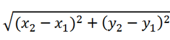

# <p align="center">**Function**</p>

## **Problem 1: Size of some basic data types**

### **Task**
- Complete the sample code below, defining a function in C++ to to display size of the following data types:
    + char
    + unsigned char
    + short
    + unsigned short
    + int
    + unsigned int
    + long
    + unsigned long
    + float
    + double

### **Sample Code**
```CPP
#include <iostream>

/**
 * @brief : displays size of data types
 */
// Define you function displaySizeOfDataTypes here

int main() 
{
    // call displaySizeOfDataTypes here

    return 0;
}
```

### Expected Output
```
size of char: 1
size of unsigned char: 1
size of short: 2
size of unsigned short: 2
size of int: 4
size of unsigned int: 4
size of long: 4
size of unsigned long: 4
size of float: 4
size of double: 8
```

### Solution
```CPP
#include <iostream>
using std::cout;

/**
 * 
 * @brief : displays size of data types
 */
void displaySizeOfDataTypes()
{
    cout << "size of char: " << sizeof(char) << " bytes\n";
    cout << "size of unsigned char: " << sizeof(unsigned char) << " bytes\n";
    cout << "size of short: " << sizeof(short) << " bytes\n";
    cout << "size of unsigned short: " << sizeof(unsigned short) << " bytes\n";
    cout << "size of int: " << sizeof(int) << " bytes\n";
    cout << "size of unsigned int: " << sizeof(unsigned int) << " bytes\n";
    cout << "size of long: " << sizeof(long) << " bytes\n";
    cout << "size of unsigned long: " << sizeof(unsigned long) << " bytes\n";
    cout << "size of float: " << sizeof(float) << " bytes\n";
    cout << "size of double: " << sizeof(double) << " bytes\n";
}

int main() 
{
    displaySizeOfDataTypes();

    return 0;
}
```
<div style="page-break-after: always;"></div>

## **Problem 2: Function to check if a number is even**

### Task
- Complete the sample code below, defining a function in C++ to check if a given number is even or odd using the function.
    + Input: integer n.
    + Output: displays if n is even or odd.

### Sample Code
```CPP
#include <iostream>
using std::cout;
using std::cin;
/**
 * @param  {int} n : the number which needs checking
 * @return {int}   : 1 if even, 0 if odd.
 */
// define the function checkOddEven here

int main()
{
    int n;
	cout << "Function: Check if the number is even or odd:\n";
    cout << "Input any number: ";
    cin >> n;

    // Combine if/else statement with the function checkOddEven() 
    // to display if the number is even or odd:
    
    return 0;
}
```

### Example
```
Function : check the number is even or odd:
Input any number : 7
The entered number is odd.
```

### Solution
```CPP
#include <iostream>
using std::cout;
using std::cin;

/**
 * @param  {int} n : the number which needs checking
 * @return {int}   : 1 if even, 0 if odd.
 */
int checkOddEven(int n)
{   
    return (n & 1);//The & operator does a bitwise and,
}

int main()
{
    int n;
	cout << "Function: Check if the number is even or odd:\n";
    cout << "Input any number: ";
    cin >> n;

    // Combine if/else statement with the function checkOddEven() 
    // to display if the number is even or odd:
    if(checkOddEven(n))
    {
        cout << "The entered number is odd.";
    }
    else
    {
        cout << "The entered number is even.";
    }
    return 0;
}
```
<div style="page-break-after: always;"></div>


## **Problem 3: Perimeter and area of a circle**

### Task
- Complete the sample code below, defining a function in C++ to compute the perimeter and area of a circle with a given radius.
    + Inpput: radius of the circle.
    + Output: perimeter and area.

### Sample Code
```CPP
#include <iostream>
using std::cout;
using std::cin;

/**
 * @brief: Calculate perimeter from radius
 * @param  {float} radius
 * @return {float}: perimeter of the circle
 */
// define function getPerimeter here

/**
 * @brief: Calculate area from radius
 * @param {float} radius
 * @return {float}: area of the circle
 */
//define function getArea here

int main() {
    float radius = 0;

    /* Inputting the radius of the circle */
    cout << "radius = ";
    cin >> radius;

    // Call getPerimeter and display the perimeter here

    // Call getArea and display the area here

   return 0;
}
```

### Example
```
radius = 10
perimeter = 62.799999 inches
area = 314.000000 square inches
```

### Solution
```CPP
#include <iostream>
using std::cout;
using std::cin;

/**
 * @brief: Calculate perimeter from radius
 * @param  {float} radius
 * @return {float}: perimeter of the circle
 */
float getPerimeter(float radius)
{
    return 2 * 3.14 * radius;
}

/**
 * @brief: Calculate area from radius
 * @param {float} radius
 * @return {float}: area of the circle
 */
float getArea(float radius)
{
    return 3.14 * radius * radius;
}

int main() {
    float radius = 0;

    /* Inputting the radius of the circle */
    cout << "radius = ";
    cin >> radius;

    cout << "perimeter = " << getPerimeter(radius) << " inches\n";
    cout <<"area = " << getArea(radius) << " square inches\n";

   return 0;
}
```
<div style="page-break-after: always;"></div>


## **Problem 4: Functions in `math.h`**

### Task
- Research and write examples of using some common functions in the ‘cmath.’ library.

### Sample Code
```CPP
#include <iostream>
#include <cmath>
using std::cout;
int main() {
    double num = 25.0;
    double result = sqrt(num);
    cout << "Square root of " << num << " is " << result;
    return 0;
}
```

```CPP
#include <iostream>
#include <cmath>
using std::cout;
using std::pow;
int main() {
    double base = 2.0;
    double exponent = 3.0;
    double result = pow(base, exponent);
    cout << base << " raised to the power of " << exponent << " is " << result;
    return 0;
}
```

```CPP
#include <iostream>
#include <cmath>
using std::cout;
using std::sin;
using std::cos;
using std::tan;
int main() {
    double angle_degrees = 30.0;
    double angle_radians = angle_degrees * 3.14 / 180.0;
    cout << "sin(" << angle_degrees << ") = " << sin(angle_radians);
    cout << "\ncos(" << angle_degrees << ") = " << cos(angle_radians);
    cout << "\ntan(" << angle_degrees << ") = " << tan(angle_radians);
    return 0;
}
```

```CPP
#include <iostream>
#include <cmath>
using std::cout;

int main() {
    double num = 100.0; // Example value

    // Exponential (e^x)
    double result_exp = exp(num);

    // Common logarithm (base 10)
    double result_log10 = log10(num);

    // Natural logarithm (base e)
    double result_log = log(num);

    cout << "Exponential of " << num << " = " << result_exp;
    cout << "\nLog10 of " << num << " = " << result_log10;
    cout << "\nLog of " << num << " = " << result_log;

    return 0;
}
```
<div style="page-break-after: always;"></div>


## **Problem 5: The distance between two points**

### Objective

The formula of distance between two points is:



### Task
- Complete the sample code below, defining a function in C++ to calculate the distance between two points.
    + Input: (x1, y1) and (x2, y2).
    + Output: distance between two points.

### Sample Code
```CPP
#include <iostream>
#include <cmath>
using std::cout;
using std::cin;
// The following is just declaration of function getDistance.
// Define it at the end of the sample code
float getDistance(float x1, float y1, float x2, float y2);

int main() {
    float x1 = 0, y1 = 0, x2 = 0, y2 = 0;
    float squareDistance = 0, distance = 0;
    
    // Input point 1 (x1, y1)
    cout << "Input x1: ";
    cin >> x1;
    cout << "Input y1: ";
    cin >> y1;
    
    // Input point 2 (x2, y2)
    cout << "Input x2: ";
    cin >> x2;
    cout << "Input y2: ";
    cin >> y2;
        
    // Display the distance:
    cout << "Distance between the said points: " << getDistance(x1, y1, x2, y2);

    return 0;
}

/**
 * @brief : Calculate distance between 2 points
 * @param  {float} x1 : x-axis (horizontal) of 1st point
 * @param  {float} y1 : y-axis (vertical) of 1st point
 * @param  {float} x2 : x-axis (horizontal) of 2nd point
 * @param  {float} y2 : y-axis (vertical) of 2nd point
 * @return {float}    : distance of 2 points
*/
// Define getDistance here:
```

### Example
- Assume that (x1, y2) = (0, 0) and (x2, y2) = (4, 3).  The input and output will be displayed as the followings:

```
Input x1: 0
Input y1: 0
Input x2: 4
Input y2: 3
Distance between the said points: 5
```

### Solution
```CPP
#include <iostream>
#include <cmath>
using std::cout;
using std::cin;
using std::sqrt;
using std::pow;
// The following is just declaration of function getDistance.
// Define it at the end of the sample code
float getDistance(float x1, float y1, float x2, float y2){
    return sqrt(std::pow(x2 - x1, 2) + pow(y2 - y1, 2));
}

int main() {
    float x1 = 0, y1 = 0, x2 = 0, y2 = 0;
    
    // Input point 1 (x1, y1)
    cout << "Input x1: ";
    cin >> x1;
    cout << "Input y1: ";
    cin >> y1;
    
    // Input point 2 (x2, y2)
    cout << "Input x2: ";
    cin >> x2;
    cout << "Input y2: ";
    cin >> y2;
        
    // Display the distance:
    cout << "Distance between the said points: " << getDistance(x1, y1, x2, y2);

    return 0;
}

/**
 * @brief : Calculate distance between 2 points
 * @param  {float} x1 : x-axis (horizontal) of 1st point
 * @param  {float} y1 : y-axis (vertical) of 1st point
 * @param  {float} x2 : x-axis (horizontal) of 2nd point
 * @param  {float} y2 : y-axis (vertical) of 2nd point
 * @return {float}    : distance of 2 points
 */
float getDistance(float x1, float y1, float x2, float y2)
{
    return sqrt((x1-x2)*(x1-x2) + (y1-y2)*(y1-y2));
}
```
<div style="page-break-after: always;"></div>


## **Problem 6: Function to calculate sum of 1/1 + 1/2 + ... + 1/n**

### Task
- Complete the sample code below, defining a function in C++ to find the sum of the series 1/1 + 1/2 + 1/3 + ... + 1/n and display it.
    + Input: integer n.
    + Output: the sum.

### Constraint:
- Don't use recursive functions.

### Sample Code
```CPP
#include <iostream>
using std::cout;
using std::cin;
 
// Declare function displaySum here

int main()
{
    int n = 0;

    cout << "Input any number: ";
    cin >> n;
    
    // Call function displaySum here

    return 0;
}

/**
 * @brief: calculate sum of 1/1 + 1/2 + 1/3 + ... + 1/n.
 * @param  {int} n
 */
// Define function displaySum here
```

### Example
```
Input any number: 5
Sum = 2.283334
```

### Solution
```CPP
#include <iostream>
using std::cout;
using std::cin;
 
void displaySum(int n);

int main()
{
    int n = 0;

    cout << "Input any number: ";
    cin >> n;
    displaySum(n);

    return 0;
}

/**
 * @brief: calculate sum of 1/1 + 1/2 + 1/3 + ... + 1/n.
 * @param  {int} n
 */
void displaySum(int n)
{   
    int i = 0;
    float sum = 0;
    for (i = 1; i <= n; i++) {
        sum += 1.0/i;
    }

    cout << "Sum = " << sum;
}
```
<div style="page-break-after: always;"></div>


## **Problem 7: Function to calculate sum of odd numbers**

### Task
- Complete the sample code below to calculate odd numbers among `n` integer numbers. 
    + Input: n.
    + Output: sum of odd numbers

### Sample Code
```CPP
#include <iostream>
using std::cout;
using std::cin;

// Declare function calculateSumOfOdds here

int main() {
    int n = 0;
    int i = 0;

    int sumOfOdds = 0;

    cout << "n = ";
    cin >> n;

    // call calculateSumOfOdds here and assign the return value to sumOfOdds

    cout << "sum of the odd numbers: \n" << sumOfOdds;

    return 0;
}

/**
 * @brief : allow user to input n integer numbers, then calculate sum of all
 *          odd numbers among the input numbers.
 * @param  {int} n : number of numbers to be entered.
 * @return {int}   : sum of odd numbers among the input numbers.
 */
// Define function calculateSumOfOdds here
```

### Example
```
n = 10
input number 1: 1
input number 2: 3
input number 3: 7
input number 4: 2
input number 5: 4
input number 6: 8
input number 7: 10
input number 8: 6
input number 9: 2
input number 10: 4
sum of the odd numbers: 11
```

### Solution
```CPP
#include <iostream>
using std::cout;
using std::cin;

int calculateSumOfOdds(int n);

int main() {
    int n = 0;
    int i = 0;
    
    int sumOfOdds = 0;

    cout << "n = ";
    cin >> n;


    sumOfOdds = calculateSumOfOdds(n);

    cout << "sum of the odd numbers: " << sumOfOdds;

    return 0;
}

/**
 * @brief : allow user to input n integer numbers, then calculate sum of all
 *          odd numbers among the input numbers.
 * @param  {int} n : number of numbers to be entered.
 * @return {int}   : sum of odd numbers among the input numbers.
 */
int calculateSumOfOdds(int n)
{
    int temp = 0;
    int sumOfOdds = 0;

    for (int i = 1; i <= n; i++) {
        cout << "Input number " << i << ": ";
        cin >> temp;

        if (temp % 2 != 0)      // check if temp is an odd number
        {
            sumOfOdds += temp;
        }
    }

    return sumOfOdds;
} 
```
<div style="page-break-after: always;"></div>

## **Problem 8: Function to calculate sum of even numbers**

### Task
- Write a C++ program to calculate even numbers among `n` integer numbers. 
    + Input: n.
    + Output: sum of even numbers

### Solution:
- Refer to Problem 7
<div style="page-break-after: always;"></div>


## **Problem 9: Simple Caclulator**

### Task
- Complete the sample code below, giving Menu-Driven Program to perform a simple calculation
    + Input: 
        + an options among:
            1. addition (enter 1)
            2. substraction (enter 2)
            3. multiplication (enter 3)
            4. division (enter 4)
            5. Exit the program (enter 5)
        + 2 real numbers.
    + Output: a real number which is result of the calculation.
- When enter the option, if user enters an invalid number, ask him/her to enter again.

### Sample Code
```CPP
#include <iostream>
using std::cout;
using std::cin;

// declare function getOption here

// declare function doAddition here

// declare function doSubstraction here

// declare function doMultiplication here

// declare function doDivision here

int main() {
    float num1 = 0, num2 = 0, result = 0;
    int option = 0;

    option = getOption();

    if (option == 5) {
        cout << "Exiting the program...";
        return 0;
    }
    else {
        cout << "1st number: ";
        cin >> num1;
        cout << "2nd number: ";
        cin >> num2;
    }

    switch(option)  // Start a switch statement based on the user's choice.
    {
    case 1:
        doAddition(num1, num2);
        break;

    case 2:
        doSubstraction(num1, num2);
        break;

    case 3:
        doMultiplication(num1, num2);
        break;  

    case 4:
        doDivision(num1, num2);
        break;

    case 5: 
        break;  // Exit the program.
    }

    return 0;
}

/**
 * @brieft : display options (from 1 to 5) for user to select.
 * @return {int}  : option input by user
 */
// define function getOption here

/**
 * @brief : Display result of addition of 'a' and 'b'
 * @param  {float} a
 * @param  {float} b
 */
// define function doAddition here

/**
 * @brief : Display result of substraction of 'a' and 'b'
 * @param  {float} a
 * @param  {float} b
 */
// define function doSubstraction here

/**
 * @brief : Display result of multiplication of 'a' and 'b'
 * @param  {float} a
 * @param  {float} b
 */
// define function doMultiplication here

/**
 * @brief : Display result of division of 'a' and 'b'
 * @param  {float} a
 * @param  {float} b
 */
// define function doDivision here

```

### Example
- The first example demonstrates how a program prompts the user to input a valid number and displays the result of multiplication. The behavior of addition, subtraction, and division is similar to multiplication.

```
Input your option:
1-Addition.
2-Substraction.
3-Multiplication.
4-Division.
5-Exit.
z
The input is wrong format. Please input a valid option
Input your option:
1-Addition.
2-Substraction.
3-Multiplication.
4-Division.
5-Exit.
7
7 is an invalid option. Please input a valid option.
Input your option:
1-Addition.
2-Substraction.
3-Multiplication.
4-Division.
5-Exit.
1
1st number: 3.2
2nd number: 1
The Addition of  3.200000 and 1.000000 is: 4.200000
```

- The second example demonstrates what will happen when user select "exit".
```
Input your option :
1-Addition.
2-Substraction.
3-Multiplication.
4-Division.
5-Exit.
5
Exiting the program ...
```

- The third example demonstrates what will happen when a user attempts to divide by 0.
```
Input your option:
1-Addition.
2-Substraction.
3-Multiplication.
4-Division.
5-Exit.
4
1st number: 1.5
2nd number: 0
The second integer is zero. Divide by zero.
```

### Solution
```CPP
#include <iostream>
#include <limits> // For numeric_limits

using std::cout;
using std::cin;
using std::numeric_limits;
using std::streamsize;
/**
 * @brief : Display options (from 1 to 5) for user to select.
 * @return {int}  : option input by user
 */
int getOption() {
    int option = 0;

    // Display the menu for operation choice.
    while (true) {
        cout << "Input your option:\n";
        cout << "1-Addition.\n2-Subtraction.\n3-Multiplication.\n4-Division.\n5-Exit.\n";
        cout << "Enter your choice: ";

        cin >> option;

        if (cin.fail()) {
            // Clear the error flag
            cin.clear();
            // Discard invalid input
            cin.ignore(numeric_limits<streamsize>::max(), '\n');
            cout << "The input is in wrong format. Please input a valid option.\n";
        } else if (option < 1 || option > 5) {
            cout << option << " is an invalid option. Please input a valid option.\n";
        } else {
            break;
        }
    }

    return option;
}

/**
 * @brief : Display result of addition of 'a' and 'b'
 * @param  {float} a
 * @param  {float} b
 */
void doAddition(float a, float b) {
    cout << "The Addition of " << a << " and " << b << " is: " << (a + b);
}

/**
 * @brief : Display result of subtraction of 'a' and 'b'
 * @param  {float} a
 * @param  {float} b
 */
void doSubtraction(float a, float b) {
    cout << "The Subtraction of " << a << " and " << b << " is: " << (a - b);
}

/**
 * @brief : Display result of multiplication of 'a' and 'b'
 * @param  {float} a
 * @param  {float} b
 */
void doMultiplication(float a, float b) {
    cout << "The Multiplication of " << a << " and " << b << " is: " << (a * b);
}

/**
 * @brief : Display result of division of 'a' and 'b'
 * @param  {float} a
 * @param  {float} b
 */
void doDivision(float a, float b) {
    if (b == 0) {
        cout << "The second number is zero. Divide by zero is not allowed.\n";
    } else {
        cout << "The Division of " << a << " by " << b << " is: " << (a / b);
    }
}

int main() {
    float num1 = 0, num2 = 0;
    int option = 0;

    option = getOption();

    if (option == 5) {
        cout << "Exiting the program...";
        return 0;
    } else {
        cout << "1st number: ";
        cin >> num1;
        cout << "2nd number: ";
        cin >> num2;
    }

    switch (option) {  // Start a switch statement based on the user's choice.
        case 1:
            doAddition(num1, num2);
            break;
        case 2:
            doSubtraction(num1, num2);
            break;
        case 3:
            doMultiplication(num1, num2);
            break;
        case 4:
            doDivision(num1, num2);
            break;
        case 5:
            // Already handled above
            break;
        default:
            cout << "Invalid option. Please choose a valid option.\n";
            break;
    }

    return 0;
}
```
<div style="page-break-after: always;"></div>


## **Problem 10: max function and min function**

### Task
- Complete the sample code below, giving Menu-Driven Program to find max and min among n integer numbers. (Write one program using for loop and another using while loop).
    + Input:
        + an option among:
            1. max (enter 1)
            2. min (enter 2)
            3. Exit the program (enter 3)
        + n (integer)
        + n numbers to find max or min.
    + Output: max and min.

### Sample Code
```CPP
#include <iostream>
using std::cout;
using std::cin;

// Declare function promtUserToInputN here

// Declare function getOption here

// Declare function getMax here

// Declare function getMin here

// Declare function readInteger here

int main() {
    int n = promtUserToInputN();
    int option = getOption();

    switch(option) 
    {
        case 1:
            cout << "max = " << getMax(n);
            break;

        case 2:
            cout << "min = " << getMin(n);
            break;

        case 3:
            cout << "Exiting the program ...";
            break;
    }
    
    return 0;
}

/**
 * @brief : allow user to input n - number of numbers. n must be a positive integer.
 * @return {int}  : n.
 */
// Define function promtUserToInputN here

/**
 * @brieft : display options (from 1 to 1) for user to select.
 * @return {int}  : option input by user
 */
// Define function getOption here

/**
 * @brief : allows user to input n numbers, then find the max number
 * @param {int} n : number of numbers which user will input
 * @return {int}  : max number among the input numbers
 */
int getMax(int n)
{
    int max;
    for (int i = 1; i <= n; i ++) 
    {
        int temp = readInteger(i);
        if (i == 1)             // If this is the first number which user inputs,
            max = temp;         // assign the first number to max.
        else if (max < temp)    // Else, compare the current max value with temp,
            max = temp;         // and assign temp value to max if max < temp.
        else                    // Else,
            ;                   // do nothing.
    }
    return max;
}

/**
 * @brief : allows user to input n numbers, then find the min number
 * @param {int} n : number of numbers which user will input
 * @return {int}  : min number among the input numbers
 */
int getMin(int n)
{
    int min;
    for (int i = 1; i <= n; i ++) 
    {
        int temp = readInteger(i);
        if (i == 1)             // If this is the first number which user inputs,
            min = temp;         // assign the first number to min.
        else if (min > temp)    // Else, compare the current min value with temp,
            min = temp;         // and assign temp value to min if min > temp.
        else                    // Else,
            ;                   // do nothing.
    }
    return min;
}

/**
 * @brief : read an integer
 * @param  {int} i : index which is displayed so that user will know the index of number. 
 * @return {int}   : the number which user enters.
 */
// Define function readInteger here
```

### Examples

- The first example shows the case in which the user decides to exit the program.
```
Input n (n > 0): 5
Input your option:
1-Max of n numbers.
2-Min of n numbers.
3-Exit.
3
Exiting the program ...
```

- The 2nd example shows the case in which the user input some wrong format, wrong valid and then select to find max.
```
Input n (n > 0): a
The input is wrong format. Please input a positive integer.
Input n (n > 0): 0
n must be greater than 0. Please input a positive integer.
Input n (n > 0): 5
Input your option:
1-Max of n numbers.
2-Min of n numbers.
3-Exit.
a
The input is wrong format. Please input a valid option
Input your option:
1-Max of n numbers.
2-Min of n numbers.
3-Exit.
1
Input number 1: 1
Input number 2: 2
Input number 3: 3
Input number 4: 5
Input number 5: 4
max = 5
```

### Solution
```CPP
#include <iostream>
#include <limits>
using std::cout;
using std::cin;
using std::endl;
using std::numeric_limits;
using std::streamsize;
/**
 * @brief: Allow user to input n - number of numbers. n must be a positive integer.
 * @return {int}: n.
 */
int promptUserToInputN();

/**
 * @brief: Display options (from 1 to 3) for user to select.
 * @return {int}: Option input by user.
 */
int getOption();

/**
 * @brief: Allows user to input n numbers, then find the max number.
 * @param {int} n: Number of numbers which user will input.
 * @return {int}: Max number among the input numbers.
 */
int getMax(int n);

/**
 * @brief: Allows user to input n numbers, then find the min number.
 * @param {int} n: Number of numbers which user will input.
 * @return {int}: Min number among the input numbers.
 */
int getMin(int n);

/**
 * @brief: Read an integer.
 * @param {int} i: Index which is displayed so that user will know the index of number.
 * @return {int}: The number which user enters.
 */
int readInteger(int i);

int main() {
    int n = promptUserToInputN();
    int option = getOption();

    switch (option)
    {
    case 1:
        cout << "max = " << getMax(n) << endl;
        break;

    case 2:
        cout << "min = " << getMin(n) << endl;
        break;

    case 3:
        cout << "Exiting the program ..." << endl;
        break;

    default:
        cout << "Invalid option." << endl;
        break;
    }

    return 0;
}

int promptUserToInputN()
{
    int n = 0;
    while (true) {
        cout << "Input n (n > 0): ";
        cin >> n;

        if (cin.fail()) {
            cin.clear(); // Clear the error flag
            cin.ignore(numeric_limits<streamsize>::max(), '\n'); // Discard invalid input
            cout << "The input is in the wrong format. Please input a positive integer." << endl;
        }
        else if (n <= 0) {
            cout << "n must be greater than 0. Please input a positive integer." << endl;
        }
        else {
            break;
        }
    }

    return n;
}

int getOption()
{
    int option = 0;
    while (true) {
        cout << "Input your option:" << endl;
        cout << "1-Max of n numbers." << endl;
        cout << "2-Min of n numbers." << endl;
        cout << "3-Exit." << endl;

        cin >> option;

        if (cin.fail()) {
            cin.clear(); // Clear the error flag
            cin.ignore(numeric_limits<streamsize>::max(), '\n'); // Discard invalid input
            cout << "The input is in the wrong format. Please input a valid option." << endl;
        }
        else if (option < 1 || option > 3) {
            cout << option << " is an invalid option. Please input a valid option." << endl;
        }
        else {
            break;
        }
    }

    return option;
}

int getMax(int n)
{
    int max;
    for (int i = 1; i <= n; i++)
    {
        int temp = readInteger(i);
        if (i == 1) {
            max = temp;
        }
        else if (max < temp) {
            max = temp;
        }
    }
    return max;
}

int getMin(int n)
{
    int min;
    for (int i = 1; i <= n; i++)
    {
        int temp = readInteger(i);
        if (i == 1) {
            min = temp;
        }
        else if (min > temp) {
            min = temp;
        }
    }
    return min;
}

int readInteger(int i)
{
    int inputNumber = 0;
    while (true) {
        cout << "Input number " << i << ": ";
        cin >> inputNumber;

        if (cin.fail()) {
            cin.clear(); // Clear the error flag
            cin.ignore(numeric_limits<streamsize>::max(), '\n'); // Discard invalid input
            cout << "The input is in the wrong format. Please input a valid integer." << endl;
        }
        else {
            break;
        }
    }

    return inputNumber;
}
```
<div style="page-break-after: always;"></div>


## **Problem 11: Recursive function for the sum of n natural numbers**

### Task
- Write a C++ program to calculate sum of the first n natural numbers, using recrusive function.
    + Input: n
    + Output:
        + sum of the first n natural numbers

### Example
- Exampel 1:
```
Enter a positive integer: 7
Sum = 28
```

- Example 2:
```
Enter a positive integer: -1
Error!
```

### Solution
```CPP
#include <iostream>
using std::cout;
using std::cin;

int addNumbers(int n);

int main() {
    int num;
    cout << "Enter a positive integer: ";
    cin >> num;
    if (n >= 0)
        cout << "Sum = " << addNumbers(num);
    else
        cout << "Error!\n";
    return 0;
}

int addNumbers(int n) {
    if (n > 1)
        return n + addNumbers(n - 1);
    else
        return 1;
}
```
<div style="page-break-after: always;"></div>


## **Problem 12: Recrusive function for factorial**

### Task
- Write a C++ program to calculate factorial of n, using recursive function.
    + Input: n
    + Output: factorial of n

### Example
```
Enter a non-negative integer: 7
Factorial of 7 = 5040
```

### Solution
```CPP
#include <iostream>
using std::cout;
using std::cin;

unsigned long long factorial(int n);

int main() {
    int n;
    cout << "Enter a non-negative integer: ";
    cin >> n;
    if (cin.fail() || n < 0) {
        cout << "Invalid input. Please enter a non-negative integer.";
        return 1;
    }
    cout << "Factorial of " << n << " = " << factorial(n);
    return 0;
}

unsigned long long factorial(int n) {
    if (n >= 1)
        return n * factorial(n - 1);
    else
        return 1;
}
```
<div style="page-break-after: always;"></div>

## **Problem 13: Recrusive function for Fibonacci sequence**

### Objective
Fibonacci sequence formula:


### Task
- Write a C++ program to output the nth number in Fibonacci sequence, using recursive function.
    + Input: n
    + Output: the nth number in Fibonacci sequence.

### Example
```
Program to output the nth number in Fibonacci sequence
Input integer n (n >= 0): 10
10th Fibonacci term is 55
```

### Solution
```CPP
#include <iostream>
using std::cout;
using std::cin;

unsigned long long calFibonacci(int num);

int main() {
    int n = 0;
    unsigned long long fibonacci;

    cout << "Program to output the nth number in Fibonacci sequence\n";
    cout << "Input integer n (n >= 0): ";
    cin >> n;

    if (cin.fail() || n < 0) {
        cout << "Invalid input. Please enter a non-negative integer.";
        return 1;
    }
    fibonacci = calFibonacci(n);
    cout << n << "th Fibonacci term is " << fibonacci;

    return 0;
}

unsigned long long calFibonacci(int num) {
    if (num == 0) // Base condition
        return 0;
    else if (num == 1) // Base condition
        return 1;
    else
        return calFibonacci(num - 1) + calFibonacci(num - 2);
}
```
<div style="page-break-after: always;"></div>
